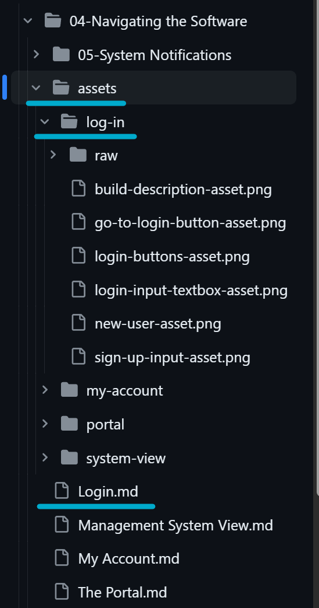

# README.md for DarkWarehouse Documentation

## Introduction 🌟

Welcome to the DarkWarehouse documentation project!

This README is for developers and contributors who are preparing documentation for the end-users of the Dark Warehouse product suite.

Our end-users may not be highly tech-literate and include roles such as fork truck drivers and mid-level warehouse managers. Therefore, our documentation must be simple, engaging, and fun to read, incorporating emojis 😃, bullet points, and ample visuals.

## Writing Guidelines 📝

### Language and Tone 💬

- **Simplicity is Key** 🗝️: Use plain language suitable for non-tech-savvy users.
  > **Note**: You may use acroynms that are defined elsewhere in the documentation or at the top of a document. Try minimize the usage of unfamiliar acronyms to keep the documentation as simple to read as possible.
- **Engaging Content** 🎉: Make use of emojis, short bullet points, and a conversational tone to keep the documentation lively.
- **Visual Aid** 🖼️: Include lots of pictures, diagrams, and screenshots to aid understanding.

### Formatting Standards 📐

- **Headings** 🏷️: Regarding headings the following is applicaple:
  - Use h1 for the primary heading for the document.
    > **Note**: Never include emojis in your h1 headings.
  - All major headings in the document should be h2. These can include emojis where applicable.
  - Any subheadings should use h3 to h6. These can include emojis where applicable.
- **Content Structure** 📚:
  - Begin each page with a primary heading (h1), followed by 3-5 sentences summarizing the page content.
  - **Example**:
    ```
    # Page Title 📘
    This page provides an overview of [Topic]. It will guide you through [Key Features/Steps]. This is essential for [Specific Users/Use Cases]. Continue reading to learn more about [Topic] 🚀.
    ```

### File Naming 📝

- Your files should always have the same name as your primary heading (eg. primary heading is `Obstacles in the System` then the file name should be `Obstacles in the System.md`).

## Environment Configuration Guide

### Setting Up Environment Variables

For the application to function correctly in your local development environment, specific environment variables must be configured. Below is a guide to help you set up these variables:

1. **Create a `.env` File**: Start by creating a `.env` file in the root directory of your project. This file will contain all the necessary environment configurations for your local development.

2. **Use the `template.env` as a Reference**: The `template.env` file serves as a blueprint for the required environment variables. Copy its contents into your newly created `.env` file.

3. **Configure the Variables**: Replace the placeholder values in your `.env` file with the actual values corresponding to your development setup. Below is an explanation of each environment variable:

   - 🏢 `REACT_APP_ADMIN_DOMAINS`: A comma-separated string listing the admin domains with access permissions.
     Format: "@domain1.com,@domain2.com"
   - 📧 `REACT_APP_EXTERNAL_ACCESS_EMAILS`: A comma-separated string listing the emails granted external access.
     Format: "user1@domain.com,user2@domain.com"
   - 🌐 `REACT_APP_EXTERNAL_ACCESS_DOMAINS`: A comma-separated string listing the domains granted external access.
     Format: "@domain1.com,@domain2.com"
   - 🔑 `REACT_APP_MSAL_CLIENT_ID`: Our application's Client ID for Microsoft Authentication Library (MSAL).
   - 🏢 `REACT_APP_MSAL_TENANT_ID`: Our Azure Active Directory Tenant ID.
   - 🆔 `REACT_APP_MSAL_SECRET_ID`: The Secret ID for our MSAL application, required if using a confidential client.
   - 🔒 `REACT_APP_MSAL_SECRET_VALUE`: The Secret Value for our MSAL application, required if using a confidential client.
   - ↪️ `REACT_APP_MSAL_REDIRECT_URI_DEVELOPMENT`: The Redirect URI for our MSAL application when running locally.
   - ↪️ `REACT_APP_MSAL_REDIRECT_URI_PRODUCTION`: The Redirect URI for our MSAL application when in production.
   - 🛂 `REACT_APP_ENABLE_AUTH`: Toggle to enable (`true`) or disable (`false`) authentication.
   - 🏠 `REACT_APP_TEST_LOCALLY`: Toggle to switch between local (`true`) and production (`false`) configurations.

4. **Keep Your `.env` Secure**: Ensure that the `.env` file is added to your `.gitignore` to prevent sensitive information from being exposed publicly.

By following these steps and properly configuring the environment variables, you will set a solid foundation for your local development environment.

## Asset Guidelines 📸

### General Instructions

- **Asset Types**: Most assets will be images and external assets linked through HTTPS links. It is recommended that you understand how to link assets in a docusaurus .md file, references are provided below:
  - [Linking assets in a Docusaurus website](https://docusaurus.io/docs/markdown-features/assets)
- **Preferred Format** 🎨: Always prefer .png format for images.
- **Storage** 💾: Assets for a particular page must be stored in a lowercase and minified version of that page's name within a local `/assets` directory within the directory where the page exists. Example below:

  - Your page is called `Login.md`.
  - You create an appropriately named directory within the `/assets` directory as follows `/assets/log-in`.
  - You create a directory therein to store raw data as follows `/assets/log-in/raw`.
  - Images with markup are stored in `/assets/log-in`, raw images are stored within `/assets/log-in/raw`.
  - An example of this is shown below:
    

  > **Note**: The idea behind the `/raw` directory is that the images with markup can be redone if the theme of the application changes or if more consistent markup is required.

- **Referencing**: Because the assets are stored in a local `/assets` folder when referencing you can use the syntax:

``

- **Content Not Available**: When content is not yet available for your documentation, please use the placeholder image below. This is done with the syntax as follows:

``


- **Reusable/Static Assets**: Like the placeholder image, for images that will be reused on multiple pages, please store these in the `/static/img` folder. By default, this folder is exposed to the client as static assets. (for further reading see [this Docusaurus link](https://docusaurus.io/docs/markdown-features/assets#static-assets)).

### Markup on Images

Should you need to add anything to an image to emphasise a point or highlight a feature, these additions are termed "markup".

- **Raw Images** 🖼️: When adding markup, remember to store the raw image in the `../assets/your-page-name/raw` directory.
- **Markup Tools** ✍️: Only use underlines, arrows, and boxes with a 3pt line thickness.
- **Color Palette** 🌈: The following colours are allowed for markup:
  - #ffb900 (yellow)
  - #a93226 (red)
  - #79dea3 (green)
  - #4fa9e5 (blue)
- **Text in Images** 📝: Use Segoe UI font, in sentence case, sized between 12pt-16pt.
- **Software Recommendation** 💻: When adding markup to images, Microsoft PowerPoint is recommended for its built-in tools like arrows and boxes. The developer can then screenshot the contents from Microsoft PowerPoint.

### Screenshots

- **Application Focus** 👀: When using screenshots, ensure that screenshots display only the application, excluding personal browser elements like tabs and favorites.
- **Dark Mode** 🌙: Since the application is called DarkWarehouse, it makes sense that dark mode and dark mode screenshots are the default.
- **Full Screen Images**: Always show full screen images, do not provide ONLY cut out sections of the screen. Examples shown below:


### Diagrams

Diagrams refer to content that is used to demonstrate a topic outside of media from the application.

- **Creation** 🛠️: When creating diagrams that showcase the elements of the system (i.e. racking, Omni-Moles, VTUs, etc.), please use the provided PowerPoint file for creating diagrams (It can be found at: /assets/DarkWarehouse Assets.pptx). This ensures consistency and source control.
- **Incorporation** 📊: Screenshot the diagram from PowerPoint that you create and include it in the documentation.

## Contributing to the Documentation 🤝

- **Follow the Style Guide** 📖: Adhere to the guidelines outlined in this document.
- **Committing Diagrams** 📈: Utilize the provided PowerPoint file for diagrams to maintain consistency.

## Repository Structure and Workflow 📁

The essence of our documentation strategy in DarkWarehouse is to keep it simple, engaging, and informative for our end-users. Your contributions to the `/docs` folder play a crucial role in achieving this goal.

### Understanding the Docusaurus Implementation

Our DarkWarehouse documentation repository utilizes Docusaurus, focusing primarily on the `/docs` folder for all our content management. Here’s a brief overview of how our repository is structured and functions:

- **Primary Content Location** 📚: All our documentation resides within the `/docs` folder. This is the heart of our repository, where you will create, edit, and manage documentation files.
- **Exclusion of Blog Functionality** 🚫: Unlike the standard Docusaurus setup, we do not use the `/blog` folder or its blogging functionalities. Our focus is solely on creating comprehensive and user-friendly documentation.
- **Markdown Files** 📝: Documentation is written in Markdown files (.md). These files are easy to edit and allow for straightforward formatting and inclusion of images and other media.
- **Version Control** 🔄: Each contribution to the `/docs` folder should be treated with standard version control practices – use branches for changes, commit often with descriptive messages, and create pull requests for reviews.
- **Review and Merge Process** 🔍: Pull requests are reviewed for accuracy, clarity, and adherence to our documentation standards. Once approved, they are merged into the main branch, automatically updating the documentation on our site.

## Running the Application Locally 🚀

To ensure that our contributors can work effectively with the DarkWarehouse documentation, it's essential to understand how to run the Docusaurus application locally. This section covers the primary scripts you'll use from our `package.json` file, focusing on the `build`, `start`, and `clear` functionalities.

### Getting Started

Before running the application, make sure you have Node.js installed on your system. Clone the repository to your local machine and navigate to the project directory. Then, run `npm install` to install all the necessary dependencies.

### Scripts Explained

- **`npm start`**: This command starts a local development server and opens up a browser window. Most changes are reflected live without having to restart the server. Use this command for routine documentation development and review.

- **`npm run build`**: This script generates static content into the `build` directory and can be used to serve the site using a static contents hosting service. It's useful for testing the final output of your documentation before deploying it.

- **`npm run clear`**: This command is a maintenance script that helps in clearing the cache created by Docusaurus. It's particularly useful when you face issues related to stale data or when you want to ensure a fresh start.

### Workflow for Local Development

1. **Starting the Development Server**:

   - Run `npm start`.
   - This will open the documentation site in your default web browser (typically at http://localhost:3000)
   - As you make changes to the documentation, the site will automatically reload to reflect these changes.
   - If you want to stop the Docusaurus server, use CTRL+C, it will then ask you to "Terminate batch job (Y/N)?"

2. **Building the Site**:

   - Before deploying your changes, it's good practice to build the site using `npm run build`.
   - This ensures that the static files are generated correctly and there are no build-time errors.

3. **Clearing the Cache**:
   - If you encounter unexpected behavior or bugs during development, use `npm run clear`.
   - This will remove the cache and can help resolve issues that are not fixed by restarting the development server.

## Conclusion 🎬

By following these guidelines, you will help create accessible, user-friendly documentation for DarkWarehouse as well as test that you have not broken the Docusaurus server. Remember to regularly pull changes from the main repository to keep your local version up-to-date. Your contributions are valuable in making our application more approachable and easy to use for all our end-users. Happy documenting! 📖💻
