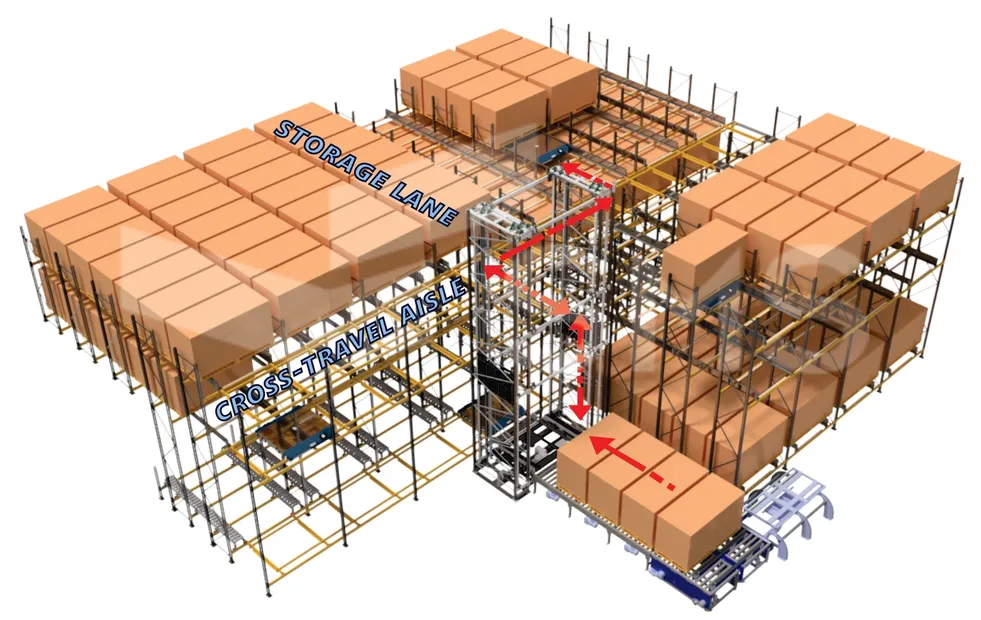

# The Environment
This page covers the terminology used describing the environment for an Omni-Mole system. The image below indicates some of the key concepts, these are explained in subheadings to follow.

## The AS/RS
This term refers to the full Omni-Mole system. AS/RS is an abbreviation for **Automated Storage and Retrieval System**. The Omni-Mole AS/RS is a type of AS/RS for palletised goods storage.

## Racking
The "racking" refers to the physical structure that hosts the machinery and pallets. This is generally built from roll-formed racking members (columns, beams, etc.). Some systems also utilise structural steel for the racking. Within the racking there are different concepts that are discussed in the subheadings to follow.

### Rails
The surfaces that the Omni-Moles travel on are called "rails". This comes from the classic "train rails" terminology. These are usually thick steel extrusions that do not deform when loaded Omni-Moles travel upon them.

### Storage Lanes / Lanes / Travel Lanes
The formal definition for a "lane" is any position in which an Omni-Mole is travelling forward/backward. Typically lanes are the racking used where Omni-Moles can store pallets (i.e. they provide a surface for pallets to be placed upon). There are lanes that serve no pallet storing purpose, either programmatically or by being mechanically unable to store pallets. Those are termed "travel lanes" as Omni-Moles/human operators can travel down these lanes unobstracted by pallets.

#### Lane Pallet Positions
Within a storage lane, typically a number of pallets can be stored (eg. 10 pallets). Lane pallet positions are the positions within a storage lane for storing pallets. In the example of a lane that stores 10 pallets, that implicies the lane will have 10 lane pallet positions.

#### Lane Extension Pieces

#### Lane End Stops

### Cross-travel Aisles / Aisles
The formal definition for an "aisle" is any position in which an Omni-Mole can travel in the port/starboard direction. Aisles are used to "cross-travel" between storage/travel lanes, hence why they are termed "cross-travel aisles". Pallets can never be stored in aisles. 

#### An Aisle Position
Typically an "aisle position" requires that an Omni-Mole

#### Aisle Extension Pieces

#### Aisle End Stops

### VTU Shaft

#### Anti-fall Devices

### Grating / Walkways

## Core Definitions
The core definitions define terms that are used for the structural elements that comprise an Omni-Mole system as well as other elements within the system that are critical to understand. See below:

| # | Term | Description | 
| --- | --- | --- |
| 1 | AS/RS | **Automated Storage and Retrieval System**. This is a type of warehouse storage system that automates both the storage and retrieval cycle for goods in the warehouse. The Omni-Mole AS/RS is an example of this but for palletised goods storage. |
| 2 | Racking | The Omni-Mole AS/RS is built using specialized pallet racking. The term "racking" is used loosely to describe the entire Omni-Mole AS/RS environment. |
| 3 | Lanes / Travel Lanes / Storage Lanes |  |
| 4 | Aisles / Cross-Travel Aisles | This is the racking that is used in places where Omni-Moles can travel between lanes. Aisles are for Omni-Mole travel in a left/right orientation. |
| 5 | Rails | This is a term used for the surface that an Omni-Mole travels upon. There can be lane rails and aisle rails. |
| 6 | End Stops | This is a term used for the surface that an Omni-Mole travels upon. There can be lane rails and aisle rails. |
|   | VTU Shaft | |
| 7 | RFID Tags | These are passive electronic devices that get mounted in the racking at key locations. The devices have a unique number associated with them so that when a machine reads an RFID tag the DarkWarehouse software knows where that machine is within the Omni-Mole AS/RS. [see this Wiki link for more info](https://en.wikipedia.org/wiki/Radio-frequency_identification#Tags) |
| 8 | Control Cabinet / Control Panel / Panel |  |
| 9 | PLC |  |
| 10 | HMI |  |
| 11 | RF / RF Network |  |
| 12 | WiFi / WiFi Network |  |
| | Pallet | |
| 13 | Barcode |  |
| 14 | Scanner / Handheld Scanner |  |

---

## Basic Machine Definitions
The basic machine definitions cover the basic knowledge for the machines. See below:  

### Omni-Mole
The Omni-Mole is the core of the system. These are battery operated shuttles that move pallets. They can travel in lanes and in aisles.

### Vertical Transfer Unit ("VTU")
The Vertical Transfer Unit or VTU is the elevator of the system. These are static machines, powered by 3-phase AC power. Their movement is restricted to only travel up/down. They are also only for machines and pallets. These machines allow Omni-Moles to travel in a 3D environment as they allow Omni-Moles to dock on them with/without a pallet and then travel either up/down to a different level.

### Conveyors
Conveyors are static machines

### Chargers and Charge Pads

---

## Basic Software Definitions

### The Whisker Application

### The Traffic Management System (TMS)

### The Warehouse Management System (WMS)

### The UI Application

### The Client Interface Application