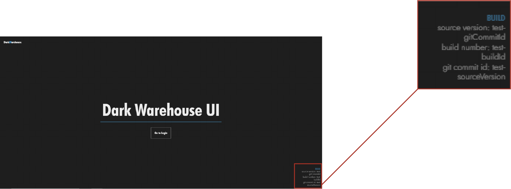
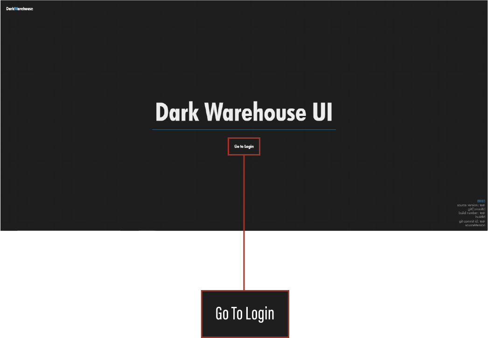
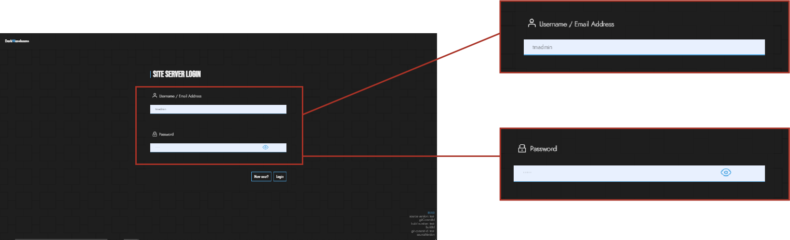
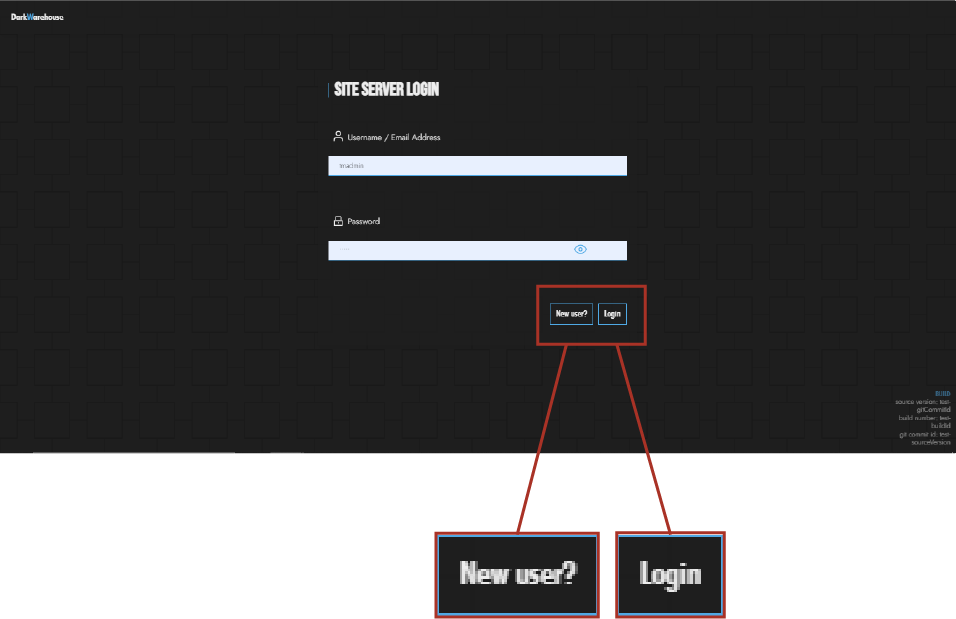
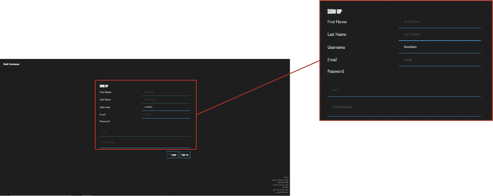
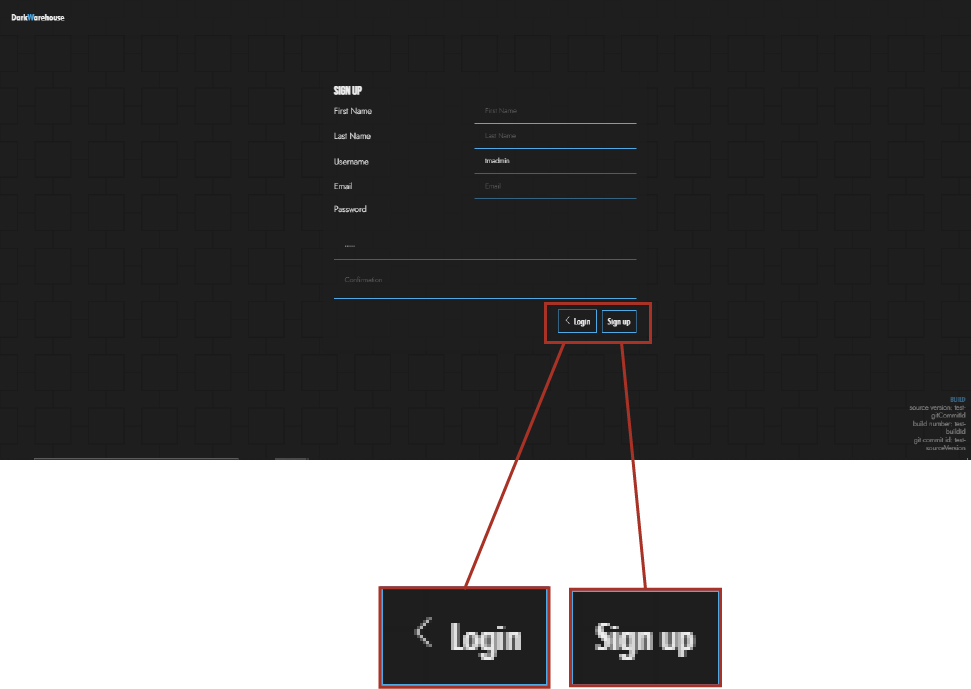

# Login Documentation :closed_lock_with_key:

This serves as a guidline for users to understand and familiarize themselves with the login page. It encompasses steps and requirements needed in order to operate as well as navigate through the page :memo:. The images provided also visually demonstrate the user interface components found on the Login page :door:. A Login Page allows users to enter the system by presenting the correct credentials and unlocking their access to the system :unlock:.

## Version Build Description :sparkles:
Upon loading the login page, the user is also able to see information regarding which DarkWarehouse build version is running on the local server :computer:.

The build describes the version of code running on the server and therefore on the user's PC. This includes the `Source Version`, `Build Number` and the `Git Commit ID`. This information is visible to ensure that users are aware of the system's current state and build version.

.

## Go To Login Page :round_pushpin:
In order to navigate to the login page, the user is then prompt to click on the `Go To Login` button. This will then open the Login Page and enable users to log into the Darkwarehouse system using their user details :confetti_ball:.

.

 ## Login Input :page_facing_up:
When the user has clicked onto the `Go To Login` button, they are then welcomed to the login page which allows them to enter their `Username` and `Password`:key:. It is essential that users have a method of remembering and securing their user details as it allows users to open the login page :rotating_light:.

.

## Login Buttons :unlock:
Two important buttons guide users through the login journey:
- New User : In the case were the user has no `Username` and `Password`, this button, when clicked, lets users to navigate to a page that allows them to create new user details :busts_in_silhouette:.
- Login    : Once the secret users details are entered, the system is now able to verify the given details by clicking on the `Login` button :heavy_check_mark:.

.

## New User Input :page_with_curl:
The "New User Input" page is where users can enter their information and preferences to create a new account :bust_in_silhouette:, enabling personalized experiences within the platform. The highlighted form below is the area in which the user is required to fill in and sign up their user details :pencil2:.

.

## New User SignUp Buttons :black_nib:
There's two buttons that are given on the new user page, these include:
- Login Button: Users have the option to cancel their signing up process and go back to the login page by clicking this button :computer_mouse:.
- SignUp Button: This buttons serves as a signup point for individuals who are interested in creating a new user account to access amazing features and services provided by the Darkwarehouse system :star:.

.

This documentation not only guides users through the login process but also emphasizes the benefits of secure access and a personalized user journey within the Darkwarehouse system :tada:.