# TMS Task Types

This page provides an overview of TMS Task Types. A TMS Task is used to define an action for the TMS to perform such as a machine or pallet being moved to a different location. This document will discuss the different task types.

## No Movement Tasks⚙️
No Movement Tasks do not involve any machine movement but instead get or update the state of a machine.
### Live Status Task🔍
A Live Status Task is used to get the current state of a machine such as it's location, mode and error state.
#### Common Uses
- To update the location of a machine that has been manually moved.
- To get data on a machine in error
#### Requirements
- The machine needs to be switched on but does not need to be online in the TMS system.
### Mode Change Task🚦
A Mode Change Task is used to update the mode of a machine to setup, manual or auto.
#### Common Uses
- To update the machines state to auto after manual movement.
#### Requirements
- The machine needs to be switched on but does not need to be online in the TMS system.
### Emergency Stop Task⛔
An Emergency Stop Task is used to enable the emergenecy stop on a machine. This will cause it to stop any current movement.
#### Common Uses
- In the case of an accident the machine should be emergency stopped.
#### Requirements
- The machine needs to be switched on but does not need to be online in the TMS system.
### Error Reset Task🧹
An Error Reset Task is used to reset any error on the machine.
#### Common Uses
- If the machine has a non-hardware related error.
#### Requirements
- The machine needs to be switched on but does not need to be online in the TMS system.
### How to Create
1) Open the right side toolbar

2) Go to Manage Traffic -> TMS Tasks -> Machine Inquiry
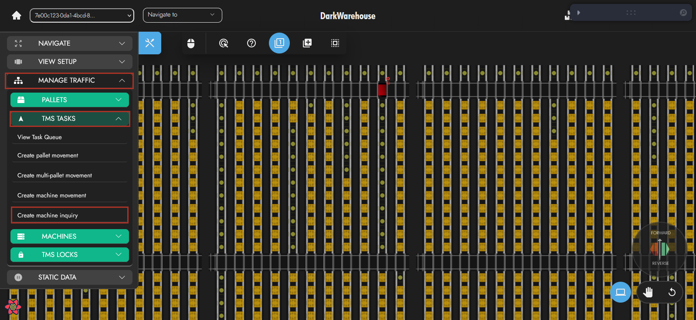

Alternatively right click a machine -> Create Machine Task -> Inquiry Task
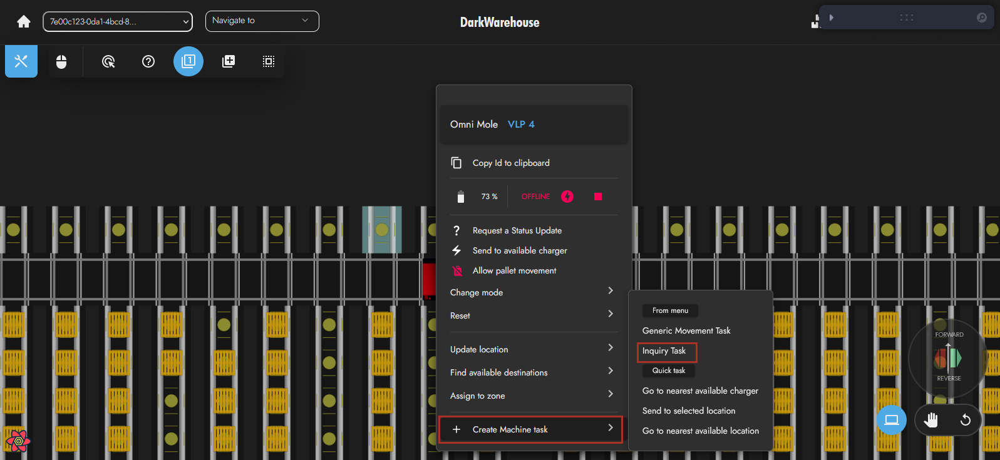

3) Select a machine. Click next.
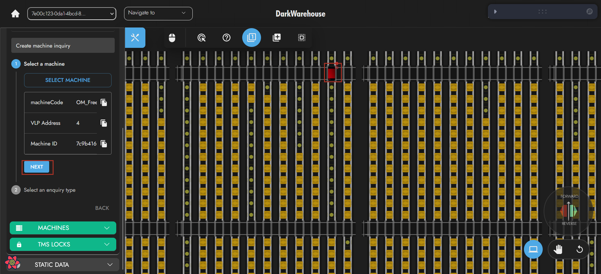

4) Select a task type. Click create.
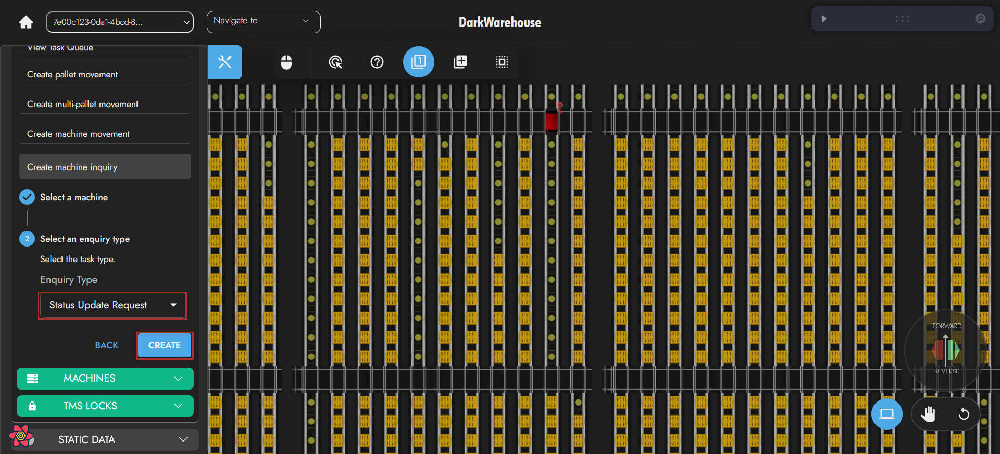

To quickly create a Live Status Task, Right click a machine -> Request a Status Update
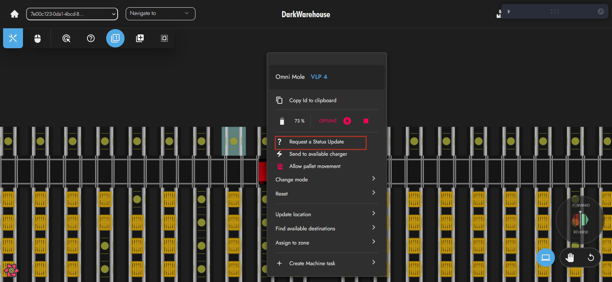

## Generic Tasks🛣️
Generic Tasks are used to move a machine to a new location.
### Go To Better Location Task🛬
A Go To Better Location Task moves a machine to the users specified location.
#### Common Uses
- To move a machine into a zone or level it will be working in.
- To move a machine for maintenance.
#### Requirements
- The machine needs to be switched on, online and in auto in the TMS system.
- The specified destination needs to be inside the machines zones and a route needs to exist to the location.
### Go To Nearest Available Location🛫
A Go To Nearest Available Location Task moves an Omni-Mole to the nearest location that is not currently occupied by a machine or in the way of any tasks.
#### Common Uses
- If an Omni-Mole needs to move away from it's current location but the destination does not matter.
#### Requirements
- The Omni-Mole needs to be switched on, online and in auto in the TMS system.
### Go To Charger⚡
A Go To Charger Task will send an Omni-Mole to the nearest available charger.
#### Common Uses
- To send an Omni-Mole to charge when low on battery.
#### Requirements
- The machine needs to be switched on, online and in auto in the TMS system.
- At least one charger needs to be switched on, online, in auto and available in the TMS system.
### How to Create
1) Open the right side toolbar

2) Go to Manage Traffic -> TMS Tasks -> Machine Movement

Alternatively right click a machine -> Create Machine Task -> Generic Movement Task (Or a specific task type)
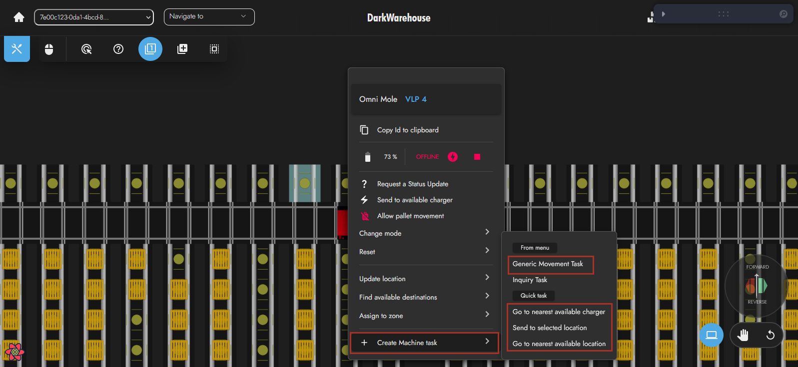

3) Select a machine. Click next.
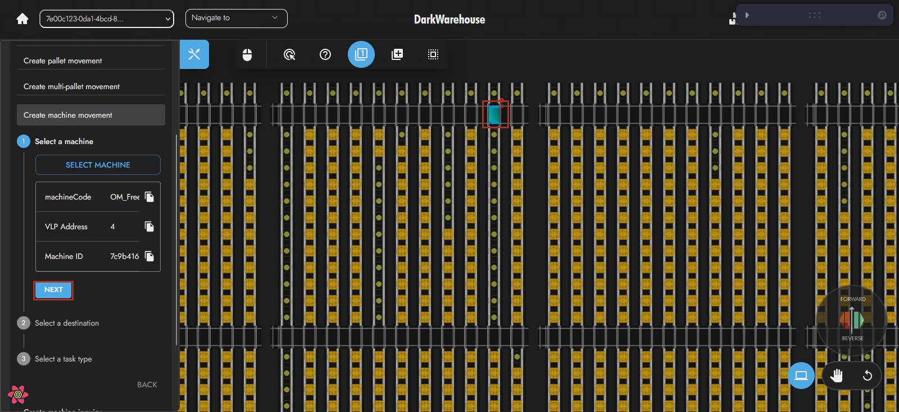

4) Optionally select a destination (Only necessary for Go To Better Location Task). Click next.
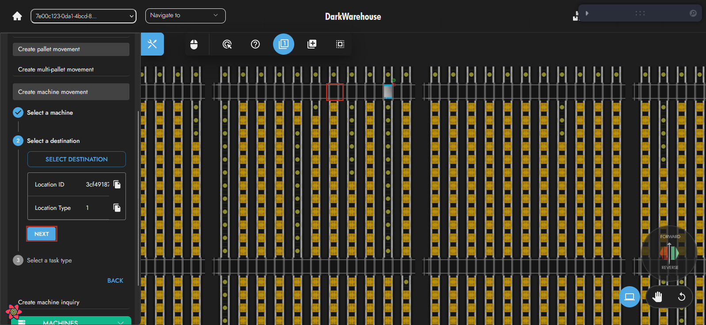

5) Select a task type. Click create.
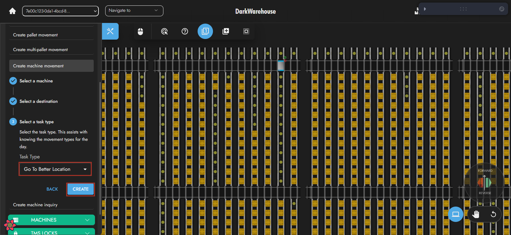

## Pallet Task🚚
Pallet Tasks are used to move a pallet to another location
### Inbound Task🚚⬇️
An Inbound Task is created on scan in of a pallet and will take the pallet into the store.
#### Common Uses
- To send a pallet into the store that has not automatically been sent in.
#### Requirements
- The source and destination locations need to be unlocked.
- At least one Omni-Mole needs to be switched on, online, in auto and available in the TMS system.
- The Omni-Mole needs to be able to access the pallet.
- The Omni-Mole needs to be able to access the destination.

If the pallet is on a conveyor:
- The conveyor needs to be switched on, online and in auto in the TMS system.
### Inbound Reject Task🚚⛔⬆️
An Inbound Reject Task is created on scan in of an invalid pallet and will move the pallet to a reject bay.
#### Common Uses
- To send an invalid pallet to a reject bay that has not automatically been sent.
#### Requirements
If the pallet is on a conveyor:
- The conveyor needs to be switched on, online and in auto in the TMS system.
If the pallet is not on a conveyor:
- The source and destination locations need to be unlocked.
- At least one Omni-Mole needs to be switched on, online, in auto and available in the TMS system. 
- The Omni-Mole needs to be able to access the pallet.
- The Omni-Mole needs to be able to access the destination.
### Internal Single Pallet Movement Task🚚🔁
An Internal Single Pallet Movement Task is created to move the pallet within the store.
#### Common Uses
- To move a pallet out of lane so that another pallet can be accessed.
- To move a pallet to a better storage location
#### Requirements
- The source and destination locations need to be unlocked.
- At least one Omni-Mole needs to be switched on, online, in auto and available in the TMS system. 
- The Omni-Mole needs to be able to access the pallet.
- The Omni-Mole needs to be able to access the destination.
### Outbound Task🚚⬆️
An Outbound Task is created to move the out of the store.
#### Common Uses
- To move a pallet out of the store that has not automatically been sent out.
#### Requirements
- The source and destination locations need to be unlocked.
- At least one Omni-Mole needs to be switched on, online, in auto and available in the TMS system. 
- The Omni-Mole needs to be able to access the pallet.
- The Omni-Mole needs to be able to access the destination.
### How to Create
1) Open the right side toolbar

2) Go to Manage Traffic -> TMS Tasks -> Pallet Movement
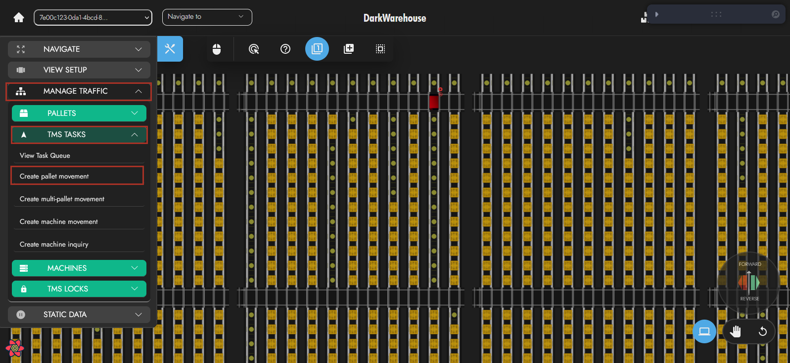

Alternatively right click a pallet -> Create Pallet Movement -> Pallet Movement
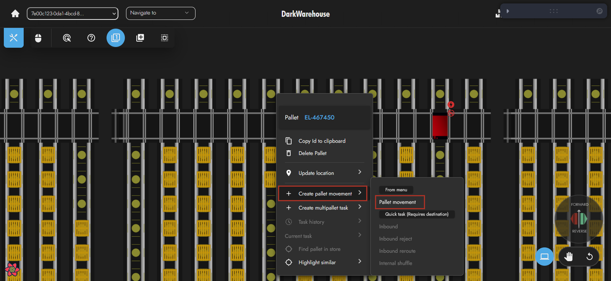

3) Select a pallet. Click next.
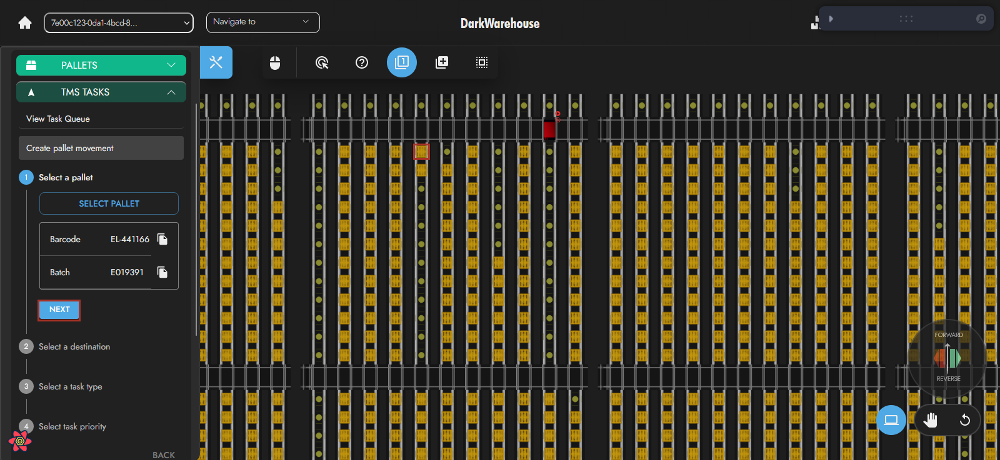

4) Select a destination. Click next.
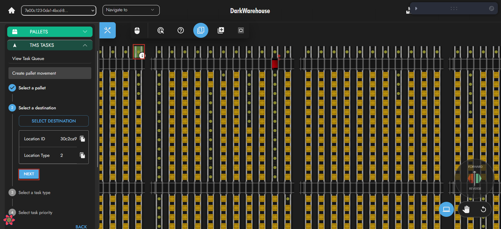

5) Select a task type. Click next.
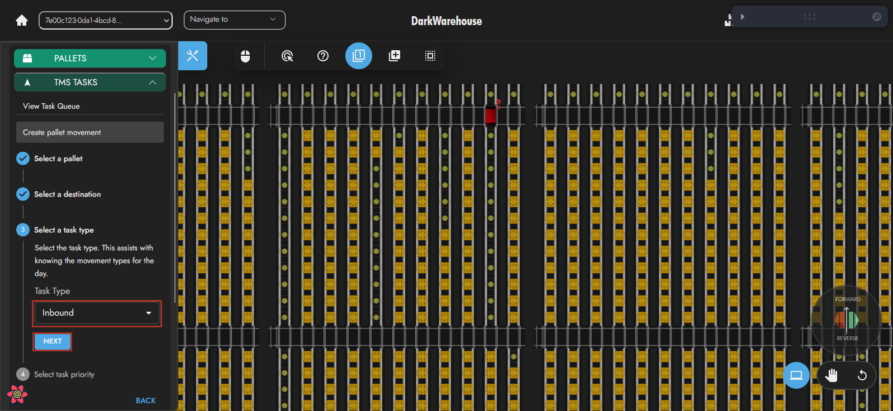

6) Select a task priority (In most cases use low. Medium and high are for more urgent tasks). Click create.
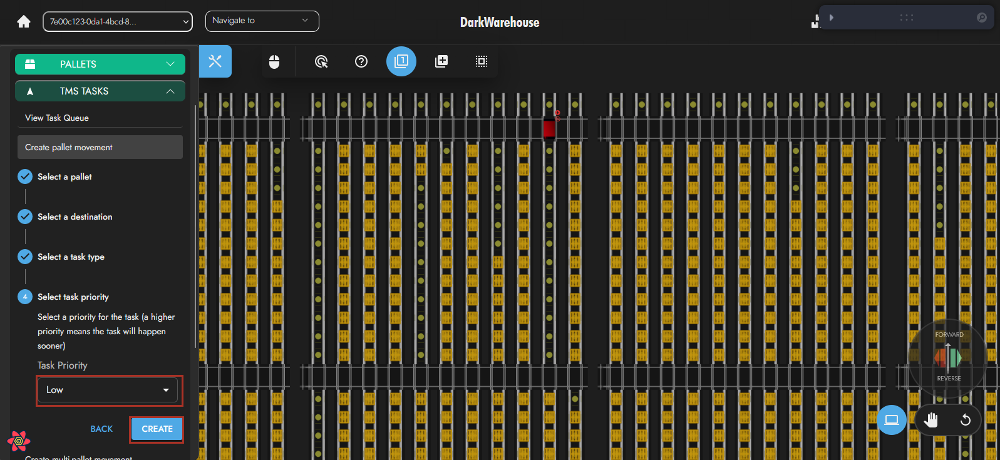

## Multi-Pallet Task
Multi-Pallet Tasks are used to perform an action on multiple pallets in a lane.
### Stock Count Task📝
A Stock Count Task counts the number of pallets in a lane.
#### Common Uses
- To validate if a lane has the number of pallets recorded in the TMS.
#### Requirements
- The destination locations need to be unlocked.
- At least one Omni-Mole needs to be switched on, online, in auto and available in the TMS system.
- The Omni-Mole needs to be able to access the destination.
### Shuffle Task🔁
A Shuffle Tasks moves a defined number of pallets forwards or backwards in a lane.
#### Common Uses
- To clean up a lane by moving all pallets to one side.
#### Requirements
- The destination locations need to be unlocked.
- At least one Omni-Mole needs to be switched on, online, in auto and available in the TMS system.
- The Omni-Mole needs to be able to access the destination.
### Automatic Retrieve Task⬆️
An Automatic Retrieve Task is used to shuffle a defined number of pallets towards an outbound location as they are being take out of the store.
#### Common Uses
- To move pallets to an outbound position while a forklift is removing the pallets and scanning them out.
#### Requirements
- The destination locations need to be unlocked.
- At least one Omni-Mole needs to be switched on, online, in auto and available in the TMS system.
- The Omni-Mole needs to be able to access the destination.
### Automatic Deposit Task⬇️
An Automatic Retrieve Task is used to shuffle a defined number of pallets away from an inbound location as they are being put into the store.
#### Common Uses
- To move pallets from an inbound position while a forklift is placing the pallets and scanning them in.
#### Requirements
- The destination locations need to be unlocked.
- At least one Omni-Mole needs to be switched on, online, in auto and available in the TMS system.
- The Omni-Mole needs to be able to access the destination.
### How to Create
1) Open the right side toolbar

2) Go to Manage Traffic -> TMS Tasks -> Multi-Pallet Movement

Alternatively right click a pallet -> Create Multi-Pallet Task -> Multi-Pallet Movement
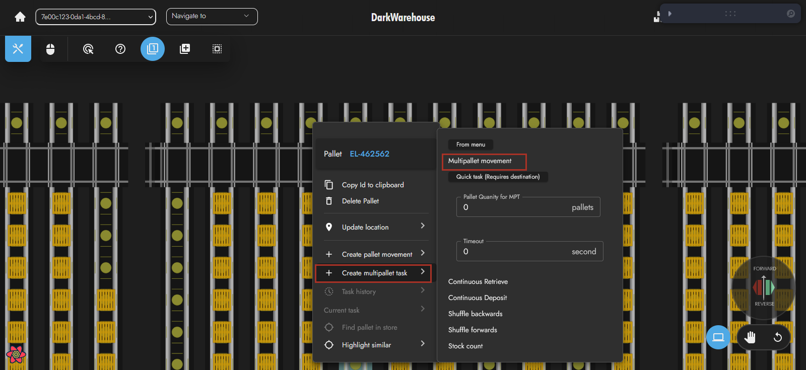

3) Select a task type. Click next.
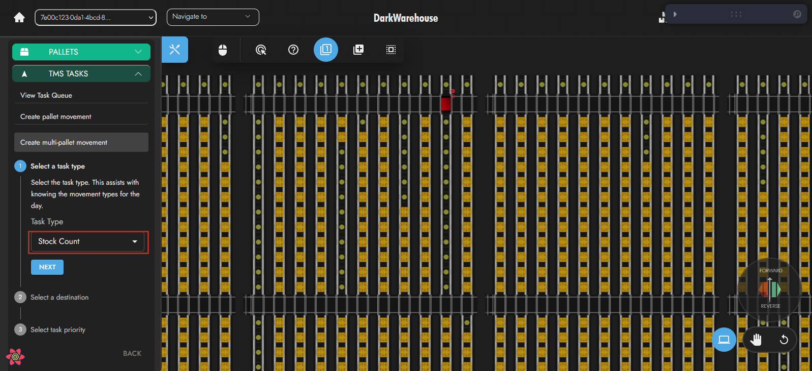

4) Select a destination. Click next.
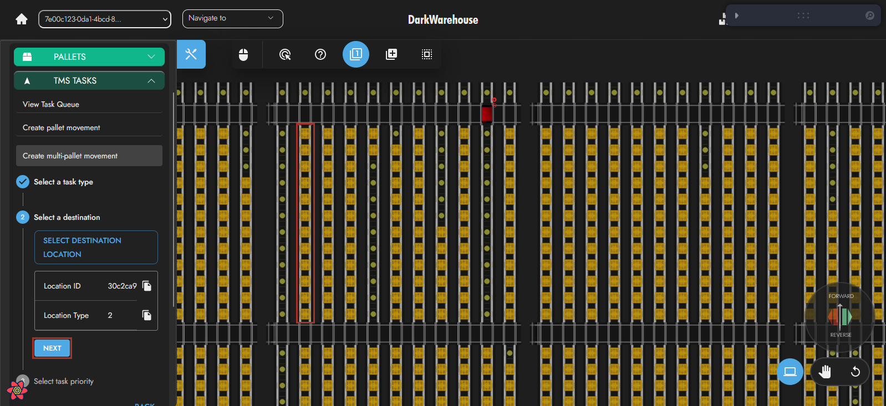

5) Select a task priority (In most cases use low. Medium and high are for more urgent tasks). Click create.
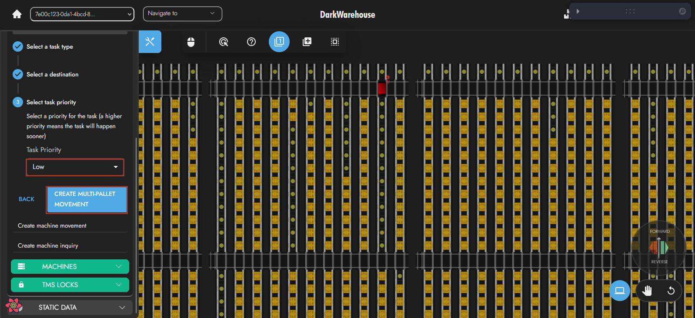

## Potential Machines For Tasks
Below are the machine that can potentially be used for each task type
Task Types                              |Omni-Mole|VTU|Conveyor|Charger
:-:|:-:|:-:|:-:|:-:
Live Status Task                        |X        |X  |X       |X      
Mode Change Task                        |X        |X  |X       |X      
Emergency Stop Task                     |X        |X  |X       |X      
Error Reset Task                        |X        |X  |X       |X      
Go To Better Location Task              |X        |X  |        |      
Go To Nearest Available Location        |X        |X  |        |      
Go To Charger                           |X        |X  |        |X      
Inbound Task                            |X        |X  |X       |      
Inbound Reject Task                     |X        |X  |X       |      
Internal Single Pallet Movement Task    |X        |X  |        |      
Outbound Task                           |X        |X  |X       |      
Stock Count Task                        |X        |X  |        |      
Shuffle Task                            |X        |X  |        |      
Automatic Retrieve Task                 |X        |X  |        |      
Automatic Deposit Task                  |X        |X  |        |      