# TMS Zones

This page provides an overview of TMS Zones. A TMS Zone is a collection of locations use to manage traffic in the system. We will explore the different types of zones and how to create/edit/delete them. Then we will cover the assigning of machine to these zones.

## Zone Types

### Travel Zone🛣️

A Travel Zone defines the set of locations an OmniMole can move in but not leave. This is especially useful for resource management and managing the routes taken by OmniMoles.

#### Uses

A Travel Zone can be used to dedicate some OmniMoles to areas of the warehouse such as a specific level etc.

> Below is an example of a Travel Zone being used to force OmniMoles to remain on a single level.
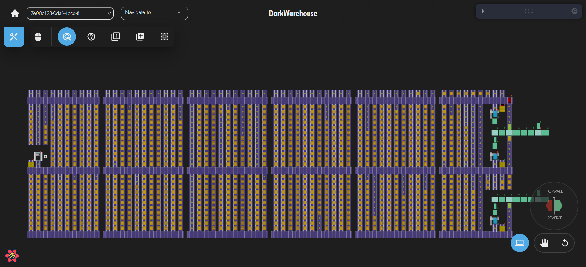

#### Important Notes

- The OmniMole can be assigned to multiple Travel Zones and as long as they over lap can move from one zone to the next.
- The Travel Zone can have multiple OmniMoles assigned to it at the same time.
- If an OmniMole has not been assigned a Travel Zone, it will be able to move through out the entire store. 
- If the OmniMole has been assigned a Travel Zone but is currently outside it, the OmniMole will not be able to move.

### Atomic Location Zone🚦

An Atomic Location Zone defines a set of locations that can only have one OmniMole inside at a time. These are useful for managing the routes taken by OmniMoles.

#### Uses

An Atomic Location Zone can be used to prevent unnecessary movements by OmniMoles. This is done by placing an Atomic Location Zone at dead ends in the system since an OmniMole that has travelled into the dead end will have to come back.

> Below is an example of an Atomic Location Zone being used near a dead end to prevent unnecessary movements.
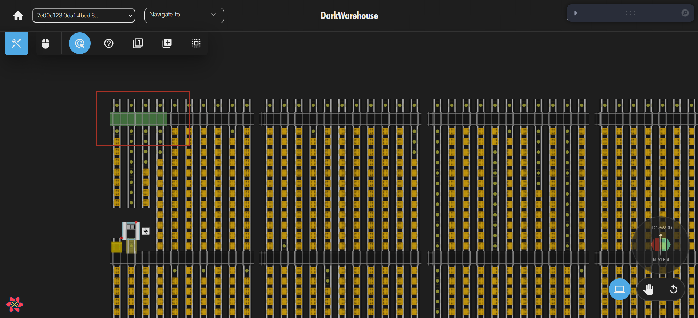

#### Important Notes

- OmniMoles are not assigned to Atomic Location Zones, instead the zone applies to all OmniMoles in the system.
- If an OmniMole is inside an Atomic Location Zone and another OmniMole needs to move into the zone, it will tell the OmniMole inside to relocate out of the zone if necessary.
- If two OmniMoles are inside the Atomic Location Zone due to manual intervention or the zone being updated, both OmniMoles are capable of moving within the Atomic Location Zone until one of them leaves.

## Creating a Zone🏗️

Creating a zone uses the following steps:

1) Open the right side toolbar

2) Go to Static Data -> Zone -> New Zone
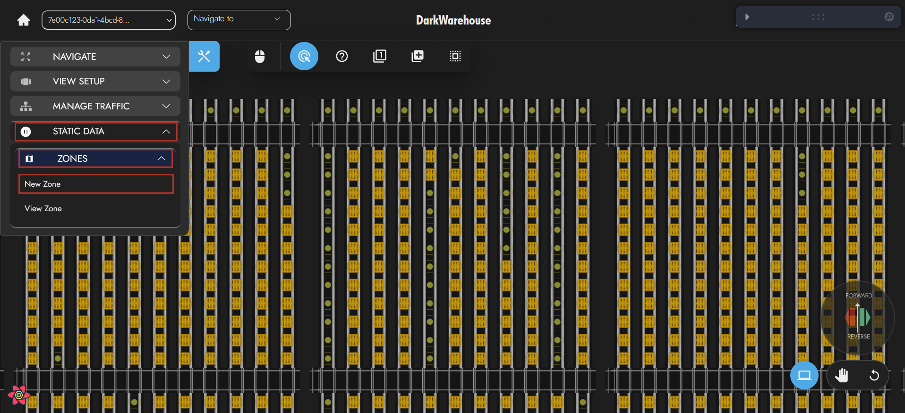

3) Set the Location Grouping to Tms Zone. Click next.
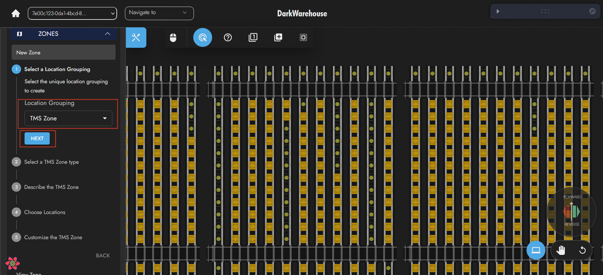

5) Set the zone type from the drop down. Click next.
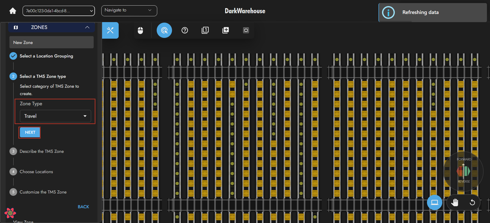

4) Choose a name and description for the zone. Click next.
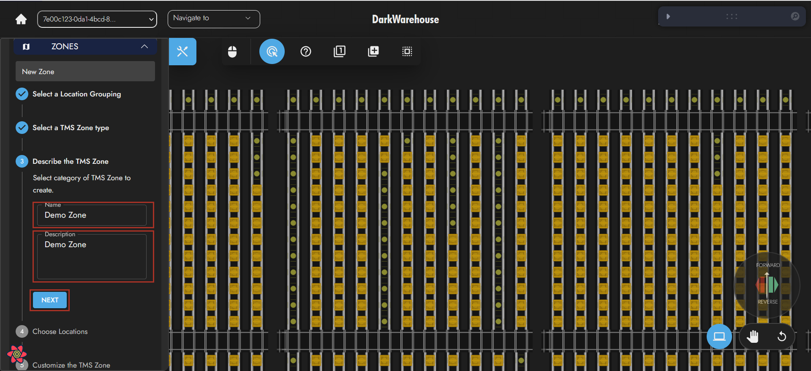

5) Choose the locations for the zone. This can be done using the Toggle Select cursor type by left clicking the locations or the Selection Box cursor type by holding shift and draggng the box over the locations. Click next.
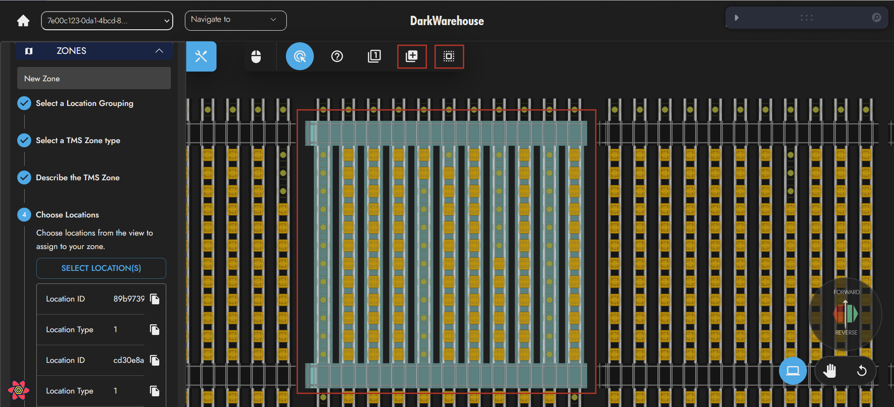

6) Finally enable the zone and click create.
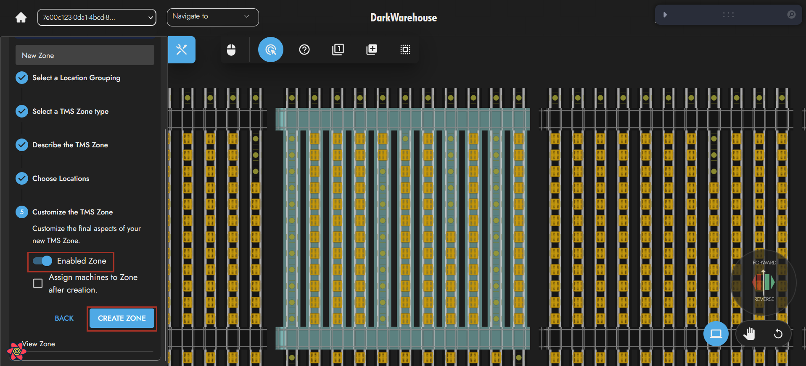

## Viewing a Zone🔍

To view a zone, right click, then go to View Zones -> Tms -> Travel (Or Atomic Location) and select the zone you want to view.
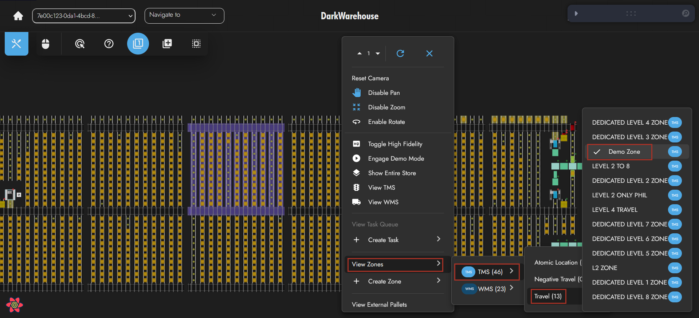

## Editing a Zone🔧

Zones may need to be expanded or shrunk. Editing a zone uses the following steps:

1) Ensure the Default cursor is selected
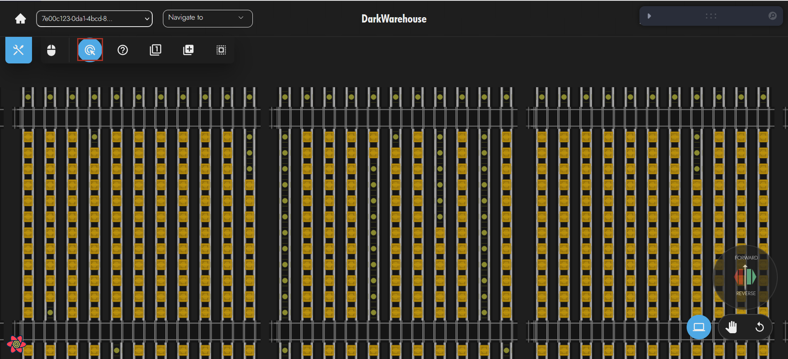

2) Right click a location and go to Assign to/Remove from TMS zone -> Travel (Or Atomic). Then select or deselect zones that the location should or should not be in.
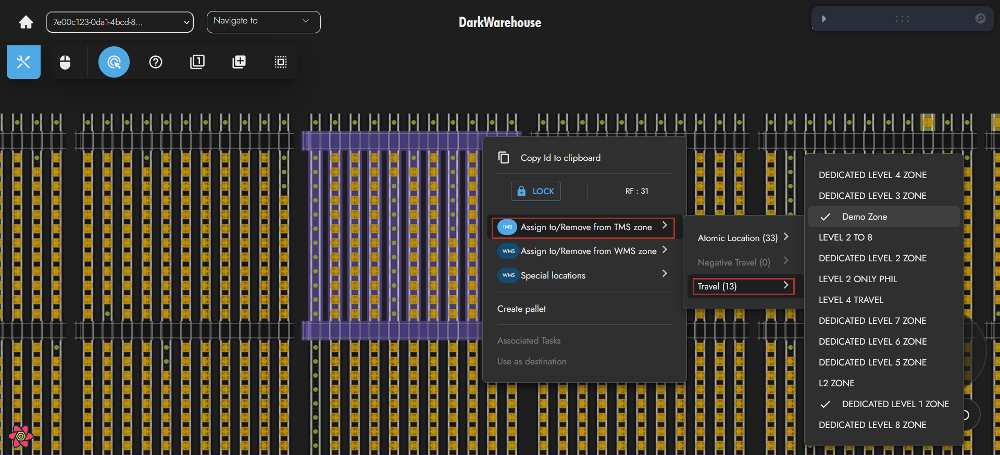

## Deleting a Zone🧹

Deleting a zone uses the following steps:

1) In the TMS view, open the right side toolbar
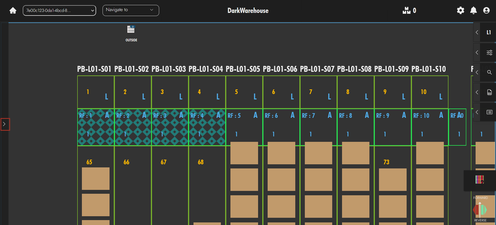

2) Go to Zones -> Delete Zone
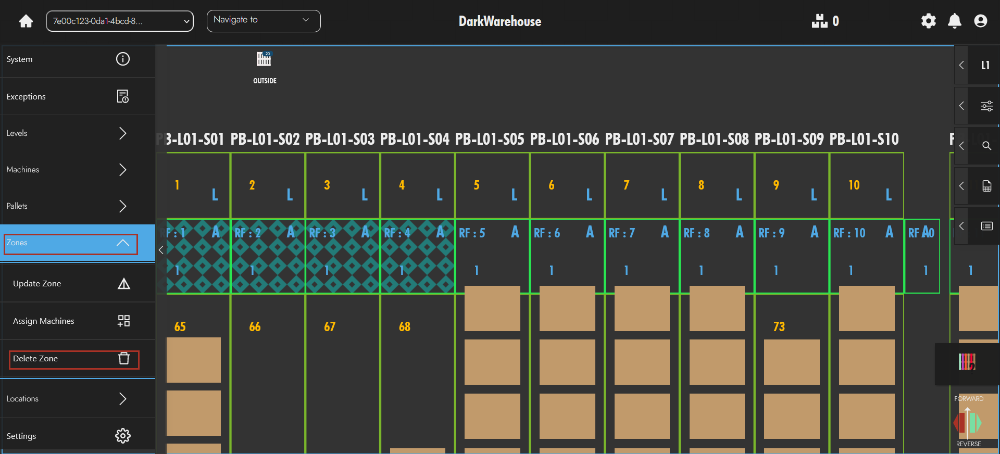

3) Use the drop down to select the zone. Click delete zone for instance.
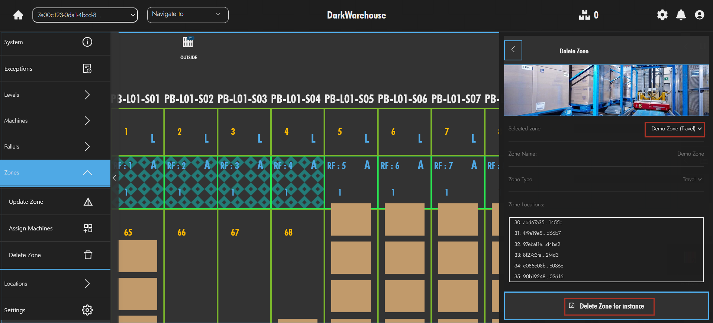

## Assigning/Unassigning a Machine to a Zone🚚

Once a Travel Zone has been created OmniMoles can be assigned/unassigned. You may need to do this if an OmniMole is needed in another zone. This is done using the following steps:

1) Right click the machine to assign/unassign to the zone

2) Go to Assign to zone -> TMS. Then select or deselect zones that the machine should be assigned to.
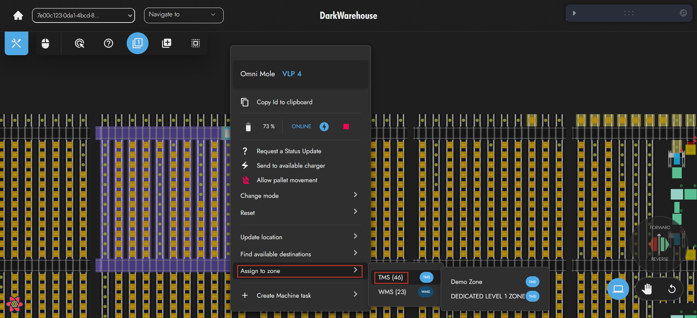