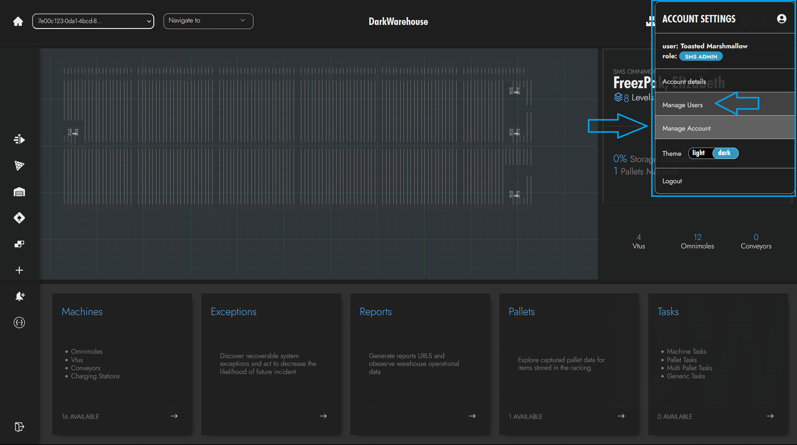
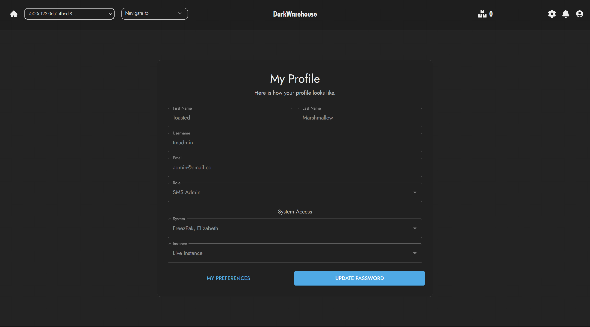
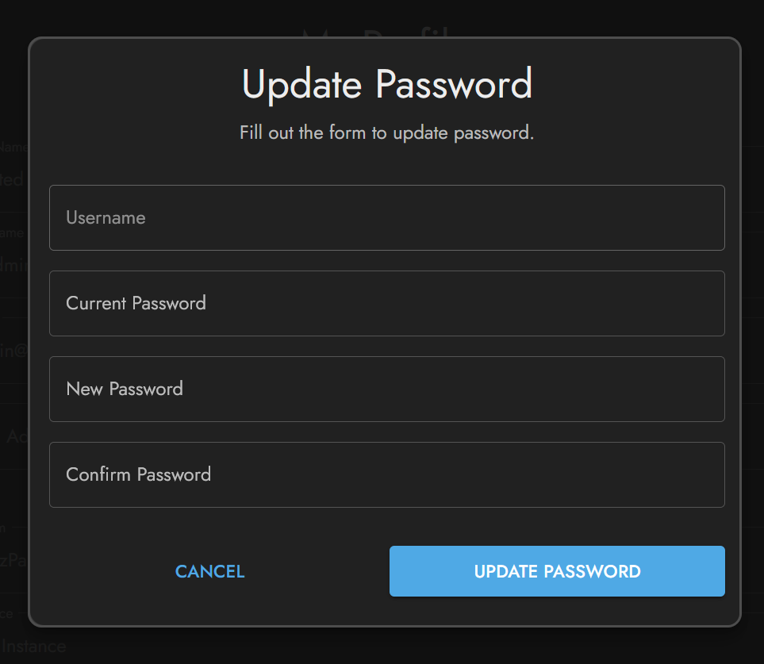

# My Account

Managing your profile and account settings is straightforward within our portal. Below you'll find a guide on how to navigate to your profile, update your details, and customize your account settings.

## Accessing My Profile :bust_in_silhouette:

Your personal profile holds the key to your account settings and preferences. To view or edit your profile details:

1. Click on the profile icon at the top right corner of the portal dashboard.
2. Select **Manage Account** from the dropdown menu.

 

## Profile Overview :id:

On the **My Profile** page, you can view and update your personal information. Here's what you can manage:

- **First and Last Name**: Your legal or preferred names as recognized by the system.
- **Username and Email**: Essential credentials for your account access and communication.
- **Role and System Access**: Your designated role and the systems you have access to within the platform.

:::note
Some profile settings may require administrator rights to change. Contact your system administrator if you need to update such restricted information.
:::

## Updating Personal Details :pencil2:

Your profile is the place to keep your contact details up-to-date:

- Navigate to **My Profile** for an overview of your personal information.
- Make any necessary changes to your name, email, or other personal details.

## My Preferences :wrench:

Customize your experience and manage your preferences directly from the **My Profile** page. This can include settings for notifications, dashboard layout, and more, tailored to suit your workflow.

:::note In Progress
The "My Preferences" feature is currently under development. Stay tuned for updates as we work to provide you with a more personalized experience.
:::

## Resetting Password :key:

Security is paramount, and maintaining a strong, private password is a significant part of your account security.

- To change your password, head over to **My Profile**.
- Click on the **Update Password** button to initiate the process.

  

:::success
You'll see a confirmation message once your password has been successfully updated.
:::

## Account Settings :gear:

Your account settings provide you with the flexibility to customize your portal experience:

- **Theme**: Choose between a light or dark theme for optimal visual comfort.
- **Logout**: Securely exit your account when you're done with your session.

Access these settings from the same account dropdown menu where you found the **Manage Account** option.

Remember, keeping your profile updated and your password secure helps us ensure the integrity and safety of your account.
