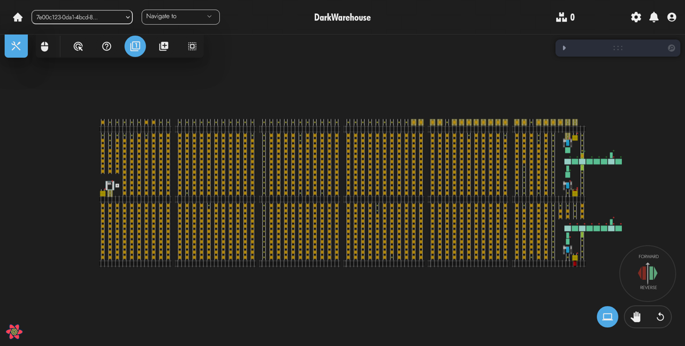
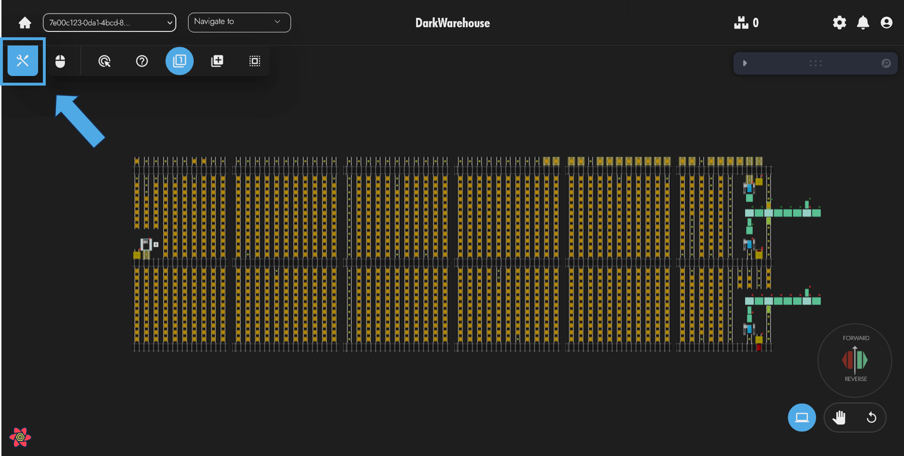
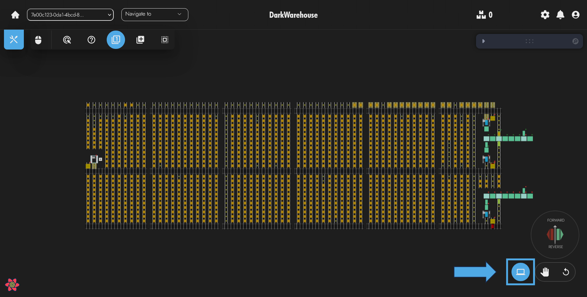
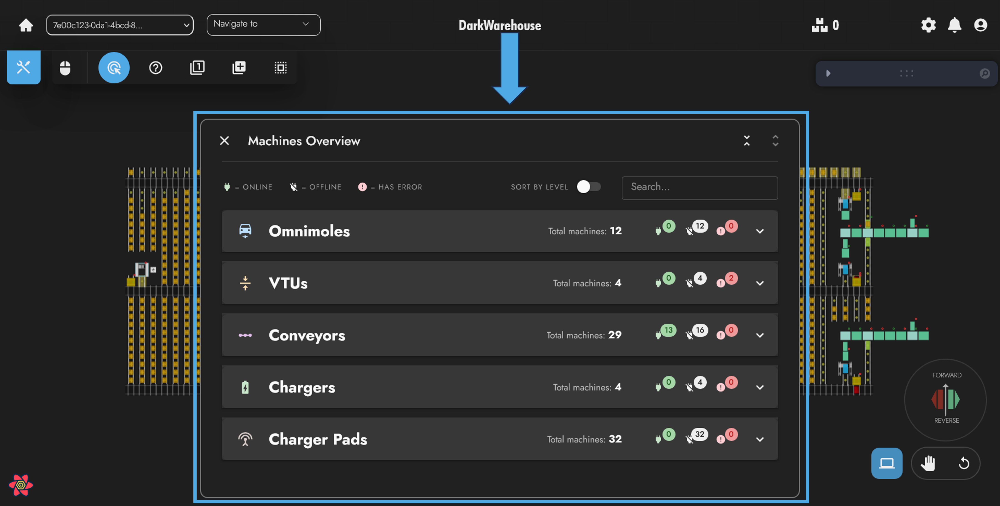
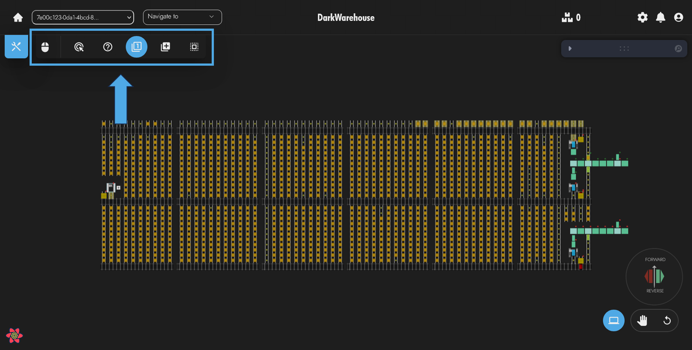
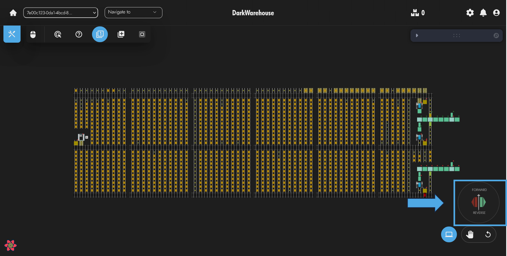
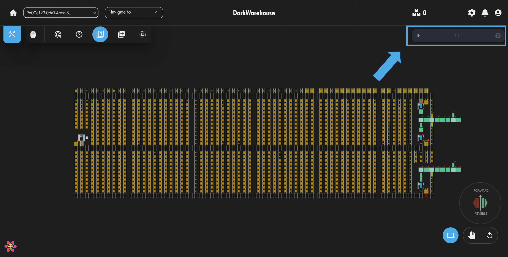
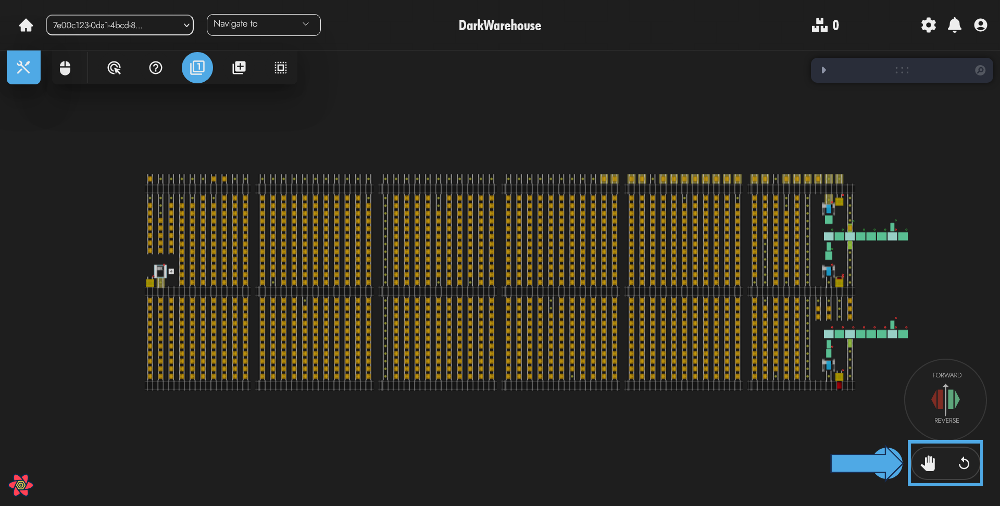

# Management System View

This page provides an overview of the basic layout of the management system view 🖥️.
It will guide you through the basic tools 🛠️ available for managing the system.
This is essential for gaining a broad overview 🌍 and understanding of what's going on within the AS/RS system 📊.

Continue reading 📖 to learn more about the basics 🚀 and where, as a system operator 👩‍💼👨‍💼, you can find the tools available to you 🧰.

## Toolbar

The toolbar is available through the toolbar icon in the top left of the screen. When clicked, it expands the toolbar menu, this can be expanded and retracted at any time.

The toolbar exposes basic functionality of the management system in an easy-to-access location.

Some of the basic functionality offered by the toolbar includes:

- Navigation 🧭
  - Navigating to a higher level of the system (useful for multi-level systems) ⬆️
  - Navigating to a lower level of the system ⬇️
  - Navigating to different areas (useful for systems split up into multiple sections) 🔀
  - Enabling "high fidelity" mode on the store. This adjusts the manner in which the system is displayed and is suitable for computers with dedicated graphical processors 🖥️🎮, as it comes with additional graphical performance costs.

- View Setup 👀
  - Allows the operator to enable or disable the system in different view modes. Namely:
    - TMS (Traffic Management) -> This is useful when the operator would like to see and gain an understanding of ongoing machine movements 🚦.
    - WMS (Warehouse Management) -> This is useful when the operator would like to gain an understanding of how certain products and batches have been distributed within the system 📦.
- Manage Traffic 🚧
  - Pallets 📌
    - Allows the operator to add or remove pallets from the system

    > NOTE: this does not physically change the location of the pallet within the store, it merely updates the server data as to where a pallet is located 📊.
    
    - View pallets outside the system -> This allows the operator to view pallets that have data within the system but are not yet located within the racking structure 🏗️.
- TMS Tasks 📝
  - Access to the task queue -> The list of ongoing operations within the store 📋.
  - Creation of multiple task types:
    - General pallet movements ↔️
    - Multi pallet movements 🔄
    - Machine movements 🚜
    - Machine state inquiries 🔍
- Machines 🤖
  - Allows the operator to update machine locations and remove the machines from the system
  
  > NOTE: this does not physically change the location of the machine within the store, it merely updates the server data as to where a machine is located. It is recommended to send the machine a live status inquiry message whenever updating machine location 📡.
  
- TMS Locks 🔒
  - Allows the operator to lock and unlock locations within the store.
- Static Data 📊
  - Zones 🌐
    - Allows the operators to create new zones and view zones that have been created (this functionality is still in active development) 🚧.

## Machines Drawer

The machines drawer is a component used to monitor the state of the fleet in the system. In order to acces this component the operator can click on the icon in the bottom right of the screen.

Through the machines drawer the operator can quickly get an idea of the ongoing machine operations within the system as well as the various states the machines are in.
This drawer assists the operator in quickly identifying machines in error states, machine battery charge levels and operational modes, last read level for various machines, can move pallet states for various machines, and more. 

## Cursors

The cursors component illustrates which cursor type is currently active for the operator. This component is available in the top left of the screen adjacent to the toolbar icon.

Different cursor types are suitable for interacting with the system in different ways.
The following list illustrates the cursor types that exist as well as outlines basic use cases for each.

-   Default
    -   The basic cursor action, set by default. Useful when the operator isn't interacting with the canvas or any of it's elements in an operational manner.
-   More info
    -   This more info cursor is useful when the operator is attempting to gain more information about a particular entity.
-   Single select
    -   Useful when the operator is selecting a single entity. (Like selecting a machine for a task)
-   Multiple select
    -   Useful when the operator is selecting multiple entities. (Like locations for a zone, or locations to be locked.)
    -   This can be activated by the operator by holding down the `Ctrl` key and selecting entities.
-   Box Select
    -  Useful when the operator is selectig a very large number of location elements at once. 
    -  This can be activated by the operator by holding down the `Shift` key and dragging the block around the entities they wish to select. 

## Context Menus

The context menus expose additional functionality on the management system view and can be triggered through the use of the right mouse button 🖱️.  

Depending on the functionality the operator would like to use, they can either right-click somewhere on the canvas where no entities exist🚫, or alternatively, can right-click on one of the various entities populating the canvas (pallets 📦, machines 🤖, etc.).

### Canvas Context Menu

The canvas context menu is the menu that pops up if the operator right clicks anywhere on the canvas. The purpose of this context menu is to expose the most utilized functionality available in the systems view.

Some of the functionality available through the canvas context menu:
- Change level
- Referesh data
- Toggle pan, zoom, and rotate
- Toggle high fidelity
- Toggle TMS/WMS configuration
- Create tasks
- Create zones 
- View zones
- View external pallets 

### Pallet Context Menu

The pallet context menu appears when the operator right clicks on a pallet in the systems view and exposes operations and functionality specifically related to pallets. 

Some of the functionality available through the pallet context menu: 
- Delete pallet
- Update pallet location
- Create pallet movement operation
- Creat multi-pallet movement operation
- Find similar pallets (product/batch/barcode)

### Machine Context Menu

The machines context menu appears when the operator right clicks on one of the several machine types available throughout the systems view such as the OmniMole, the VTU, the conveyor, the chargers, and the charge pads.

Some of the functionality available through the machine context menu:
- Toggle online/offline
- Emergency stop
- Live status request
- Toggle pallet movement setting
- Send to available charger
- Change mode (auto/manual)
- Various reset functions 
- Update machine location (in data)
- Find available destinations
- Create machine tasks

### Location Context Menu

The locations context menu is avaialble to the operator upon right clicking on one of the location entities. This context menu exposes the functionality related to locations such as aisles, lanes, and vtu-lanes.

Some of the functionality available through the locations context menu:
- Lock or unlock location
- Assign to TMS zone
- Assign to WMS zone
- Create special location
- Create pallet
- Set as destination for task

## Compass

The compass 🧭 is used primarily for indicating the orientation of the system to the operator.

The arrow ⬆️ indicates the forward and reverse ⬇️ directions with respect to the travel direction of the machines within the system.
Furthermore, the compass illustrates the aisle green travel direction 🟢 and the aisle red travel direction 🔴.  

Within the physical system, each machine has built-in lights indicating the green 🟢 and red 🔴 direction, and that's what these compass directions are in reference to.

## Canvas Controls

The canvas controls are a set of controls that don't affect the operations within the system but can be adjusted by the operator in order to customize the appearance of the system view.

The operator can:
- set various helpers and entities to a visible 👀 or hidden 🚫 state.
- change the colors 🎨 of various entities within the scene as well as the background of the scene.
- update certain camera 📷 controls.

## Camera Controls

The camera controls are available through a selection of icons at the bottom right of the screen. 
These controls allow the operator to engage the system in demo mode (for high fidelity mode) which pans the camera to various points of interest within the system. The operator can also reset the system camera setup through these controls.

