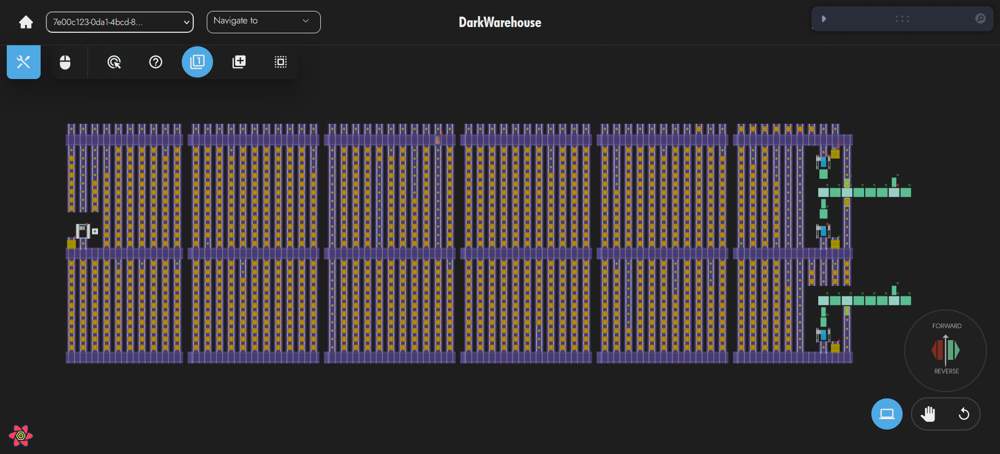
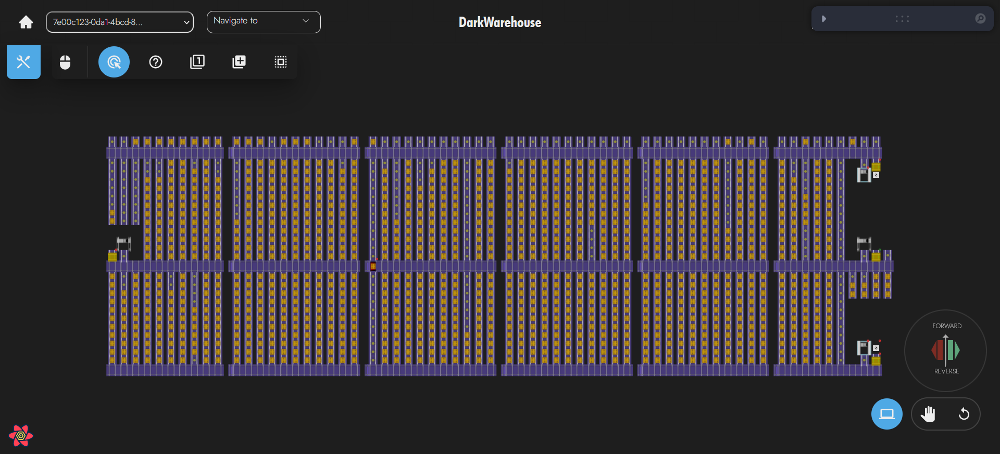
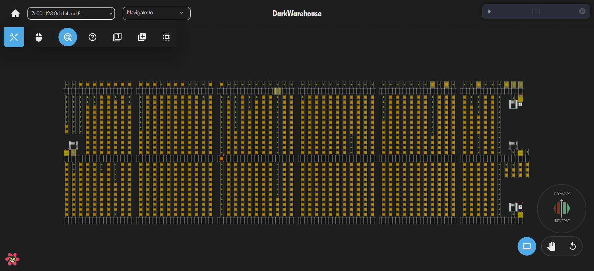
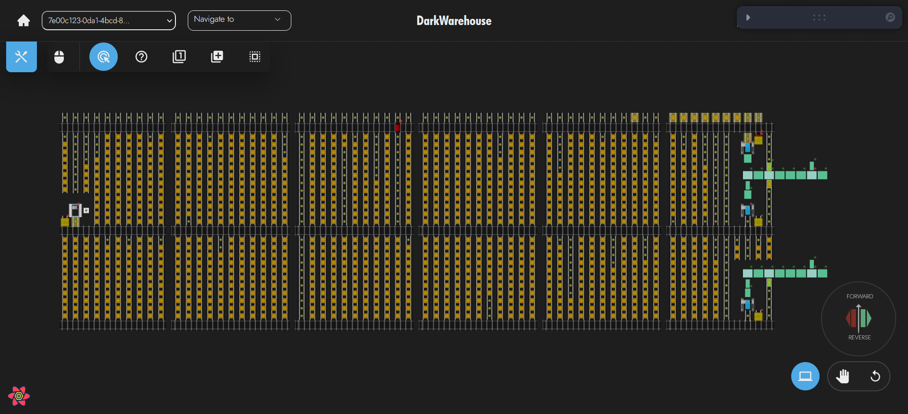

# Strategic Zoning of Omni-Moles

This page provides an overview of TMS Strategic Zoning for Omni-Moles. This uses zones to optimise the system and reduce unnecessary movements in the system.

## Free Roaming🏞️

The Free Roaming Strategy allows Omni-Moles to move throughout the store. The effect is that Omni-Moles will take pallets to a VTU and travel through the VTU with the pallet, then leave and deposit the pallet. This leads to only one Omni-Mole to be used for the task.

### Benefits👍

- Since all Omni-Moles share a zone, one Omni-Mole failing cannot not block out an entire level of the store. This reduces the number of points of failure in the system.
- By having the Omni-Mole travel with the pallet up a VTU it allows the pallet to be immidiately take out of the VTU. This reduces the time the VTU us used by a task.
- Can have Omni-Moles covering multiple levels, so a system can have less Omni-Moles than levels.
- Retrieve/Deposit interlocks are slower than Drive-In/Drive-Out interlocks

### Disadvantages👎

- Omni-Moles may need to often travel through VTUs without pallets on the way to retrieve a pallet. This will add to how often a VTU is used.
- Having too many Omni-Moles in the same zone at once can cause congestion leading to slower task times.

### When To Use👍

- There are fewer Omni-Moles in the system than levels
- When concerned about Omni-Moles failing and causing an entire level becoming inaccessable
- When there are few VTUs in the system, using this strategy reduces the amount of time they are used.

### When Not To Use👎

- When there are enough Omni-Moles in the system to have multiple on every level. Using this strategy would lead to congestion and none of the benefits.

### Identify When Setup🔍

The Free Roaming Strategy can be identified when Omni-Moles have no zones or have a zone spanning the entire system.

### How To Setup❓

This can be setup in two ways.

1) Remove the Omni-Mole from all zones, this will allow it to move throughout the store.
2) Put the Omni-Mole in a zone encompassing multiple levels of store.

The first option is the easiest to setup but unlike the second it does not allow for certain levels to be excluded or certain locations.

An example of the setup for the second is below:
Level 1           |  Level 2
:-------------------------:|:-------------------------:
  |  

Both level 1 and level 2 are inside the zone allowing the Omni-Mole to move between them.

## Hand-Off🤝

The Hand-Off Strategy limits Omni-Moles to a single level. The effect is that an Omni-Mole will take a pallet to a VTU and deposit it into the VTU, then another Omni-Mole will retrieve the pallet from the VTU on a different level and deposit the pallet.

### Benefits👍

- Fewer Omni-Moles will be on the same level causing a reduction in congestion.
- Omni-Moles will not need to travel down VTUs when retrieving pallets, this reduces the how often VTUs are used

### Disadvantages👎

- Pallets on VTUs will need to wait for another Omni-Mole to fetch the pallet. This leads to VTUs being used by a single task for longer periods of time
- If one Omni-Mole fails it can lead to an entire level becoming inaccessable unless there is another Omni-Mole on that level
- If most movement occur between two levels, some Omni-Moles may not be performing any tasks
- Retrieve/Deposit interlocks are slower than Drive-In/Drive-Out interlocks

### When To Use👍

- There are more Omni-Moles in the system than levels (Preferably at least two per level)
- When concerned about interlocks failing since fewer interlocks are invloved in a hand-off
- When there are lots of VTUs in a system

### When Not To Use👎

- When only one Omni-Mole can be on a level causing a single point of failure

### Identify When Setup🔍

If Omni-Moles are in zones consisting of a single level and a VTU shaft

### How To Setup❓

An example of the setup for two Omni-Moles is below:

#### Omni-Mole 1
Level 1           |  Level 2
:-------------------------:|:-------------------------:
  |  

Level 1 and the vtu lanes on level 2 are inside the zone

#### Omni-Mole 2
Level 1           |  Level 2
:-------------------------:|:-------------------------:
  |  

Level 2 and the vtu lanes on level 1 are inside the zone 

This setup allows one Omni-Mole to deposit in the VTU and another to retrieve on a different level.
