# WMS Special Locations
WMS Special Locations are unique locations in the Dark Warehouse system, this is a quick guide that will help you understand WMS Special Locations as well as how to manage them:clipboard:. There is a number of WMS Special Location Types that can be found in the system which are described below.

## WMS Special Location Types :pushpin:

- **No Type** - This is a none specified wms special location type and can be used to set the location to be unspecified by other types:no_entry_sign:.
- **Inbound** - Inbound locations are created for pallets to be scanned into the system:arrow_left:, the **Inbound Only Type** indicates that the selected location can only scan in pallets.

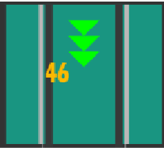.

- **Outbound** - The opposite to an Inbound type the Outbound type is used to take out a scanned out pallet:arrow_right:, when the lane location is set to the **Outbound Only Type** it is restricted to scanning out pallets.

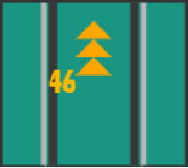.

- **Shuffle Position** - This wms special location type allows the selected location to execute a pallet shuffle task and is very useful for multiple pallets:repeat:.
- **Reject Outlet** - This specifies a special location where rejected pallets can be placed:put_litter_in_its_place:.

## Managing WMS Special Locations :earth_africa:
In order to create WMS Special Location, the user needs to navigate to the tool bar button found on the left side of the screen. This will open the tool bar menu.

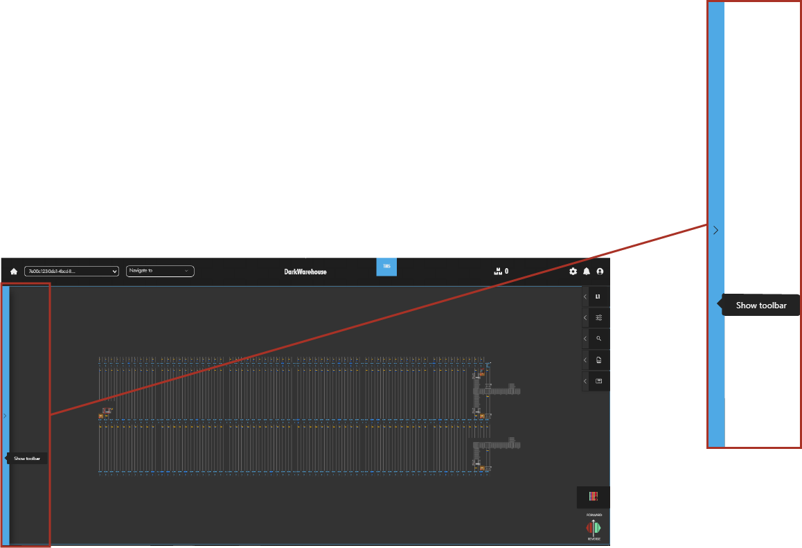.

### Tool Bar :hammer:

Once the **Tool Bar** is open:open_file_folder:, find and click the location button to expand your options.

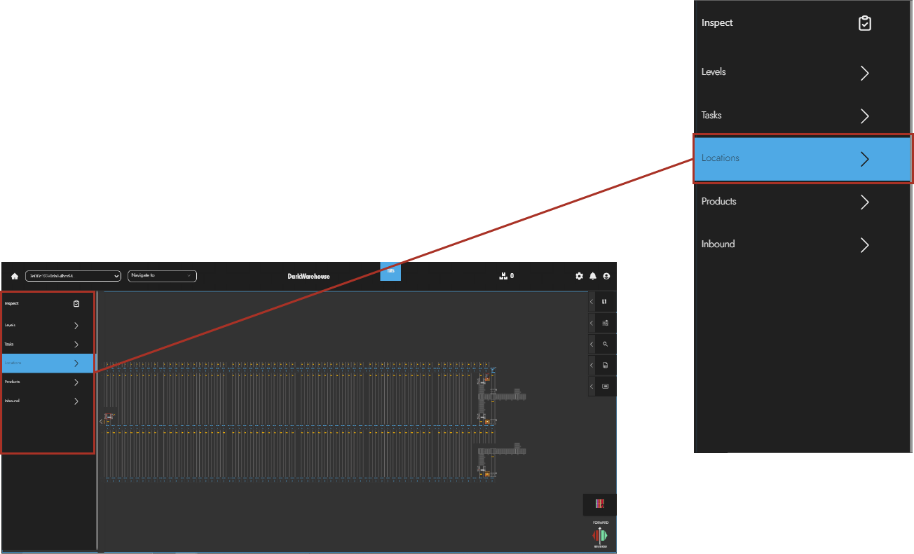.

### Location Menu :page_facing_up:

This menu allows user to customize specified locations:wrench:. Click the **Special Location** button to navigate to the `Special Locations Panel`🎯.

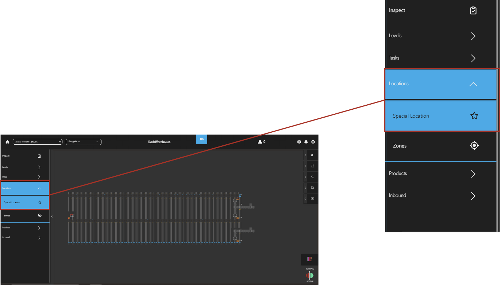.

### Special Location Panel :clipboard:

The `Special Locations Panel` is the main component used to manage special locations. It allows users to define their own special location by simply providing the required parameters:black_nib:.

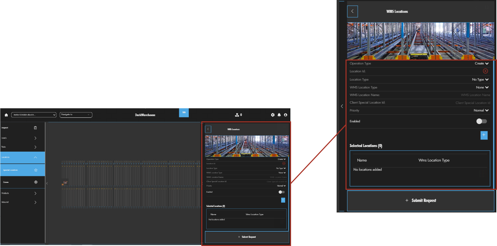.

### Manage Special Location :necktie:

Users can also chose to Create, Update or Delete special locations by selecting their operation action in the **Operation Type** drop menu:passport_control:.

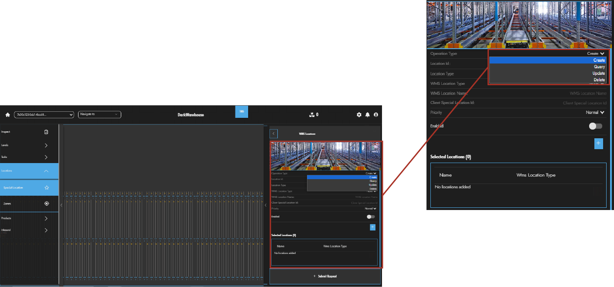.

### Select Location :sparkles:

After having selected the **Operation Type**, double click the intended location in order to provide the location Id:id:.

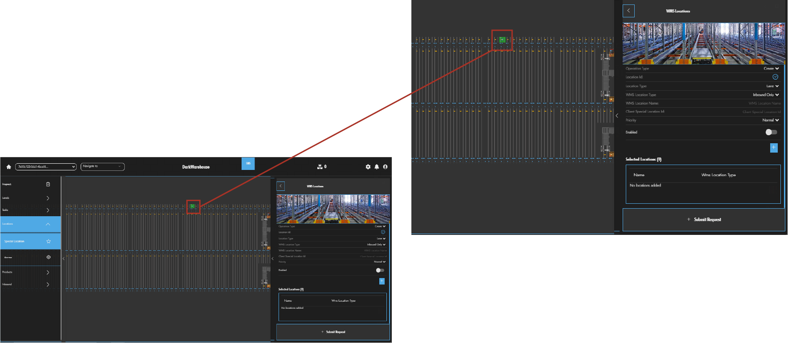.

### Submit Special Location Request :white_check_mark:

Simply enter the required information and populate the selected location by clicking the **plus** button:heavy_plus_sign:. Click **Submit Request** to complete the special location request:heavy_check_mark:.

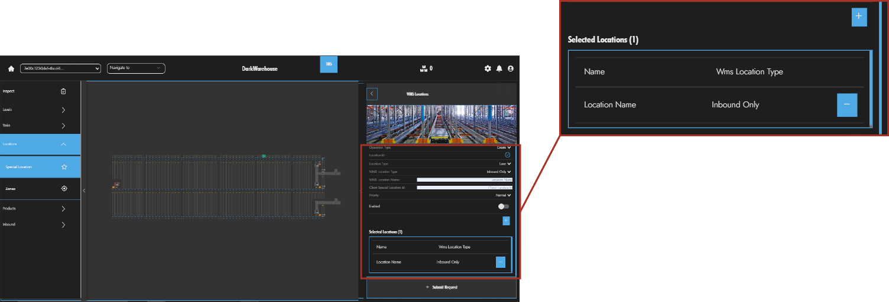.

### Special Location Request Completed :bell:

Upon completion the user is notified of the request completion:confetti_ball:!

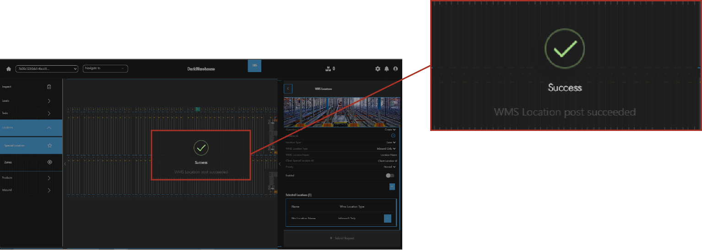.

### Quick Special Location Request:zap:

A quick shortcut to a special location request is to select and then right click on a lane location:computer_mouse:. Click the lane tab to extend your options.

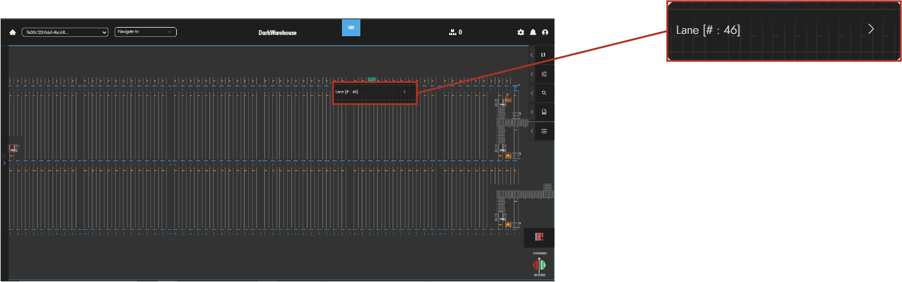.

#### 1. Navigate To Quick Special Locations

Once open, search and click the **Quick Special Locations** drop down menu to manage your selected location:mag:.

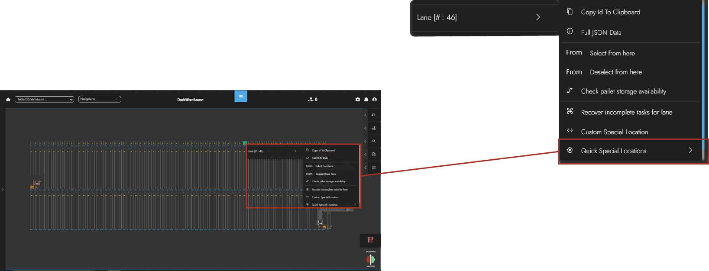.

#### 2. Manage Quick Special Location

This will provide the user with a shortcut to manage their special locations. Click on the desired special location type and you're done:tada:!

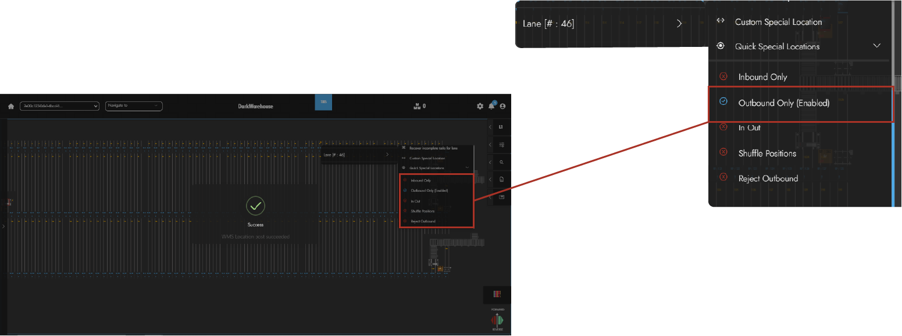.

#### 3. Delete Quick Special Location

Easily delete a special location by just finding and clicking the special location you would like to remove🗑️.

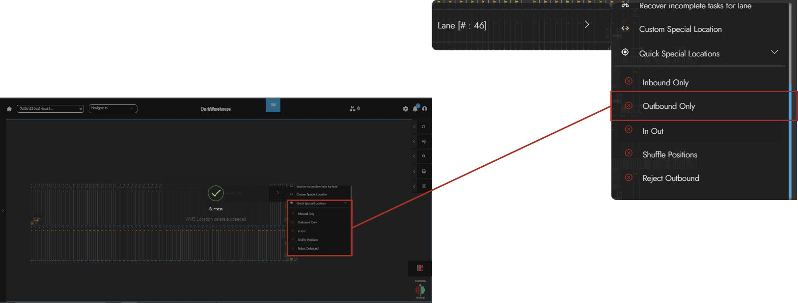.

Congradulations:star:! You have just learnt how to manage your WMS Special Locations:mortar_board:!