# The Omni-Mole Fleet
This section deals with the basic management of the fleet for a given instance. The management includes the creation of machines, deletion, and - of course - the updating of machine static data (excluding a machine's placement location). 🛠️

:::tip
The __fleet__ comprises all of the pallet transport machines in the system and includes the Omni-Moles and Vtus. 🌐
:::

## Omni-Moles 🤖

Managing the Omni-Mole fleet involves the operations related to creating, deleting, and updating Omni-Mole static data. 🔄

:::note
__Static data__ is the data, as the name suggests, that is not dependent on the machine's state and remains consistent such as the machine's VLP address. 📊
:::

These operations are seldom required as machines are rarely added or removed from systems. They are, however, still important to consider as instances may occur when it's required of the operator to update the Omni-Mole's location data manually so that it accurately reflects where the physical machine is. This can happen when machines are removed from the system for routine maintenance or similar operations. 🔧

### Create 🛠️

The purpose of creating an Omni-Mole is to create new data in the database corresponding to a newly introduced physical machine. Another reason for creating an Omni-Mole could be for the purpose of emulating a system with N machines. 🌟

Regardless of the reason, creating an Omni-Mole involves the following steps.

1. Once on the TMS view, the operator can open the tools menu location on the left-hand side of the screen by clicking on the retractable drawer.

2. With the drawer open the operator can open the create menu for the current system. 

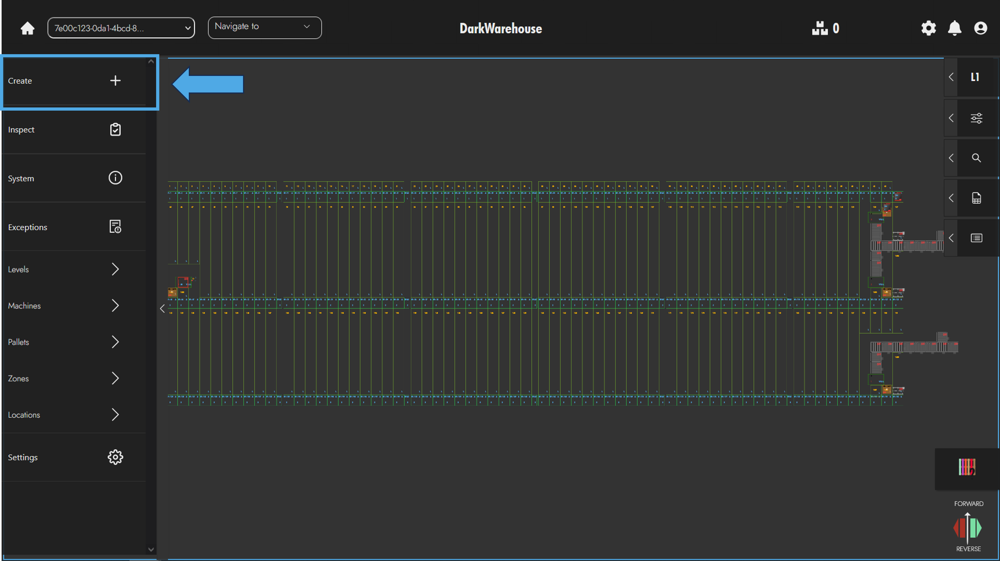

3. With the create menu open, the operator can then open the __Machine__ specific create menu by selecting the appropriate window.

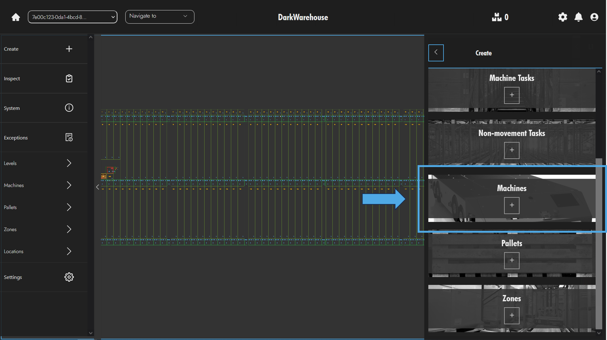

4. From here, the operator is required to populate the machine data and to select a location for the machine. Depending on the machine type the operator has selected the operator can click on various location entities in order to place the machine into the system.  The location can be selected by double clicking on any location position on the canvas (apart from Vtu Lanes in the case of Omni-Moles). The location can be updated later so it's not imperative that the location is the current position of the machine although it does help.

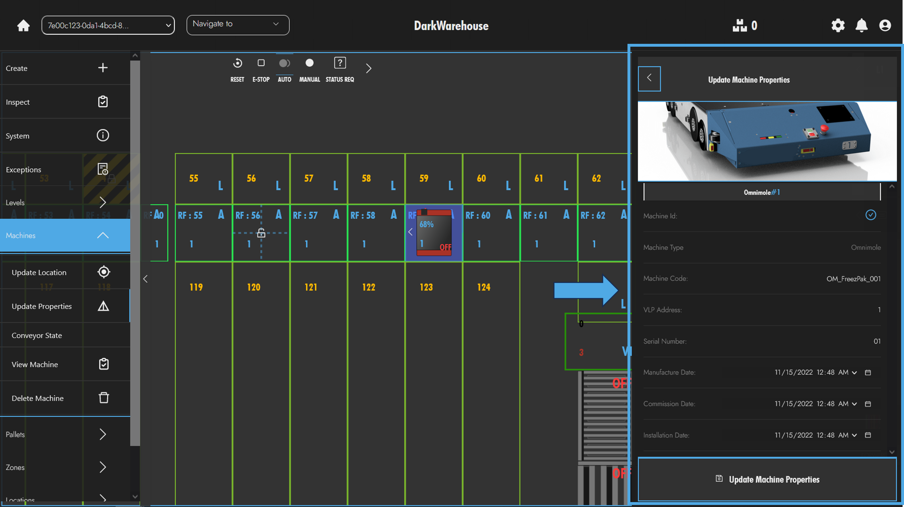
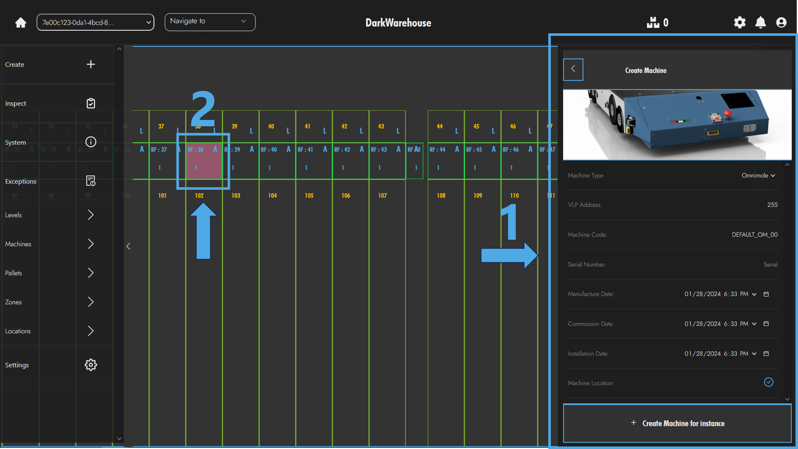

5. Once a location has been selected the operator can go ahead and click the create machine button at the bottom of the create machine menu. If all the inputs have been correctly populated the machine should appear and the create operation has been successful. ✔️

### Edit ✏️

The process for updating a machine's static data follows.

1. Firstly, the operator should select the machine they wish to update the properties of by double clicking that machine on the canvas.

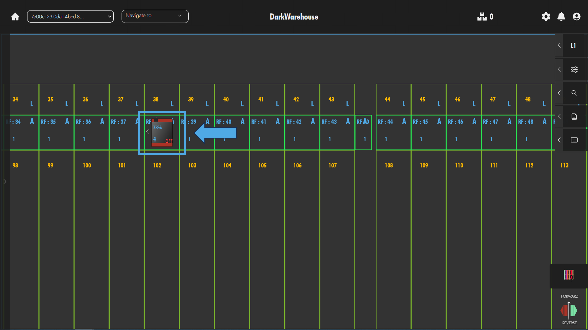

1. Next, the operator should open the tools menu on the left-hand side of the TMS view.

3. Once opened, the operator would then expand the machines subsection on the tools menu. 

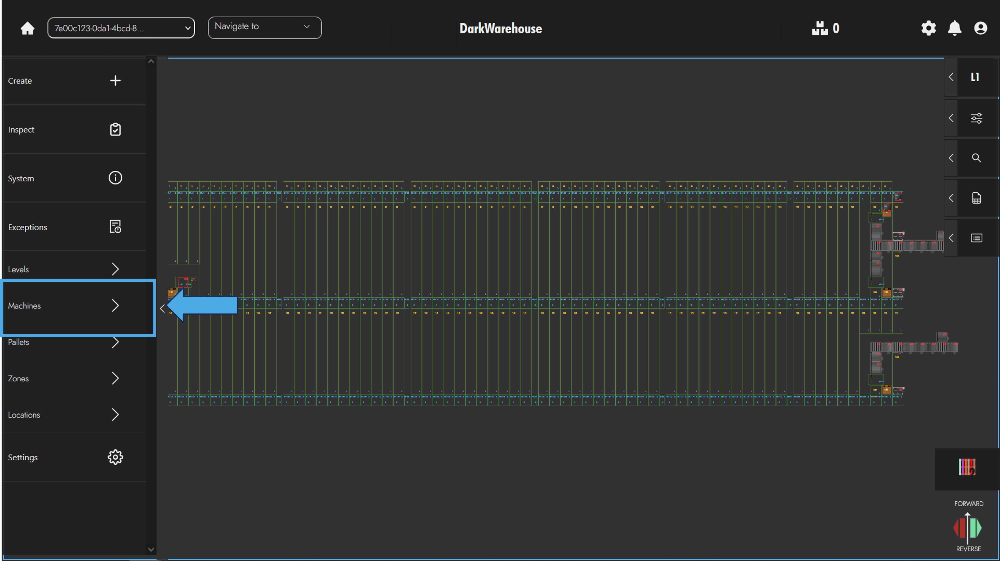

4. In the machine subsection in the tools menu, the operator can then click the `Update Properties` option. The update properties menu will open  on the right-hand side of the screen.   

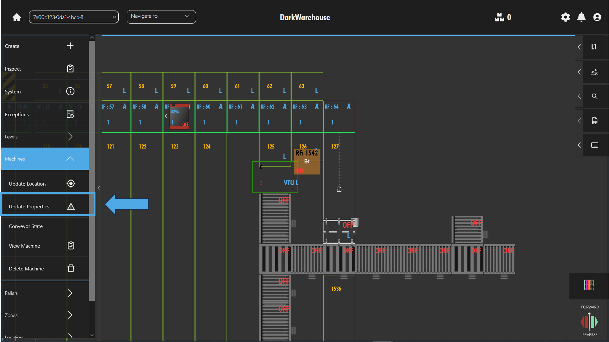

:::note

If the operator has not selected a machine, a modal will appear to indicate this information to the operator.

:::

5. The operator can now update any properties they so desire and complete the operation by clicking on `Update Machine Properties`.

An alternate method to updating machine properties that involves fewer steps is illustrated below.

1. The operator can locate the machine they wish to update and simply right click on the machine to open the relevant context menu. With the context menu open, the operator can select `Update Properties` in order to quickly access the update properties menu.

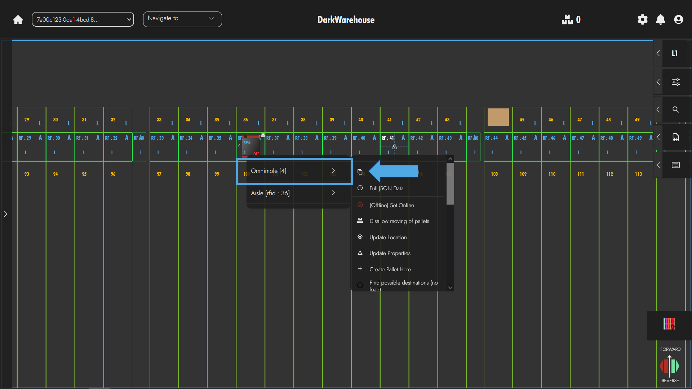

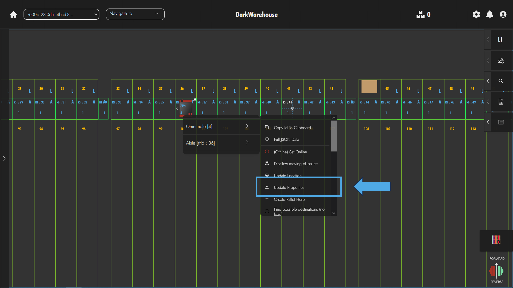

### Delete 🗑️

On very few occasions, the need may arise to delete Omni-Moles from the system. It should be noted that the operation is irreversible, however a machine can just as easily be created if necessary. 

In order to delete an Omni-Mole from the system, the operator can complete the following steps.
1. Firstly, select the machine by double clicking it on the map.

2. Once a machine has been selected the operator can open the tools menu on the left-hand side of the screen.  

3. With the toolbar open on the left-hand side of the screen, the operator can expand the machine subsection of the menu

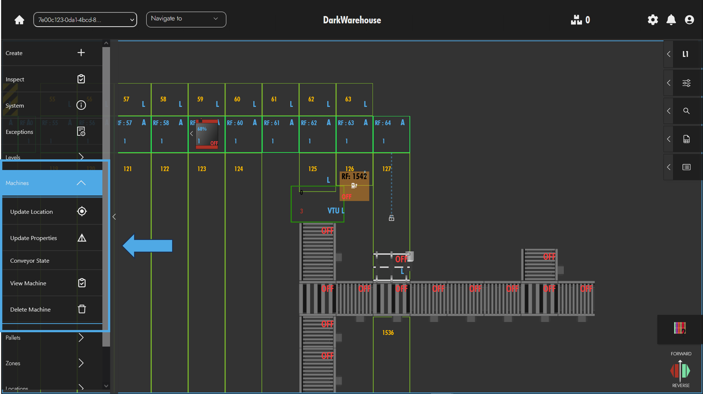

4. Within the machine subsection the operator can click the `Delete Machine` option. This will trigger a confirmation modal to pop up to allow the user to opt out should they change their mind. To proceed the operator can click `Confirm Delete` and the selected machine will be deleted from the system.

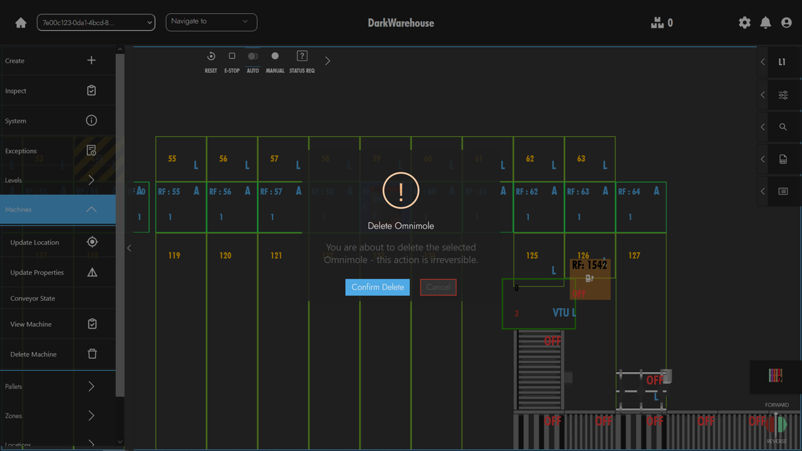
 