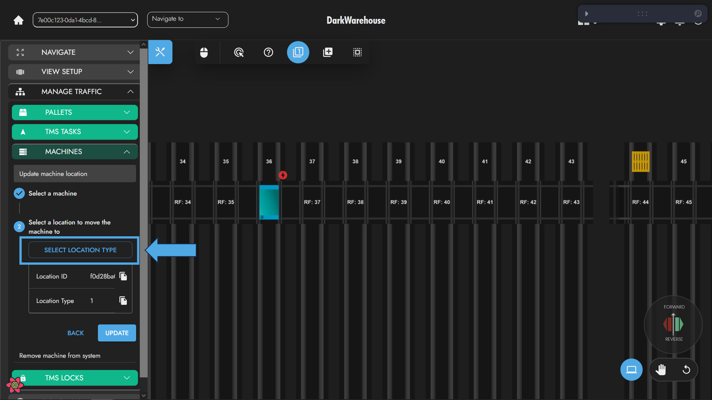

# Update Location
The Omni-Mole location can be updated for any number of reasons. 

:::warning

Updating the Omni-Mole location in the system will not result in the physical machine's location updating in real life. 🌐 In order to do this, the operator would need to create a __Machine Task__. 📝 Updating the Omni-Mole location will result in the data stored within the database being updated to reflect the operator's changes. 💾

:::

In order to update the Omni-Mole's location, the operator can follow these steps:

1. If the operator wishes to relocate the Omni-Mole within the system, they should select the location they wish to move the machine to. 📍

:::tip

Ensure the __cursor__ is in `Select Singular` mode. ✅

:::

2. Locate the machine within the system that you wish to update the location for. 🔍

3. Right-click on the machine once it's been located. This will trigger the context menu to appear. 🖱️

4. Select `Update Location` in the context menu. 📌

5. At this point, the user can either update the machine to a specified location, or to be 'Outside the system'. If the user opts for the latter, step 1 can be safely ignored. 🌐
   

                                                   
An alternative method to complete the same task, depending on what the operator prefers:

1. Open the tools menu on the left-hand side of the screen. 🧰

2. Select `Manage Traffic` and then `Machines`. 🚦

3. Select `Update Machine Location` from the options available. 🔄

4. Follow the steps presented by the form:

   1. Select a machine. This can be done either by opening the machine table using the `Select Machine` button or by clicking the machine on the canvas. 🖼️

    
    

   2. Select a valid location following the same process as step one. Remember, Omni-Moles can only be updated to Lanes, Vtus, and Aisles. 🗺️

    
    

5. Complete the process by clicking the `Update` button. ✅

:::note
Machines cannot be updated to locations where other machines are present. 
:::