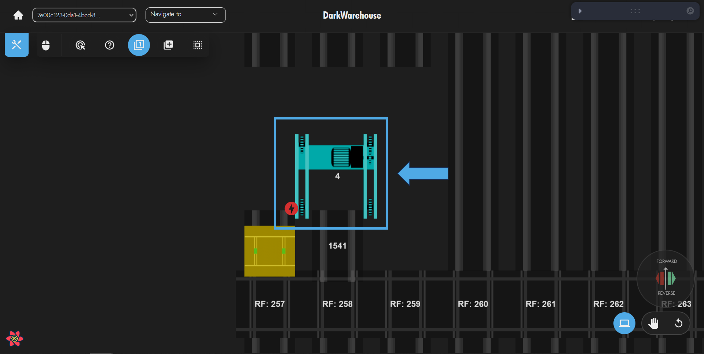
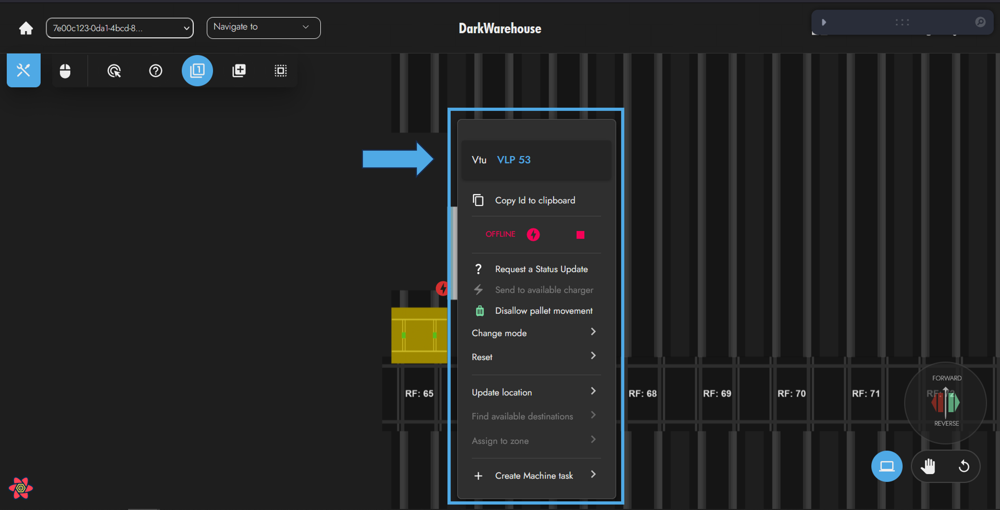
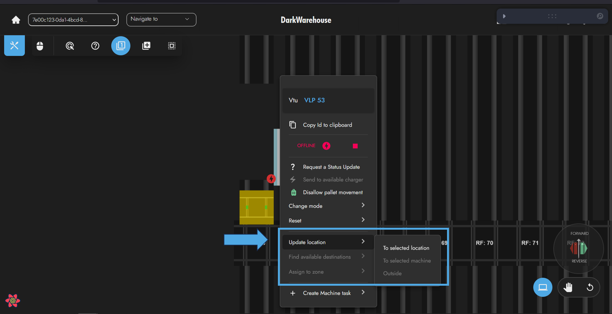
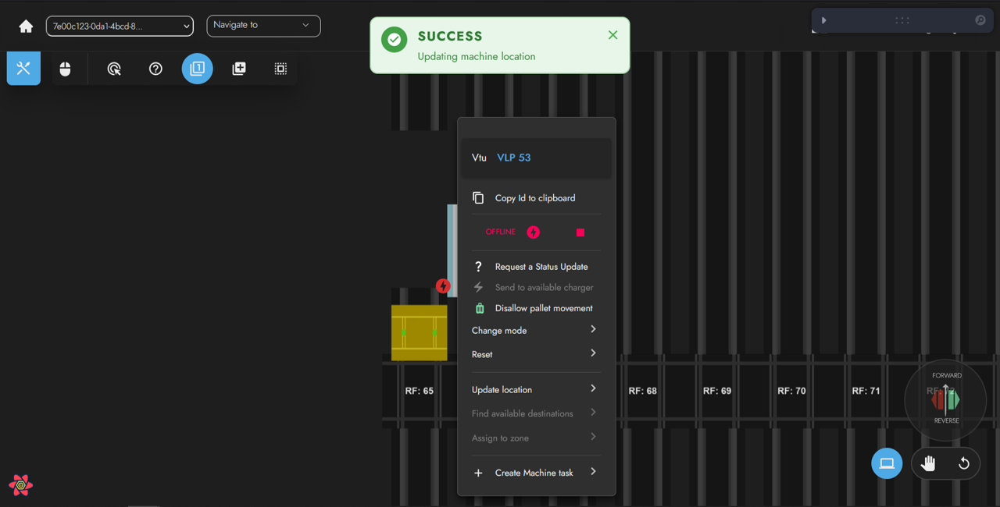

# Manually Change Level
The Vtu location update can also occur for any number of reasons, and as stated previously, updating the location for a Vtu will **not** result in the physical machine location being updated. 🔄

In order to update the location for a particular Vtu, the operator can follow the same steps as they would for that of an Omni-Mole. 📊
For example:

1. If the operator wishes to relocate the Vtu within the system, they should select the location they wish to move the machine to. 📍

:::note

A Vtu can only be updated to Vtu Lanes. This implies a Vtu can be relocated to another Vtu lift shaft, but it is inadvisable to do so.

:::

2. Right-click on the Vtu that is to be relocated. 🖱️

3. Select `Update Location` from the options available. 📌

4. At this point, again, the user can opt with whichever location update procedure is applicable. 🔄

