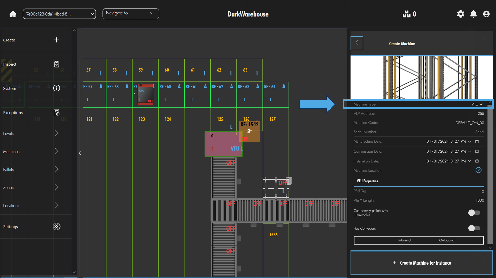
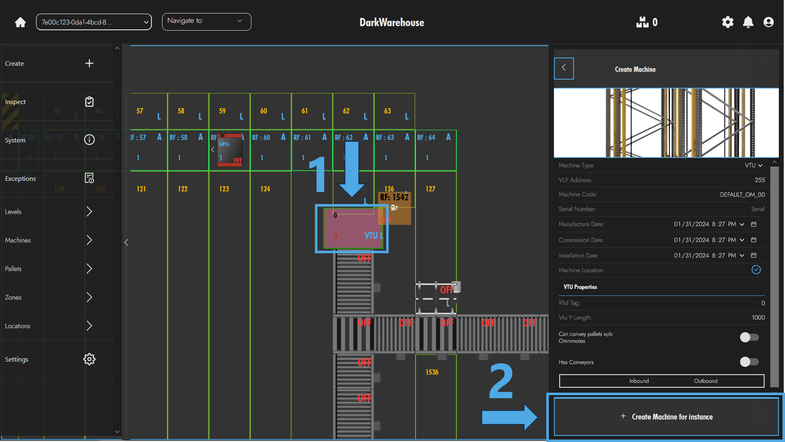
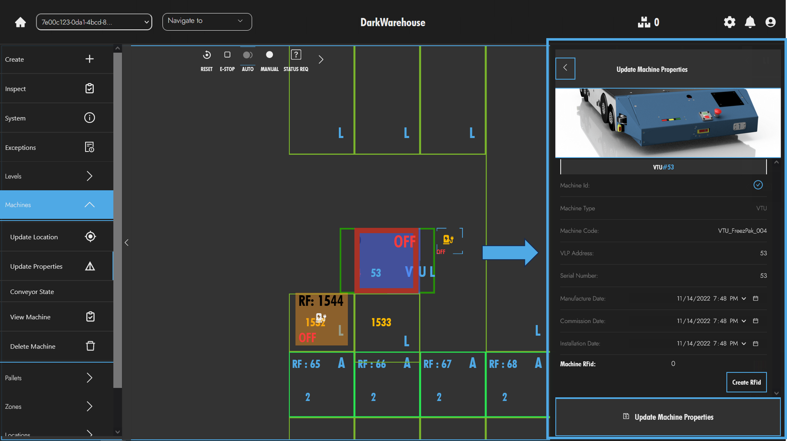
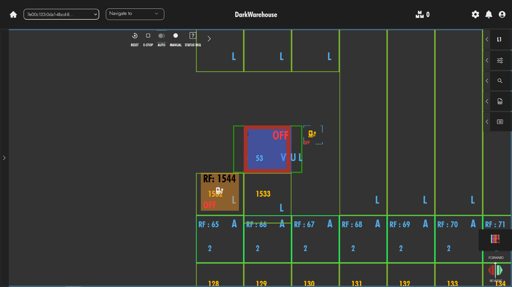
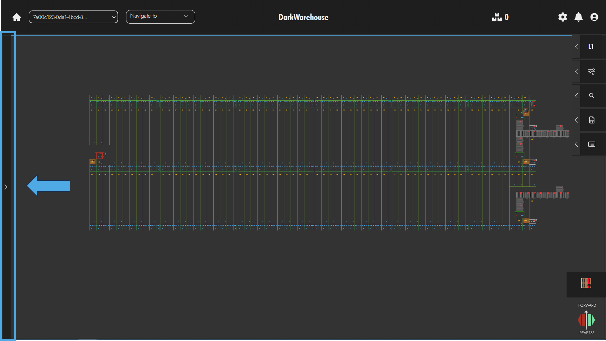
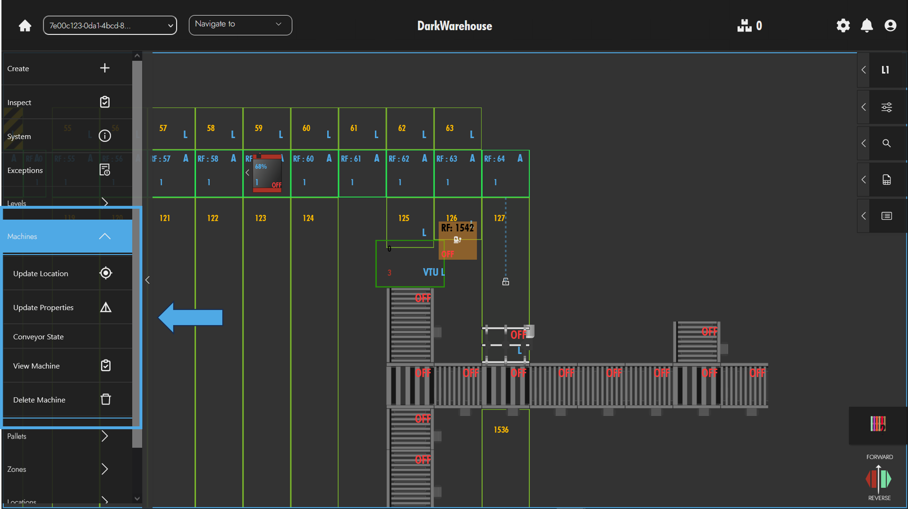
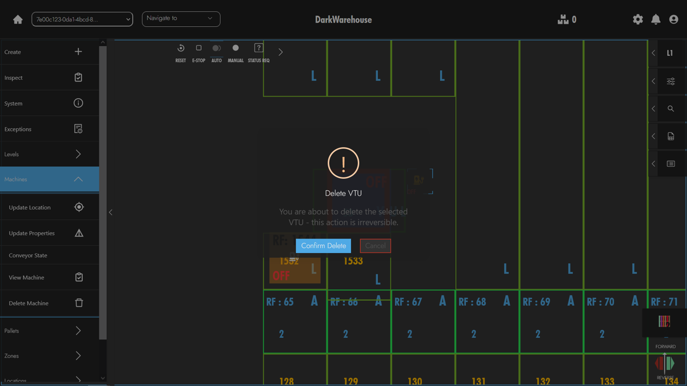

# The VTU Fleet
As with managing the Omni-Mole fleet, managing the Vtu fleet involves the operations related to creating, deleting, and updating Vtu static data. For the most part, conducting these operations for the Vtus is **the same as** conducting the equivalent operation for Omni-Moles. 🔄

### Create 🛠️

Creating a Vtu in the database is necessary on few occasions. The process follows.

The operator can follow the steps illustrated above in order to open the create machines menu. 

1. Once the machines view is open the operator can select __Vtu__ from the machines dropdown. 

2. After the Vtu has been selected for the machine creation operation an additional section will appear at the bottom of the form. Here, the operator will need to specify additional settings for the Vtu such as the Rfid Tag, the Vtu's length, etc.

:::tip
Vtus can only be placed on Vtu-Lanes (as opposed to Aisles, and Lanes.)
:::

3. When the form has been populated as desired the operator can complete the process by clicking `Create Machine`. ✔️

### Edit ✏️

The process for editing the static properties of the Vtu is effectively the same process as that of the edit for the Omni-Mole.

The only difference is that the operator can opt to `Create Rfid` as a separate process. 

### Delete 🗑️

The delete process for the Vtu is identical to that of the Omni-Mole - with the only variation being that user should select a Vtu instead of an Omni-Mole.

1. Select a Vtu by double clicking the entity on the canvas.

2. Open the tools menu on the left hand side of the viewport.

3. Expand the machines submenu.

4. Click on the `Delete Machine` option and confirm whether or not the Vtu should be deleted. 

