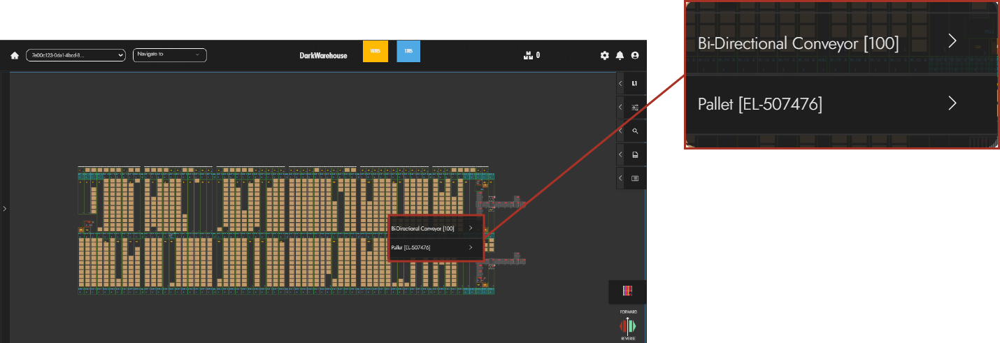
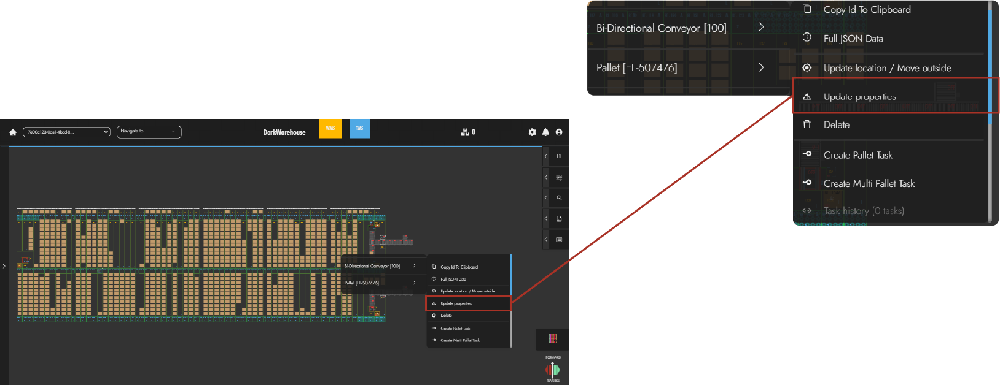
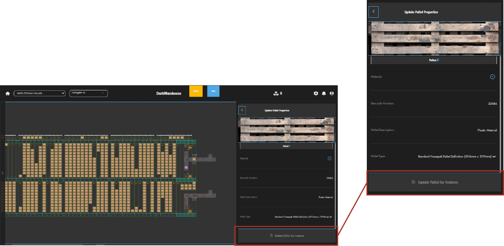

# Interacting with Conveyors

Conveyors can be a very crucial part in processing inbound pallet orders, this is a guide that illustrates how users can interact with conveyors. The following steps will help users gain a better understanding of conveyors as well as how to execute and monitor conveyor tasks effectively✍️.

## Creating Conveyor Tasks

Conveyors exclusively support pallet tasks and no movement tasks, while they do not accommodate generic tasks or multi-pallet tasks. Creating a conveyor task is a simple method that user can perform, with these easy instructions🔽:

### Select Conveyor To Create Task

The user can select the conveyor which they would like to create a task for and right-click on the selected conveyor🖱️.

### Creating A Pallet Task

Creating a Pallet Task is a basic function that can be performed by users supplying the system with information that will help identify and describe the pallet📦. The following is the information required in order to create a pallet task.

:::note
Once a pallet has been created, users can perform a `Pallet Task` by right-clicking on the created pallet and expand the `Pallet` options then click on [Create Pallet Task](/docs/07-Pallets/Creating%20And%20Moving%20Pallets.md)✨.
:::

#### Provide Pallet Barcode

Users can then provide the pallet barcode, which will also be used to identity the pallet within the Darkwarehouse system📛. Once this field has been provided the user can then proceed.

#### Pallet Type

Using the `Pallet Type` dropdown menu, the user can then select thier intended Pallet Definition. This indicates the pallet's dimension measurements, which is useful for pallet storage allocation📍.

#### Placement Location 📌

Once the pallet information has been provided, the `Placement Location` is the final step in creating the pallet task. This placement location is selected as the conveyor location in which the user would like to create the pallet and the task is done✔️.

### Updating A Pallet

Upon creation, users can then `Update Pallets` by simply right clicking on the pallet they would like to update🔄.

#### Navigate To Update Properties

Expand the Pallet options and navigate and click on `Update Properties`🗃️.

#### Update Pallet Properties

The user can now edit and change the pallet details they desire🖋️. Once the pallet data has been updated the user can click done to complete the pallet update.

## Conveyor Status Check

A status check can be known as the basic feedback a user can request from a machine, which will then provide the Dark Warehouse system with machine's current status📡. This status request can be performed in the following user-friendly manner. When a status check is initiated for a conveyor station, the system awaits and listens for a response👂. If the conveyor fails to reply, its status is marked as unknown, prompting the TMS to switch it offline.

### Select Conveyor

Select and right-click the conveyor which requires a status check. Navigate and click on the `Live Status Req` option, done👍.

## Reset Conveyors Errors

To clear the errors on the conveyor, the user can then use the `Reset Errors` method found in the conveyor by right-clicking on the conveyor. Navigate to the expanded options and click `Reset Errors` to complete the reset♻️.

## Reset Conveyor Runtime Parameters

 Runtime parameters refer to dynamic data that is relevant to the current operation of a system or process📄. This includes information about ongoing tasks, such as which pallet is being processed or which task is currently being executed. The user can also `Reset Runtime Parameters` function by right-clicking on the conveyor and click on the `Reset Runtime Parameters` option 👨‍💻. Which will remove all runtime parameters.

## Reset Conveyor Interlocks 🔒

To [Reset Interlock](../Interlocks), is to clear the interlock tasks that have been created. This is easily done by right-clicking the conveyor, navigate and click on the [Reset Interlock](../Interlocks) option🔗.

## Changing Conveyor Auto\Manual Settings ⚙️

This allows the machine to either be manually controlled or set to automatically operated. These two options can be toggled by right-clicking on the conveyor and switch the control settings found on the expanded options🎯.

:::note
The following outlines how conveyors operate when in manual mode:
- The Dark Warehouse software does not execute any pallet tasks on the conveyor❎.
- The conveyor is capable of responding to live status requests, mode change requests, and reset requests.
- Setting a single conveyor station to manual mode affects the entire conveyor line. The manual/auto setting applies uniformly to the entire line and does not function on a "per station" basis.
:::

## Conveyor Rejection Types 🛑

The Rejection Types categorize the reasons why a pallet is not accepted into the system. They essentially explain why the system refuses to accept the pallet🙅‍♂️. Below, we'll delve into various types of rejections and outline their respective handling procedures.

- **Reject No Pallet Data** - If the conveyor fails to scan barcode data and\or retrieves no information, this rejection state will occur❌. This denotes a rejection due to the absence of any pallet data. Once this occurs, reposition the pallet and rescan it to ensure the barcode is correctly read.

- **Reject Invalid Pallet Data** - This occurs when the conveyor successfully scans barcode data, but the information retrieved is incorrect or invalid📝. This rejection occurs when the scanned pallet data does not match any valid or recognized information in the system. Verify if a pallet with the barcode exists in the system and if not, create a new one.

- **Reject On Pallet Dimensions** - Pertains to a situation where the pallet's sizes and dimensions surpass the predefined limits set by the system 📐. This will require either repositioning the pallet or making physical alterations, such as cutting plastic, to ensure compatibility.

- **Reject On System Full** - Occurs when the system has reached its maximum capacity for pallet storage, signaling to users that the storage is full. In this instance, users need to either reduce the pallets stored within the system by creating pallet outbound tasks or halt the system's pallet intake⛔. 

- **Reject Generic** - Indicates a nonspecific reason for pallet rejection, used when the system encounters an issue outside predefined categories. It serves as a catch-all for rejecting pallets when the system cannot determine a more specific reason for rejection🚫. Users can contact System Administrators and Developers in order to further investigate and solve the rejection issue.

## Conveyor Rejection Station 🚨

 This is where rejected pallets are directed within the conveyor system, facilitating their removal from the main line for further handling or inspection📋. This station functions as a pivotal point for handling rejected pallets, ensuring they are appropriately diverted from the main conveyor line.

:::note 
Pallet rejection commonly occurs during the inbound process but is not exclusive to it. It involves identifying compatibility issues and subsequently refusing to accept the pallet on the conveyor line⚠️.

- When the rejection station is full, the conveyor must hold any further rejected pallets until the station becomes available again✋. 
- The rejection station has a distinct purpose compared to others and acts as a final endpoint for rejected pallets.
- Upon having a rejected pallet, user can remove the pallet and rectify any issues according to the `Rejection Type` and rescan pallet to continue with the task.
:::

## Conveyor Settings & Properties

Conveyor settings serve as customizable parameters empowering users to finely tune the behavior and operation of conveyors within the Dark Warehouse system🎛️. Conveyor properties provide users with some information and details about the conveyor in order to have a broader understanding of conveyors📖. The following dives into Conveyor Settings and Conveyor Properties, essential for comprehending the inner workings of conveyors.

### Conveyor Settings

Conveyor settings encompass configurable parameters that govern the behavior and functionality of conveyors within the system🎚️. Below is an overview of `Conveyor Settings` as well as its descriptions:

| Settings For Conveyors                                                | Description      | 
| ----------                                                            | -----------      | 
| Conveyor Avg Speed m/sec                                            | This setting variable allows users to configure the average speed of the conveyor in meters per second              | 
| Conveyor Instruction Timeout sec                                        | This setting variable determines the default timeout period, in seconds, for conveyor instructions.             | 
| Allow Backtracking On Routes                                             | When set to true, this setting enables the conveyor routing system to allow backtracking.             | 
| Only Allow Moving From Notification Conveyors                              | When enabled, this setting restricts subtask creation to start only from notification conveyors.              | 
| Ignore Non Permanent Obstacles And Offline Omni-Moles When Selecting End Points  | Enabling this setting directs the routing system to disregard non-permanent obstacles as well as offline Omni-Moles when determining endpoints for routing to destinations. |

### Conveyor Properties

Conveyor properties comprise characteristics and attributes that define the physical and operational aspects of individual conveyors within the system📑. The following can provide users with a better understanding of `Conveyor Properties`:

| Conveyor Properties               | Description      | 
| ----------                        | -----------      | 
| Conveyor Subsection Id            | The subsection number identifying the position of the conveyor within the chain.      | 
| Conveyor Number                   | The unique number assigned to the conveyor.     | 
| Orientation                       | The direction in which the conveyor is able to travel.  | 
| Level                             | The system level at which the conveyor is located. |
| X Length_mm                       | The horizontal length of the conveyor in millimeters. | 
| Y Length_mm                       | The vertical length of the conveyor in millimeters.   | 
| Z Length_mm                       | The height of the conveyor in millimeters.    | 
| Display X Position_px             | The horizontal position of the conveyor on the display screen, measured in pixels. | 
| Display Y Position_px             | The vertical position of the conveyor on the display screen, measured in pixels.              | 
| Adjacent Conveyors                | A dictionary containing information about adjacent conveyors linked to this one.  | 
| Contains Pallet Profiling Station | Indicates whether this conveyor contains a pallet profiling station. | 
| Contains Rejection Spur           | Indicates whether this conveyor contains a rejection spur. | 
| Notification  Station             | Indicates whether this conveyor contains a notification station. | 
| Scan In Station                   | Indicates whether this conveyor contains a scan-in station. | 
| Can Reject                        | Indicates whether this conveyor has the capability to reject pallets. | 
| Conveyor State Data               | Stores data related to the operational state of the conveyor machine. |

#### Conveyor State Data

`Conveyor State Data` encompasses real-time information regarding the operational status and condition of conveyors within the system📝. This conveyor data is further discussed below:

| Conveyor State Data              | Description      | 
| ----------                       | -----------      | 
| Is Loaded                        | Indicates whether the conveyor is loaded with a pallet or not. |
| Pallet Movement State            | The movement state in which the pallet is currently in, if there is a pallet loaded.      |
| Error State                      | This indicates which error state the conveyor is in.   |