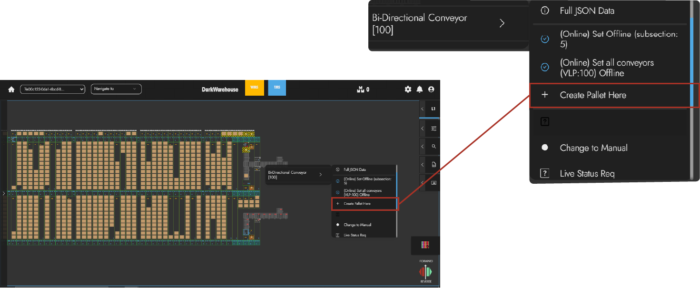
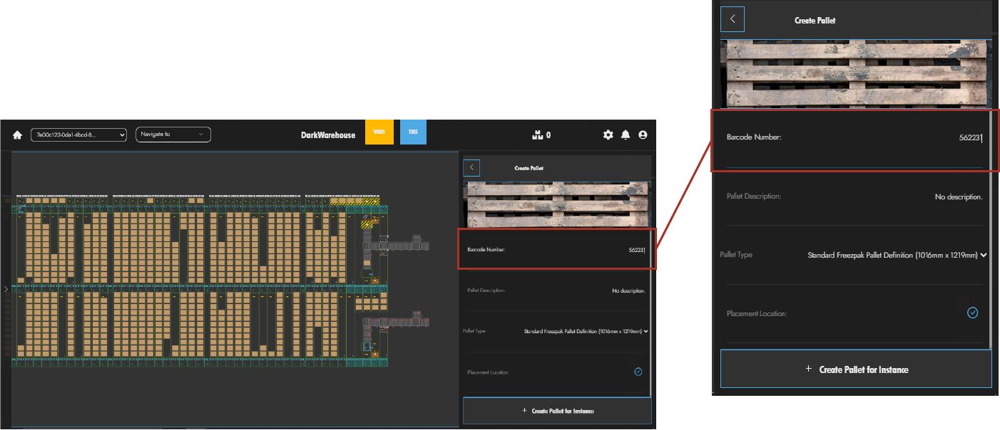
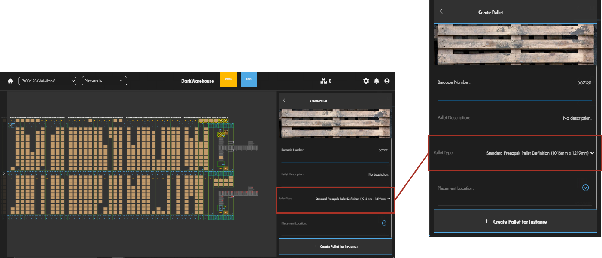
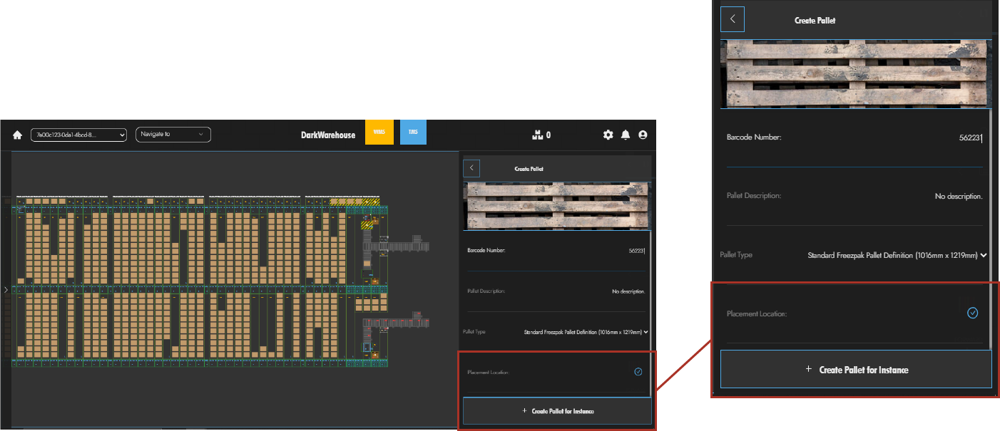
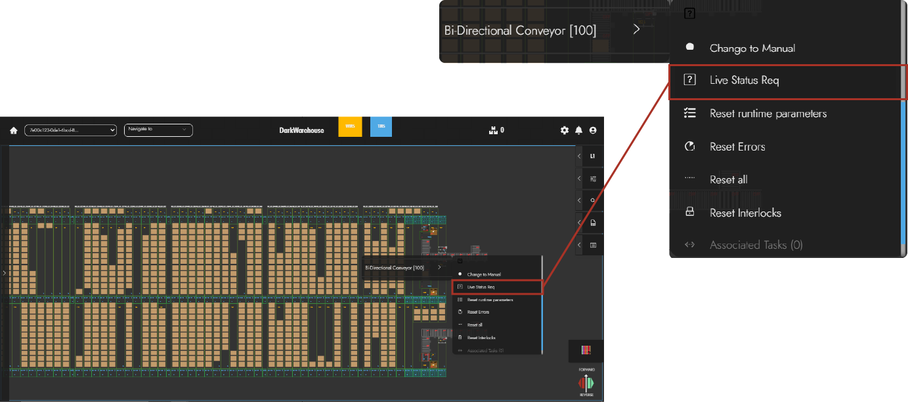
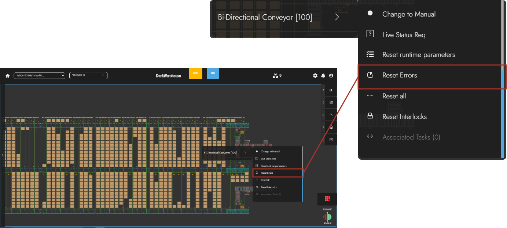
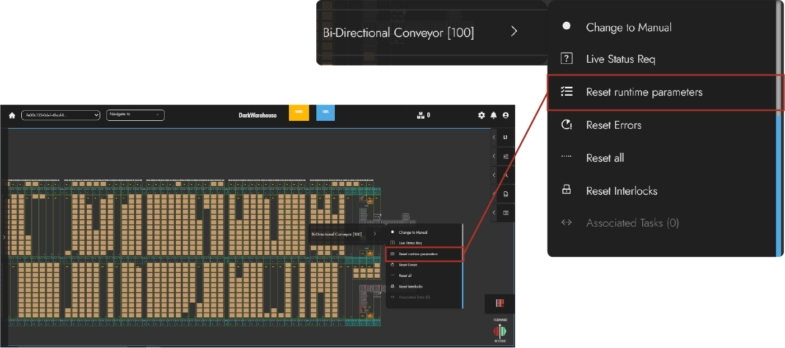
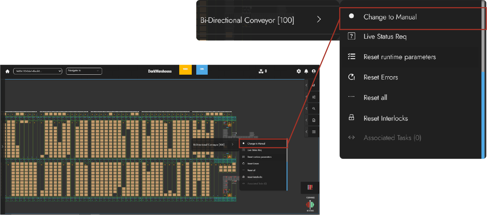
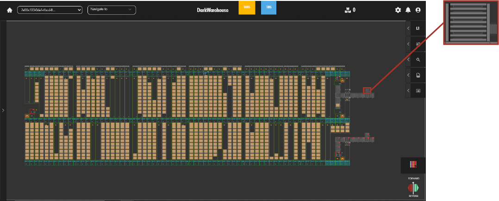

# Interacting with Conveyors

Conveyors can be a very crucial part in processing inbound pallet orders, this is a guide that illustrates how users can interact with conveyors. The following steps user can further understand conveyors, how they operate as well as be able to execute and monitor tasks✍️.

## Creating Conveyor Tasks

Creating a conveyor is a simple method that user can perform, with these easy instructions🔽:

### Select Conveyor To Create Task

The user can select the conveyor in which they would like to create a task for and right-click on the selected conveyor🖱️.

### Creating A Pallet Task

Creating a Pallet Task is a basic function that can be performed by users supplying the system with information that will help identify and describe the pallet📦. The following is the information required in order to create a pallet task.

#### Provide Pallet Barcode

Users can then provide the pallet barcode, which will also be used to identity the pallet within the Darkwarehouse system📛. Once this field has been provided the user can then proceed.

#### Pallet Type

Using the `Pallet Type` dropdown menu, the user can then select thier intended Pallet Definition. This indicates the pallet's dimension measurements, which is useful for pallet storage allocation📍.

#### Placement Location 📌

Once the pallet information has been provided, the `Placement Location` is the final step in creating the pallet task. This placement location is selected as the conveyor location in which the user would like to create the pallet and the task is done✔️.

## Conveyor Status Check

A status check can be known as the basic feedback a user can request from a machine, which will then provide the Darkwarehouse system with machine's current status📡. This status request can be performed in the following user-friendly manner. 

### Select Conveyor

Select and right-click the conveyor which requires a status check. Navigate and click on the `Live Status Req` option, done👍.

## Reset Conveyors Errors

To reproduce the errors on the conveyor, the user can then use the `Reset Errors` method found in the conveyor by right-clicking on the conveyor. Navigate to the expanded options and click `Reset Errors` to complete the reset♻️.

## Reset Conveyor Runtime Parameters

The user can also `Reset Runtime Parameters` function by right-clicking on the conveyor and click on the `Reset Runtime Parameters` option 👨‍💻.

## Reset Conveyor Interlocks 🔒

To `Reset Interlocks`, is to restore the interlock tasks that have been created in order to complete them. This is easily done by right-clicking the conveyor, navigate and click on the `Reset Interlocks` option🔗.

## Changing Conveyor Auto\Manual Settings ⚙️

This allows the machine to either be manually controlled or set to automatically operated. These two options can be toggled by right-clicking on the conveyor and switch the control settings found on the expanded options🎯.

## Conveyor Rejection Types 🛑

The Rejection Types categorize the reasons why a pallet is not accepted into the system. They essentially explain why the system refuses to accept the pallet🙅‍♂️. Below, we'll delve into various types of rejections and outline their respective handling procedures.

- **Reject No Pallet Data** - If the conveyor fails to scan barcode data and retrieves no information, it falls under the REJ-001 category rejection ❌. This denotes a rejection due to the absence of any pallet data.

- **Reject Invalid Pallet Data** - This occurs when the conveyor successfully scans barcode data, but the information retrieved is incorrect or invalid📝. This rejection occurs when the scanned pallet data does not match any valid or recognized information in the system.

- **Reject On Pallet Dimensions** - Pertains to a situation where the pallet's sizes and dimensions surpass the predefined limits set by the system 📐.

- **Reject On System Full** - Occurs when the system has reached its maximum capacity for pallet storage, signaling to users that the storage is full. In this instance, users need to either reduce the pallets stored within the system or halt the system's pallet intake⛔.

- **Reject Generic** - Indicates a nonspecific reason for pallet rejection, used when the system encounters an issue outside predefined categories. It serves as a catch-all for rejecting pallets when the system cannot determine a more specific reason for rejection🚫.

## Conveyor Rejection Station 🚨

 This is where rejected pallets are directed within the conveyor system, facilitating their removal from the main line for further handling or inspection📋. This station functions as a pivotal point for handling rejected pallets, ensuring they are appropriately diverted from the main conveyor line.

:::note 
Pallet rejection commonly occurs during the inbound process but is not exclusive to it. It involves identifying compatibility issues and subsequently refusing to accept the pallet on the conveyor line⚠️.

Additionally, when the rejection station is full, the conveyor must hold any further rejected pallets until the station becomes available again✋.
:::

The conveyor can be used to monitor and filter the inbound process by accepting pallets that meet the Darkwarehouse system requirements and rejects pallets that don't. This documentation allows users to understand the variouse methods that can be used to interact with the conveyor and serves as a tool for the users knowledge✨.