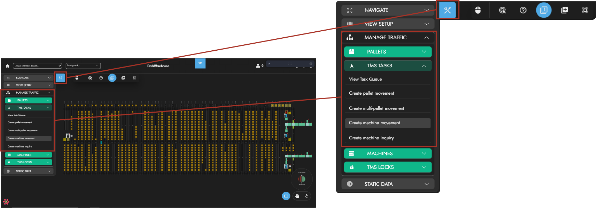
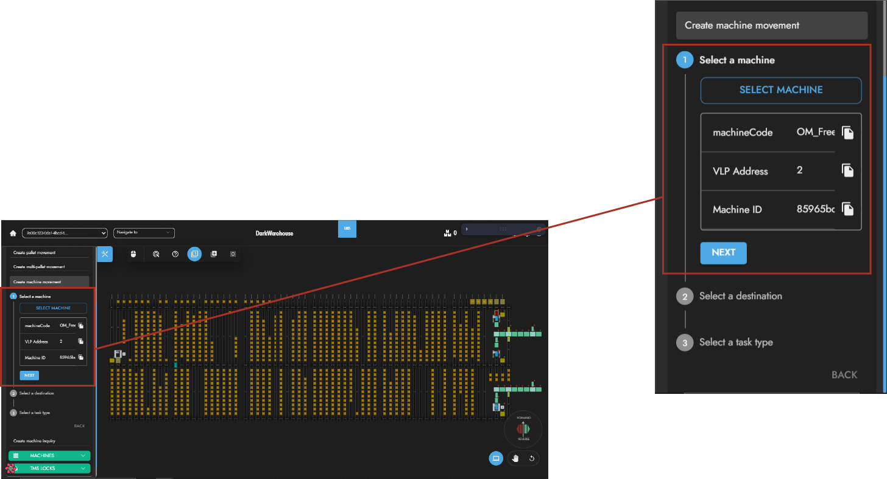
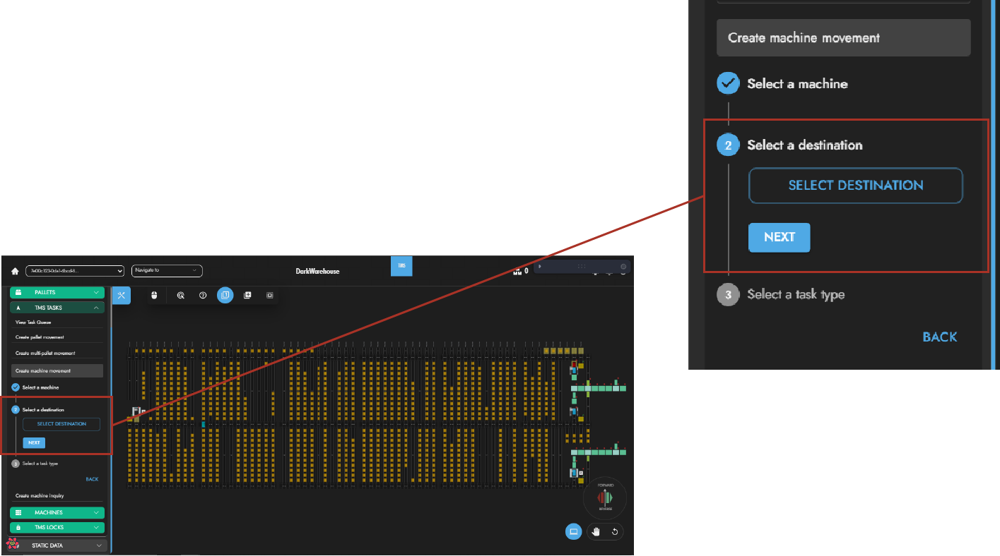
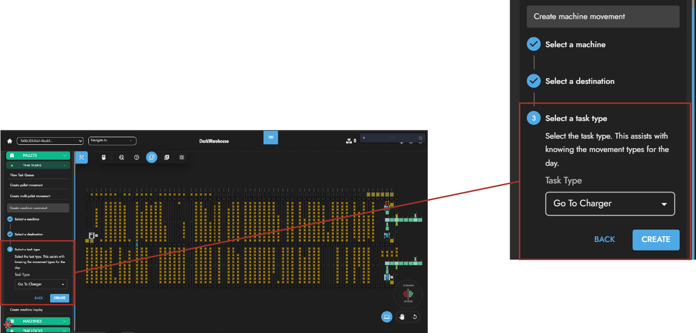
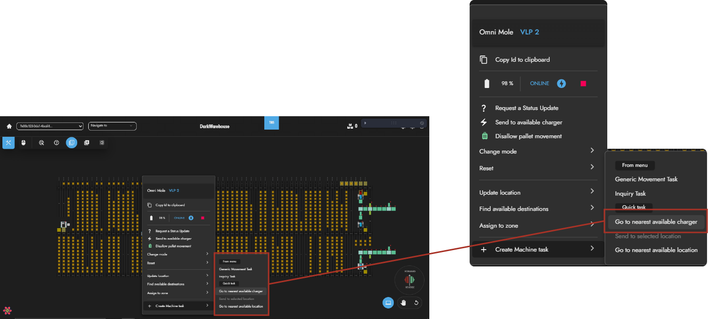
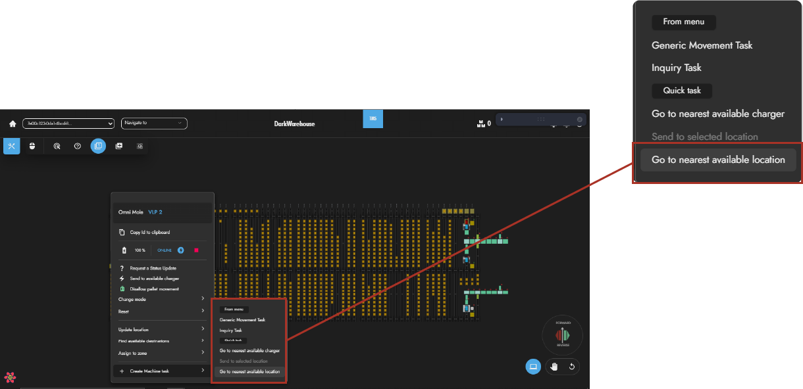

# Interacting With Chargers 

Understanding chargers and charge pads is crucial for maintaining the system's power🔌. This guide illustrates various methods that can be used to interact with chargers and charge pads.

## Understanding Chargers & Charge Pads 💡

### Chargers
Chargers operate in two ways: 
- **Standalone** 🤖- When a charger is in `standalone`, chargers operate independently with their own control cabinet.
- **Remotely controlled**📡 -  On the other hand, when a charger is `remotely controlled`, it is managed by other machines such as VTUs or conveyors. 

#### Chargers Icon
Chargers can be identified within the system by the following icon below🔽:

### Charge Pads
Charge pads act as fuel stations where omni-moles can power up or recharge⛽. 

#### Charge Pads Icon
These charge pad power stations are indicated by the following icon below🔽:

## Using Charge Pads
Follow these simple steps to charge an omni-mole or communicate with a charge pad using an omni-mole📟:

### Sending Omni-Moles to Charge via the LHS Toolbox Menu 🧰

On the operations navigation bar, the user should click on the **Toolbox** button🔧. Once clicked, select the **Manage Traffic** menu in order to `Create Machine Movement`.

### Select Omni-Mole 📍

Choose the omni-mole that is intended for charging and click the **Next** button, when you have selected an omni-mole🎯.

### Destination

The user can immediately click the **Next** button to continue as the destination location is not needed⏩. This is due to the Dark Warehouse autonomously selecting the most appropriate charger for the omni-mole to go to📌.

### Select Task Type

Once that has been completed, users can select the a **Task Type** of `Go To Charger` and click the **Next** button to complete operation🎉.

### Sending Omni-Moles to Charge via the Right Click Context Menu✨
Quickly right-click on an omni-mole to open the short-cut options⚡. Navigate to `Create Machine Task` and click on `Go To Nearest Available Charger`, done👍.

### Get Omni-Mole From Charger
Simply right-click the omni-mole and send it to the nearest available location 🖱.

## Settings For Machine Charging 🎛️

The system offers customizable charge settings that allow users to define the parameters for the omni-mole battery🎚️. These settings supply users with information in knowing at what state the omni-mole is in and they include:

- **Must Go To Charger**: If an omni-mole reports a charge percentage value of 35% or lower, it must go to a charge pad🚨.

- **Can Go To Charger**: If an omni-mole reports a charge percentage value of 40% or lower, it can go to a charge pad⚠️.

- **Can Leave Charger**: If an omni-mole reports a charge percentage value of 80% or higher, it can leave the charger✔️.

- **Full Cycle Cutoff**: If an omni-mole reports a charge percentage value of 95% or higher, it can leave the charger after a full cycle🔋.

- **Perform Full Charge Cycle Interval Min**: This is represents the minimum number of **days** in which a single omni-mole must go from a critically low battery state of charge to a full state of charge⏳.

- **Perform Full Charge Cycle Interval Max**: This, in turn, represents the maximum number of **days** in which a single omni-mole must go from a critically low battery state of charge to a full state of charge⌛.

## Chargers & Charge Pad Data Properties 📝

Chargers and Charge Pads have attributes that provide users with information and configuration mechanisms⚙️. These properties help identify chargers and charge pads as well as determine how they behave and operate within the system. 

### Chargers Data Properties 🗒️

| Properties                            | Description                                                                               | 
| ----------                            | -----------                                                                               | 
| ReferenceMachineId                    | The unique identifier of the machine controlling the charger.                             | 
| SubsectionId                          | Identifies the specific subsection to which the charger belongs.                          |
| ChargePadBitMapping                   | A mapping dictionary indicating the correspondence between message bits and charge pads.  |
| SimultaneousChargingEnable            | Indicates whether the charger can power multiple charge pads simultaneously.              |
| MaxNumberOfOnlineChargePads_PerGroup  | The maximum number of charge pads, within a group, that can be simultaneously online.     |
| MaxNumberOfOnlineChargePads_Total     | The maximum number of charge pads controlled by the charger that can be online at once.   |

### Charge Pad Data Properties 🗒️

| Properties                        | Description                                                                                           | 
| ----------                        | -----------                                                                                           | 
| ControllingChargerId              | The unique identifier of the charger controlling the charging pad.                                    | 
| LocationId                        | The unique identifier of the charge pad's location.                                                   |
| LocationType                      | Indicates the type of location where the charge pad is installed.                                     |
| RfidTagId                         | The unique identifier of the RFID Tag associated with the charge pad.                                 |
| RfidTag                           | Information about the RFID tag used by the charge pad.                                                |
| EntryPointsDirectionAndDistance   | Structured data defining the distance from the entry points of the location to the charger pad.       |
| Groups                            | Specifies the charge pad group that the charge pad belongs to, determined by the charger's grouping.  |

This documentation provides comprehensive information on interacting with chargers and charge pads, along with the various charge settings users need to know🎓.