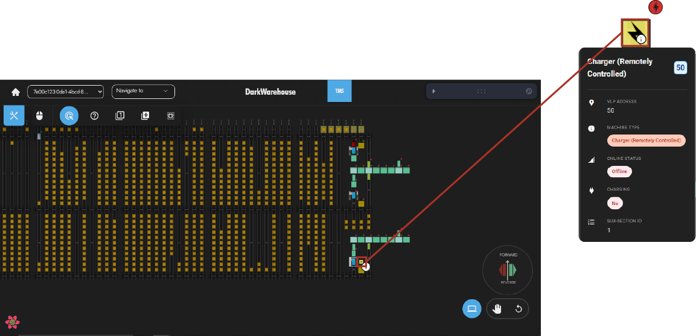
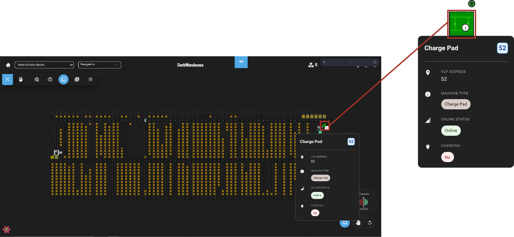

# Interacting With Chargers

Understanding chargers and charge pads is crucial for maintaining the system's power. This guide illustrates various methods that can be used to interact with chargers and charge pads.

## Understanding Chargers & Charge Pads

### Chargers
Users can communicate with chargers in two ways: directly interacting with chargers (standalone) or indirectly using machines (remotely controlled). Chargers can be identified within the system by the following icon: 

.

### Charge Pads
Charge pads are stations where omni-moles can power up or charge their battery. These power stations are indicated by the following icon: 

.

## Using Charge Pads
Follow these simple steps to charge an omni-mole or interact with a charge pad using an omni-mole:

## Navigate To Toolbox

The user can click on the toolbox button, located at the operations navigation bar. Once clicked, select the **Manage Traffic** menu in order to `Create A Machine Movement`.

.

## Select Omni-Mole

Choose the omni-mole in which is intended for charging and click the **Next** button, when you have selected an omni-mole.

.

## Destination

The user can immediately click the **Next** button to continue as the destination location is not needed.

.

## Select Task Type

Once that has been completed, users can select the a **Task Type** of `Go To Charger` and click the **Next** button to complete operation.

.

## Disconnect From Charger
Simply right-click the omni-mole and send it to the nearest available location.

.

### Quick Send To Charger Method
Quickly right-click on an omni-mole to open the short-cut options. Navigate to `Create Machine Task` and click on `Go To Nearest Available Charger`.

.

## States Of Charge
Charging can go through several states, as discussed below:

- **Must Go To Charger**: If an omni-mole reports a charge percentage value of 40% or lower, it must go to a charge pad.

- **Can Go To Charger**: If an omni-mole reports a charge percentage value of 35% or lower, it can go to a charge pad.

- **Can Leave Charger**: If an omni-mole reports a charge percentage value of 80% or lower, it can leave the charger.

- **Full Cycle Cutoff**: If an omni-mole reports a charge percentage value of 95% or lower, it can leave the charger after a full cycle.

- **Perform Full Charge Cycle Interval Min**: This is the minimum interval (in days) in which a single omni-mole must go from a critically low battery state of charge to a full state of charge.

- **Perform Full Charge Cycle Interval Max**: This is the maximum interval (in days) in which a single omni-mole must go from a critically low battery state of charge to a full state of charge.
