# Diagnosing Communications

This page provides an overview of how the DarkWarehouse communicates with machines via the Whisker and how to diagnose and test the connection between the DarkWarehouse and Whisker.

## Communication Protocol 📡

The DarkWarehouse communicates with machines via a protocol called Variable-Length Protocol (VLP). VLP is a structured message that machines and the DarkWarehouse can both understand. The DarkWarehouse will generate a VLP message and these messages are sent to machines in the form of data bytes. The conversion from a structured message to data bytes is done via a message-translator called the "Whisker".

The DarkWarehouse and Whisker communication is done via a communication protocol called HTTP/HTTPS. HTTP/HTTPS is a protocol used for exchanging information over the internet. 🌐

Below is a diagram depicting the three components of the AS/RS and how they interact.

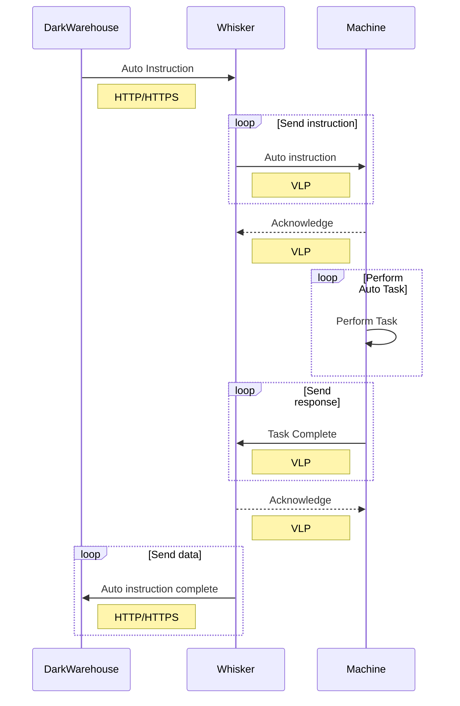

## Testing Communication 🛠️

There are a few tests that can be done to test if the communication between the three main components is set up successfully.

### Test 1: HTTP/HTTPS Connection Test (Whisker ↔️ DarkWarehouse)

#### Whisker to DarkWarehouse Test

On the Whisker, under Settings>Service Communication, you will be able to test the connection between the Whisker and the DarkWarehouse. This can be done by verifying that the "URL for the DarkWarehouse API" is correct and then pressing "Check Connection".

1. Navigate to Service Communication 🛰️
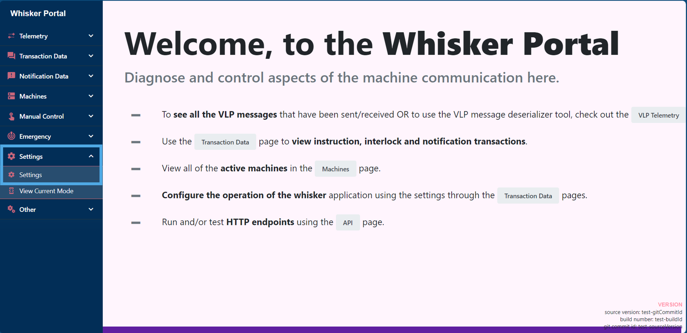

2. Verify URL and Check Connection 🔗
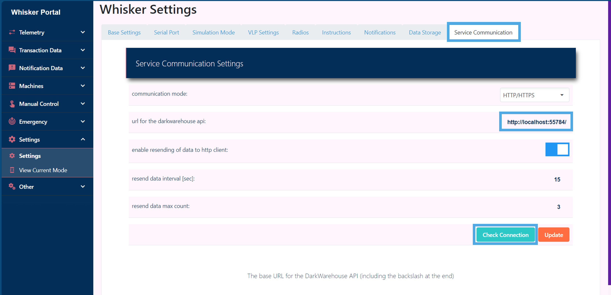

3. Evaluate Response 📊
   1. Successful Connection ✅ \
   If the connection is successful, you will see a message at the bottom of the screen that says "Connected to.." some information about the current DarkWarehouse connection.
   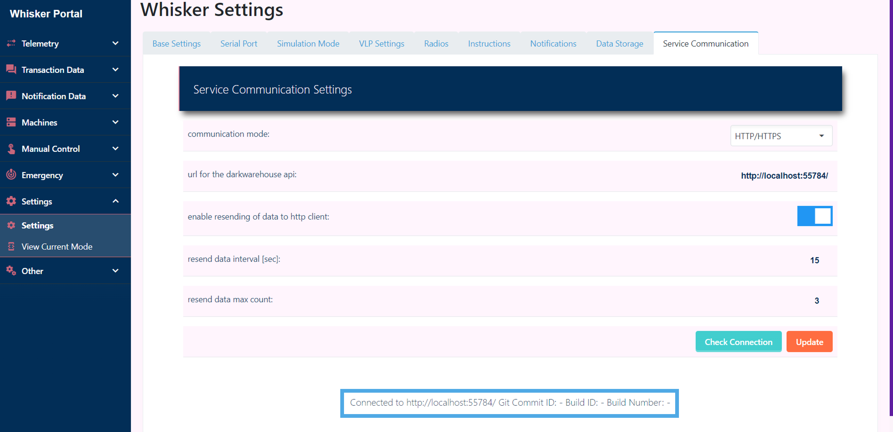
   2. Unsuccessful Connection ❌ \
   If the connection fails, an error message will pop-up explaining what went wrong. Please contact a Toasted Marshmallow employee if you do not understand the error.
  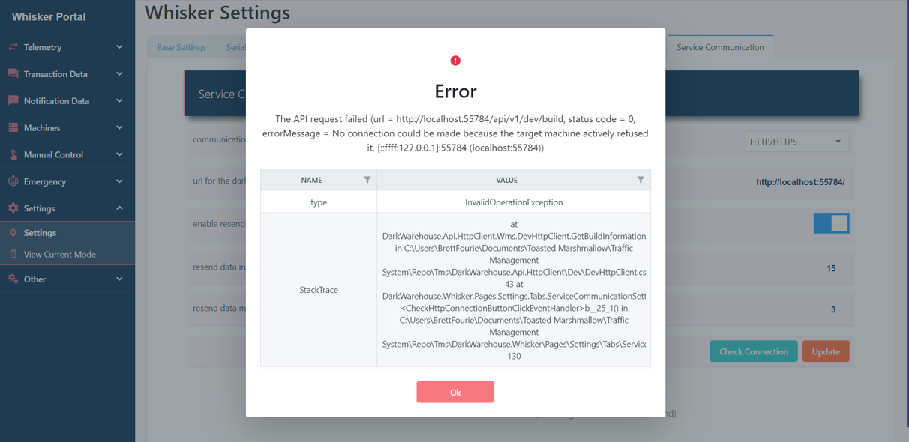

#### DarkWarehouse to Whisker Test

A similar test can be done to ensure the DarkWarehouse is connected to the Whisker correct.

1. Navigate to DarkWarehouse API Definition 🌐 \
   This can be found at the mai URL of the application. Right down at the bottom, you will find an API route called "dev/whisker-diagnostics > /api/v1/dev/whisker-diagnostics/connection". Locate this and press "Try it out"
   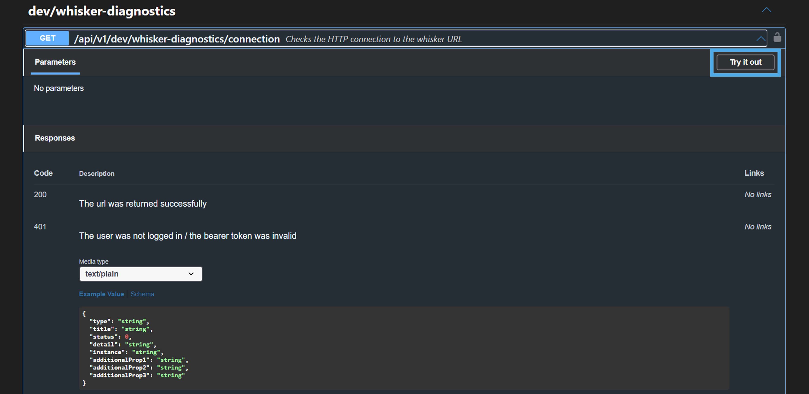

2. Run the Route ▶️ \
   Press "Execute" to run the connection test.
   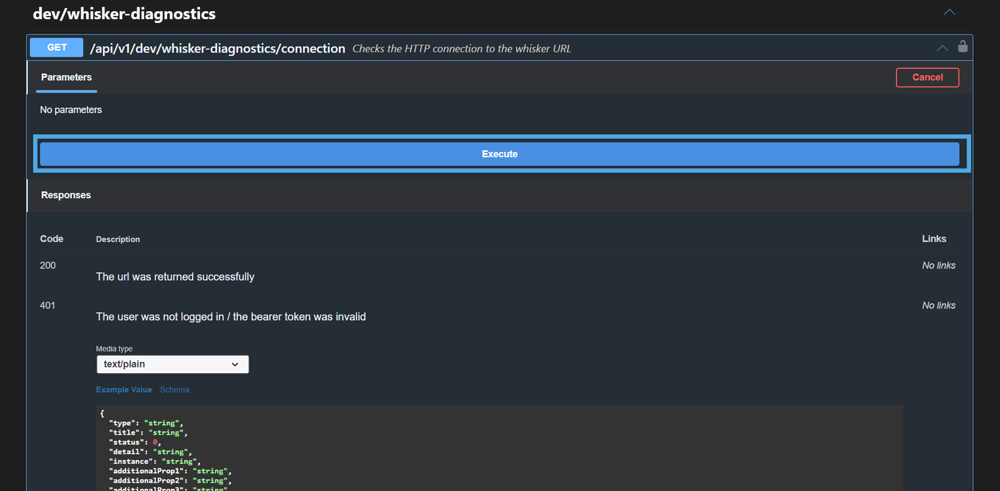

3. Evaluate Response
   1. If successful, you will received a 200 response with the connection values.
   2. If unsuccessful, you will receive a 500 response with n associated error message.

### Test 2: Manual Whisker Test (Whisker ↔️ Machine)

You are able to bypass the use of the DarkWarehouse and send auto instructions to machine through the Whisker. This can be done by navigating to the "Manual Control" page and setting up the control to send the required instruction to the machine. The instruction and response can be evaluated to determine if Whisker to machine communication is setup correctly. To perform this test, follow the steps below:

1. Navigate to Manual Control 🕹️
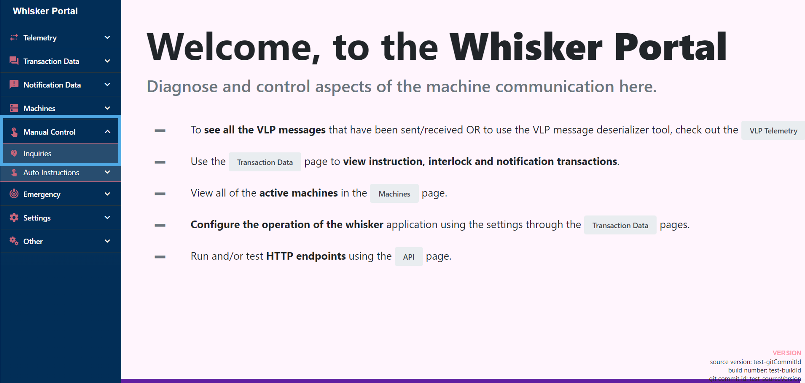

2. Select the Correct Machine and Inquiry Type 🤖
  Select the machine you would like to send an instruction to and then select "Request Live Status" as the Inquiry Type. Once that is done, press "Send Message"
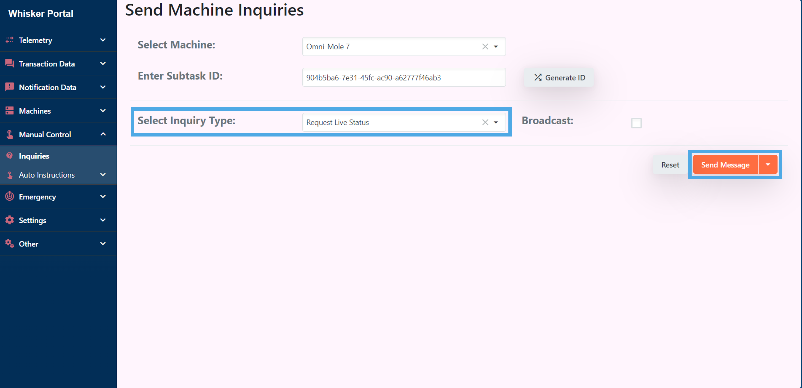

3. Evaluate Response via Live Telemetry 📊
   1. Navigate to the Live Telemetry page where all communication in and out of the Whisker can be viewed.
    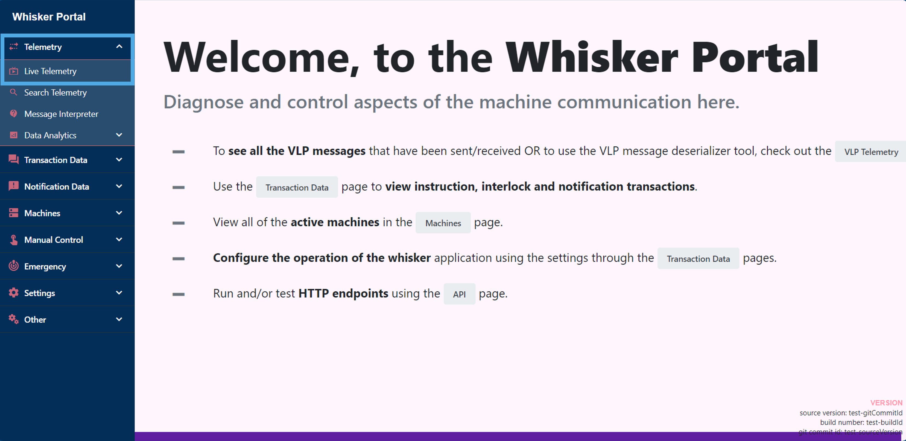
   2. Look through the live telemetry logs and find the live status that was just sent to the request VLP address. If everything was successful, you should see an Inquiry then Status from the machine followed by an Acknowledge from the Whisker. If those messages are not all present, a breakdown in communication has occurred and the relevant team should be notified.
   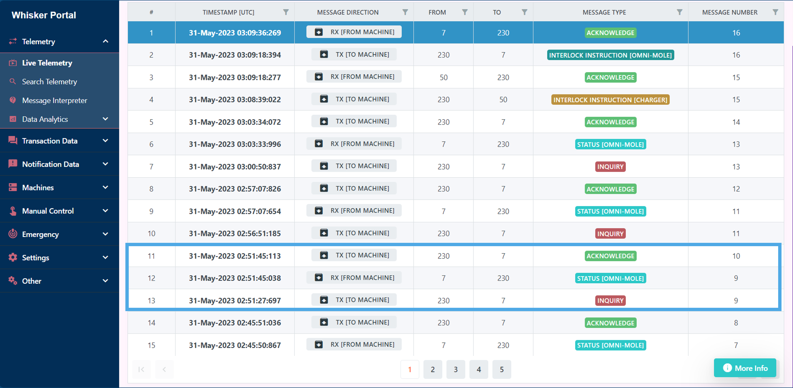

### Test 3: Machine Location Update Test ♻️ (DarkWarehouse ↔️ Whisker ↔️ Machine) 

A comprehensive test to assess the communication between the DarkWarehouse, Whisker, and Machine is the Machine Location Update Test. This involves updating an OmniMole's position in the DarkWarehouse system to a random location and observing the response and subsequent location correction from the machine.

#### Steps to Perform the Test:
1. Update Machine Location on DarkWarehouse UI 📍 \
Log in to the DarkWarehouse interface and manually alter the OmniMole's location to a random point within the system. This action simulates a discrepancy in the system's data.

2. Send Live Status Request to Machine 📡 \
Trigger a live status request from the DarkWarehouse to the OmniMole. This will prompt the machine to report its actual physical location.

3. Monitor Whisker Telemetry for Transmission Details 📊 \
Check the Whisker's telemetry logs to confirm that the live status request was sent correctly, using the appropriate VLP address.

4. Verify Machine Response 🤖 \
Ensure the machine's reply with its actual location is received. The correct response should lead to an automatic update of its position on the DarkWarehouse UI.

#### Troubleshooting 🛠️
In case of a failure in communication or an incorrect response:

1. Verify that the Whisker's telemetry indicates a sent live status.
   - Check if the machine's response is received and accurately reflects its physical location.
   - If discrepancies persist, delve into deeper diagnostics such as inspecting the VLP address used, listener's byte analysis, or consultation with technical support.

2. Confirm UI Update 🖥️ \
Observe the DarkWarehouse UI for the updated location of the OmniMole, ensuring it matches the machine's reported actual position.

⚠️ **WARNING** ⚠️\
**Be cautious when updating the OmniMole's location on the UI. If other machines are moving in the system, the DarkWarehouse may route a different OmniMole into your OmniMole's position in real life and cause a collision. We'd recommend performing this test when the entire system is not running or at least that level.**