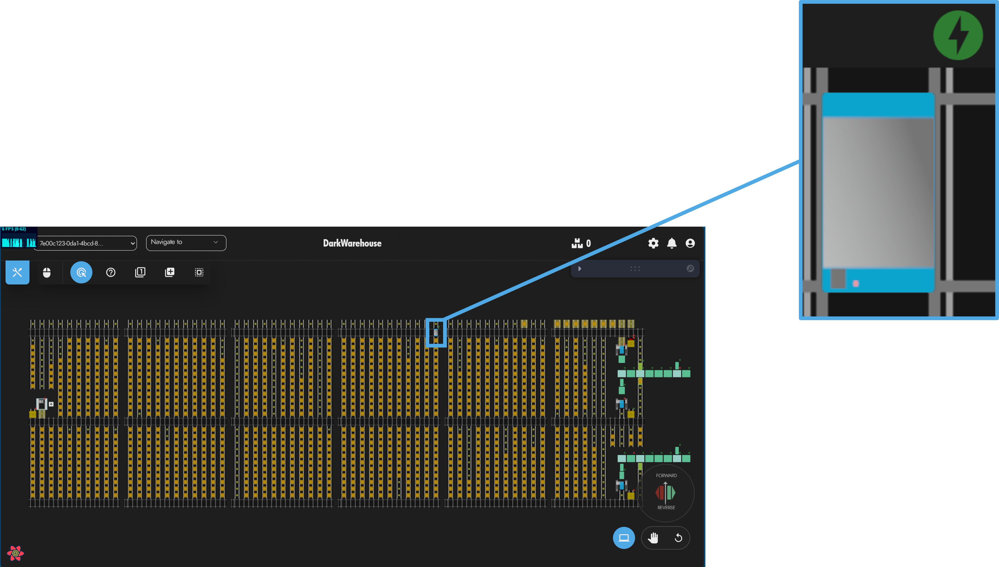
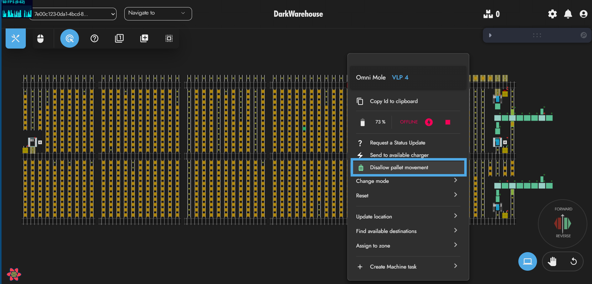
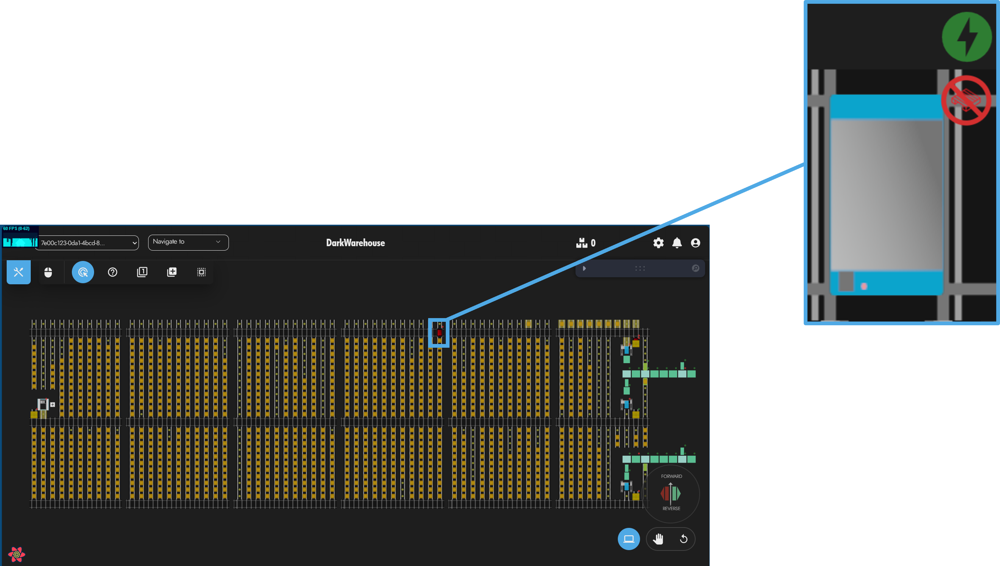
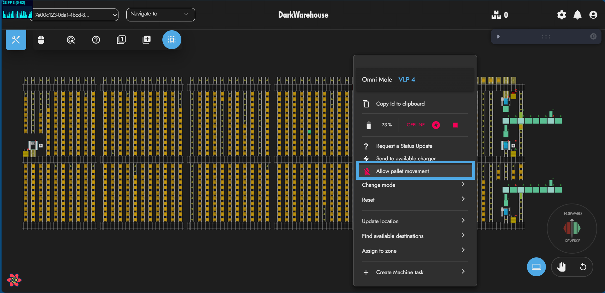
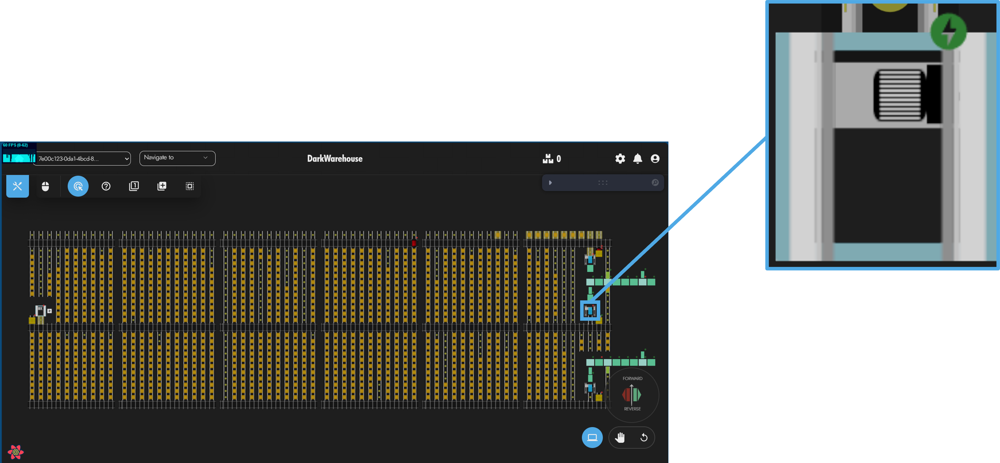
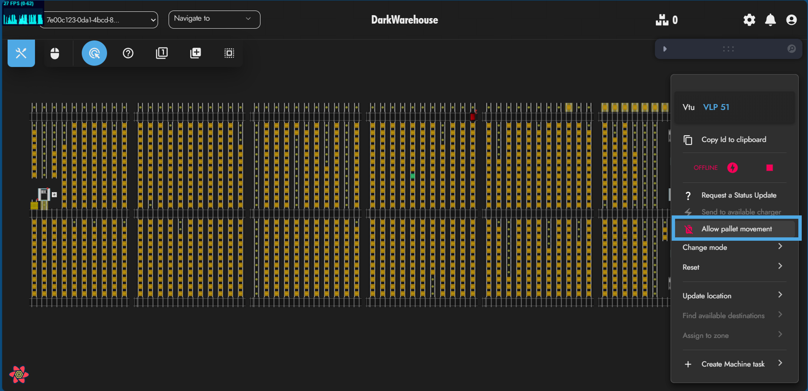

# 'Can Move Pallets' Setting

This page provides an overview on the machine-related setting: 'Can Move Pallets' toggle. This details what the setting means and how to use them.

## 'Can Move Pallets' Machine Functionality 📦

The DarkWarehouse has the ability to allow and disallow a machine's ability to perform pallet tasks. This gives the user an extra level of control over the machines. For example, if a machine is on it's way to pick up a pallet and the user then decides that that machine is needed for a maintenance checkup and want to send the machine to a certain area for a technician to take it out of the system, they can "Disallow Moving of Pallets" for that machine and send it a generic task to where they want it to go. If possible, the DarkWarehouse will then select another machine to fulfill it's original task.

On the UI, a machine is indicated as 'not allowed to perform pallet tasks' with a red crossed-out-pallet icon as depicted below. ❌📦 \

This feature is only available to OmniMoles and VTUs.

### Allowed Moving of Pallets ✔️

When a machine is allowed to perform pallet tasks, the DarkWarehouse sees that machine as available to perform any task in the system. This can be a generic movement, live status or pallet task.

### Disallowed Moving of Pallets ❌

When a machine is not allowed to perform pallet tasks, it will only be able to perform live status and generic tasks. If a machine has a pallet on it when disallowed, it will still be allowed to perform generic tasks and will take into account the fact that it has a pallet on it when routing.

### OmniMoles

When an OmniMole is allowed to move pallets, it will have no indicator. This can be seen below.\

Disallowing an OmniMole from moving pallets can be done done by right-clicking the mole and pressing "Disallow pallet movement".

When an OmniMole is not allowed to move pallets, it will have not-allowed-to-move-pallets indicator. This can be seen below. \

Allowing an OmniMole to move pallets can be done done by right-clicking the mole and pressing "Allow pallet movement".

### VTUs

When an VTU is allowed to move pallets, it will have no indicator. This can be seen below. \

Disallowing an VTU from moving pallets can be done done by right-clicking the VTU and pressing "Disallow pallet movement".

When an VTU is not allowed to move pallets, it will have no indicator. This can be seen below. \

Allowing an VTU to move pallets can be done done by right-clicking the VTU and pressing "Allow pallet movement".
