# Machine Online/Offline Settings

This page provides an overview on the machine-related setting: Online/Offline toggle. This details what the settings mean and how to use them.

## Online/Offline Machine Functionality 🤖

The DarkWarehouse has the ability to turn any machine online or offline. If a machine is online, it means that is can be selected as a valid machine to perform some task within the system. If the machine is offline is means that it cannot be selected to perform any task.

On the UI, a machine is indicated as online or offline with a coloured lightning blot icon as depicted below. ⚡

*Online Machine* 

*Offline Machine*

### Online Machines 🟢

When a machine is online, the DarkWarehouse sees that machine as available to perform some type of task. That machine will automatically be sent live statuses every few minutes to ensure that the system is always in sync with reality and if necessary, that machine will be chosen to do a task.

### Offline Machines 🔴

When a machine is offline, Live Statuses can still be sent to it by the user but no automatic tasks (including Live Statues) will be sent to that machine.

### OmniMoles

When an OmniMole is offline, no automatic instructions will be sent to it. The user can still update the location of the machine manually or send a live status to the machine but they will not be able to move the machine. The opposite is true for when an OmniMole is online, where the OmniMole will automatically be sent live statuses and be chosen to perform tasks.

When an OmniMole is online, it will be blue on the UI and has an online indicator. This can be seen below.
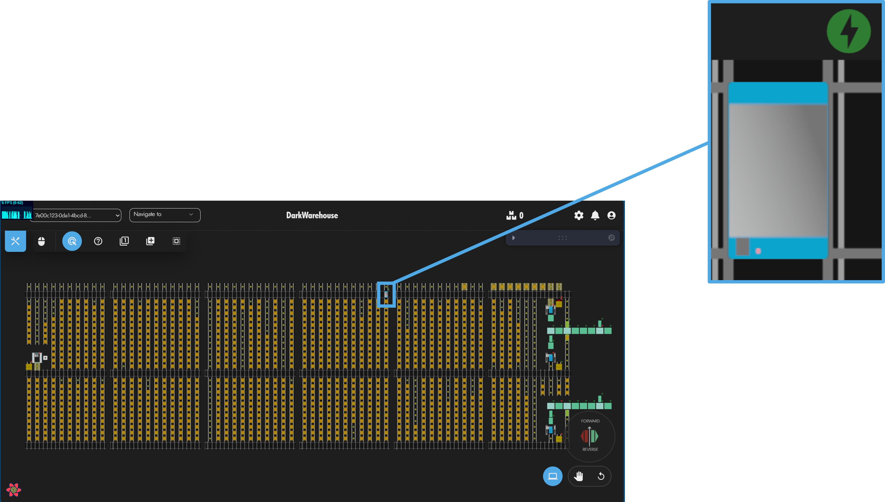

Turning the OmniMole offline can be done by right-clicking the mole and pressing "Online".
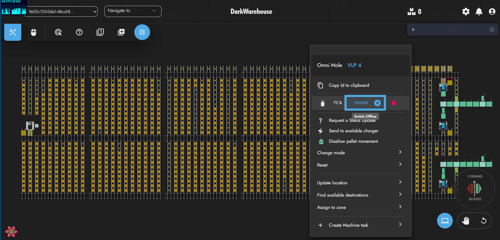

When an OmniMole is offline, it will be red on the UI and has an offline indicator. This can be seen below.
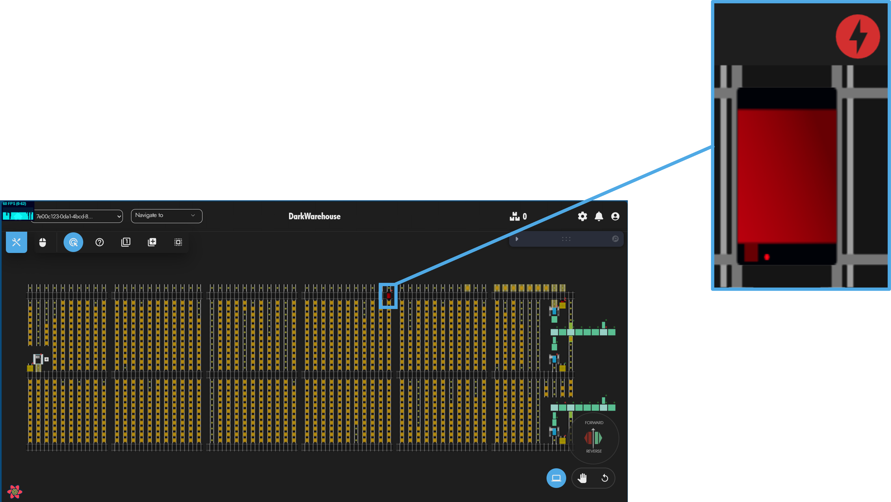

Turning the OmniMole online again can be done by right-clicking the mole and pressing "Offline".
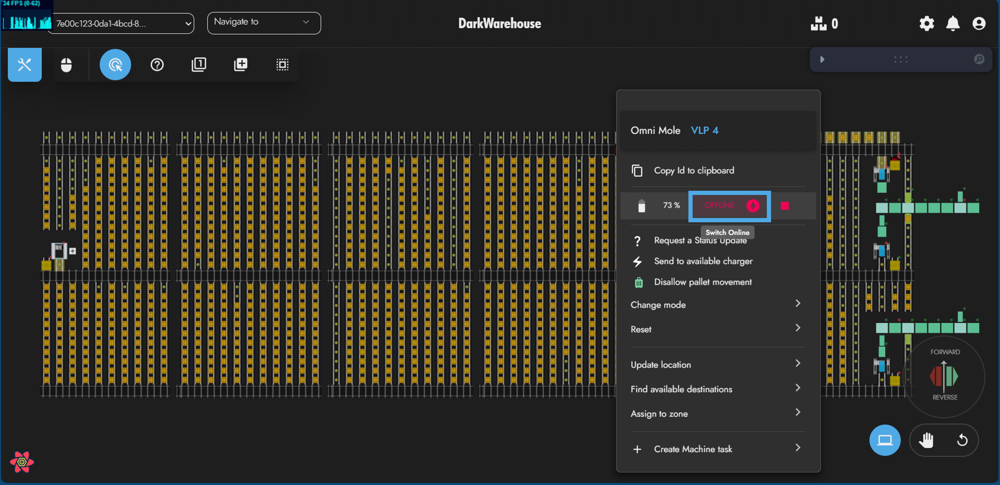

### VTUs

When a VTU is offline, no automatic instructions will be sent to it. The user can still update the location of the machine manually or send a live status to the machine but they will not be able to move the machine. The VTU will not be chosen as a valid route to change levels through. The opposite is true for when an OmniMole is online, where the OmniMole will automatically be sent live statuses and be chosen to perform tasks. The VTU will be available to be chosen as part of a route for a pallet or a mole to change levels.

When a VTU is online, it will have an online indicator. This can be seen below.\
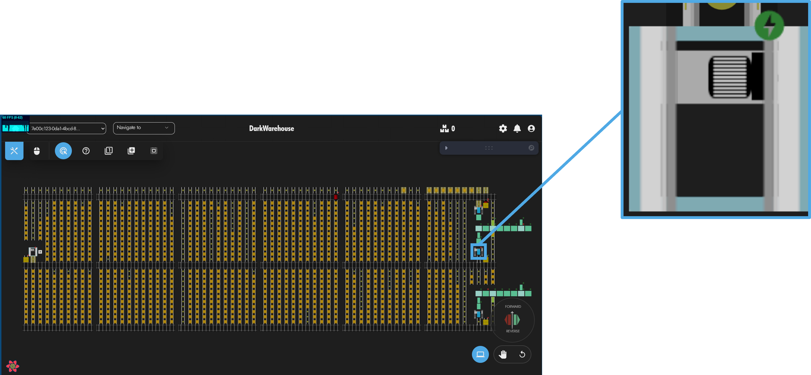

Turning the VTU offline can be done by right-clicking the VTU and pressing "Online".
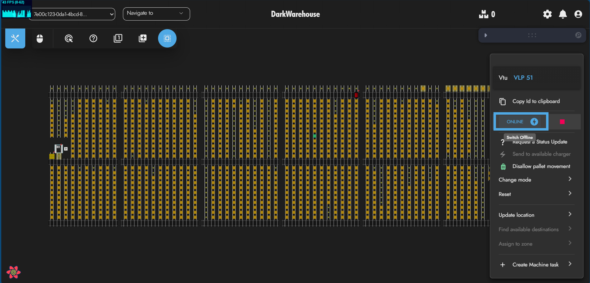

When a VTU is offline, it will have an offline indicator. This can be seen below.
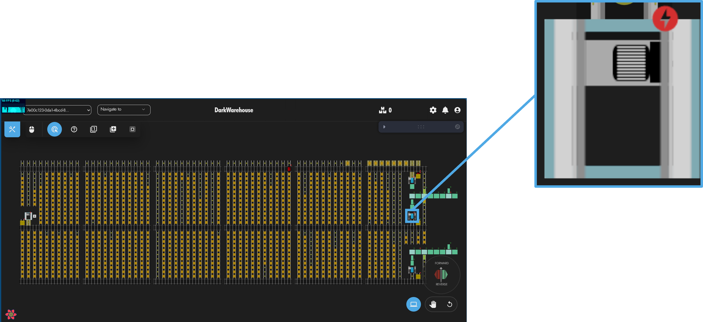

Turning the VTU online again can be done by right-clicking the VTU and pressing "Offline".
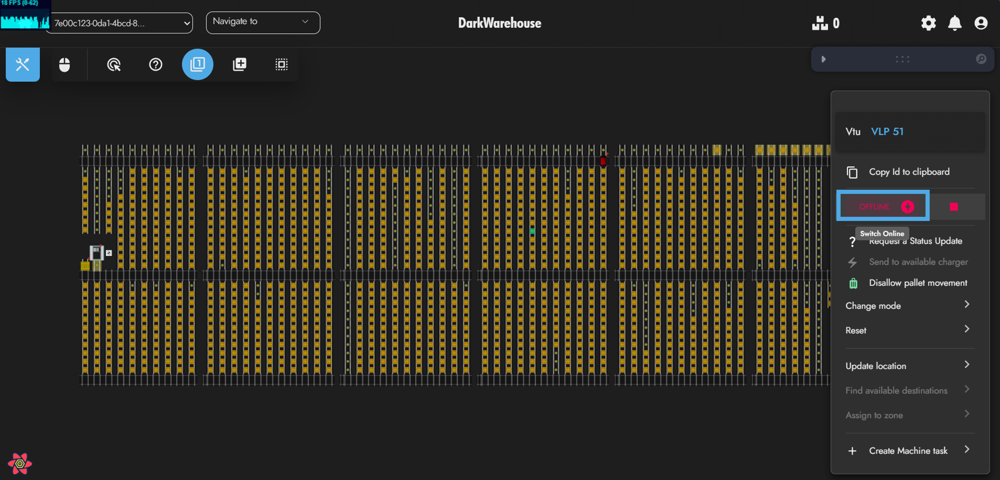

### Conveyors

When a Conveyor is offline, no automatic instructions will be sent to it. The user can still update the status of the machine by sending it a live status but they will not be able to move pallets with machine. When a Conveyor is online, it can be used to move pallets. Conveyors can be turned online and offline on a line or subsection level.

When a Conveyor is online, it will have no indicator. This can be seen below.\
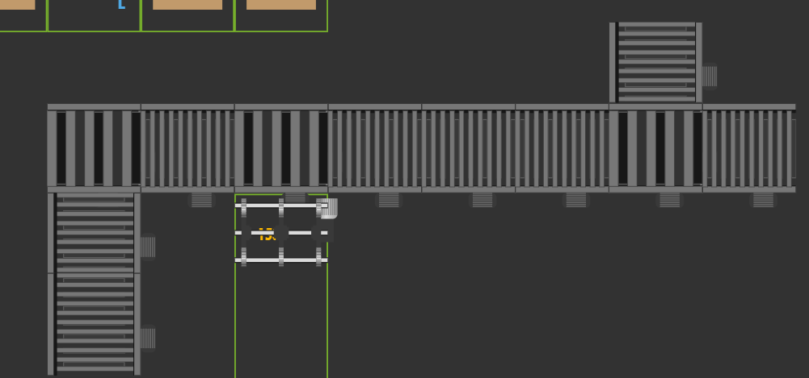

Turning the Conveyor offline can be done in two ways.\
1. Turning an individual subsection offline.
   - This is done by right-clicking the desired subsection and pressing "Set Offline (subsection: x)"
2. Turning a full Conveyor Line offline.
   - This is done by by right-clicking any subsection on the line and pressing "Set all conveyors offline".\
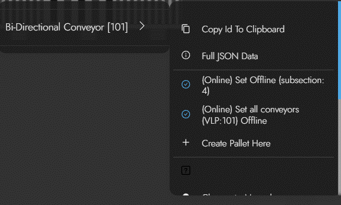

When a Conveyor is offline, it will be indicated by a red "OFF" indicator. This can be seen below.
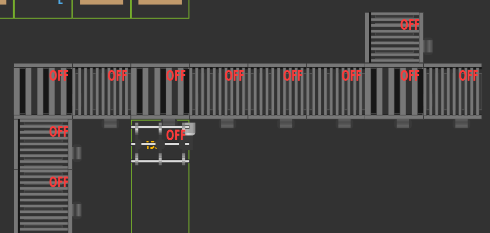

Turning the Conveyor online can be done in two ways.\
1. Turning an individual subsection online.
   - This is done by right-clicking the desired subsection and pressing "Set Online (subsection: x)"
2. Turning a full Conveyor Line online.
   - This is done by by right-clicking any subsection on the line and pressing "Set all conveyors online".\

If a particular subsection is turned offline, the DarkWarehouse will not route a pallet beyond that subsection. For example, in the picture below, we can see that the full line is online except for one subsection. The DarkWarehouse will not route a pallet past that point, meaning all pallets will be routed to the first lane conveyor.
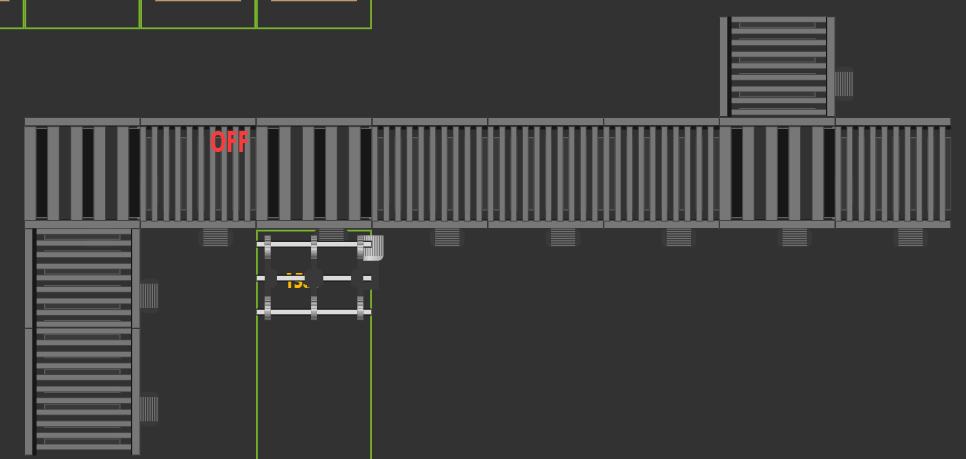

### Chargers and Charge Pads

When a Charger or Charge Pad is offline, no automatic instructions will be sent to it. The user can still update the status of the machine by sending a live status to the machine but they will not be able to use the machine to charge an OmniMole. If a Charger is offline, none of it's Charge Pads can be chosen to charge an OmniMole. If a Charge Pad is offline, it cannot be selected to charge an OmniMole. If a Charger is online, any of it's *online* Charge Pads can be chosen to charge and OmniMole.

When a Charger or Charge Pad is online, they will have an online indicator. This can be seen below.\
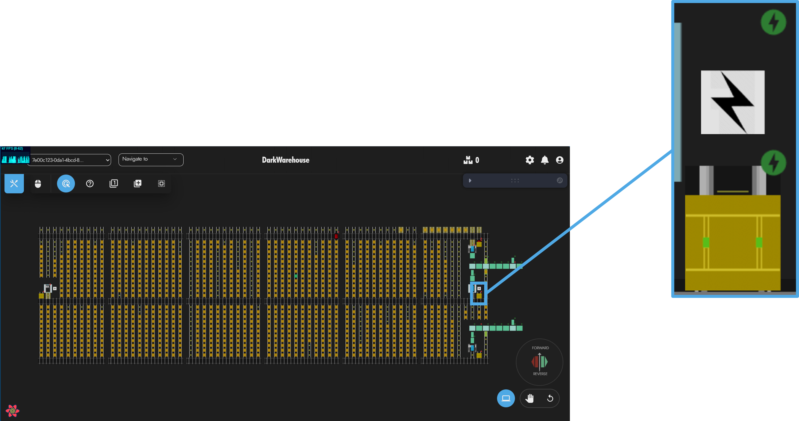

When a Charger or Charge Pad is offline, they will have an offline indicator. This can be seen below.\
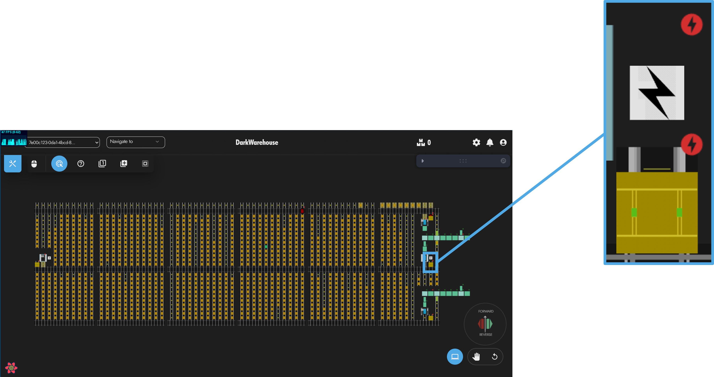

Turning a Charger offline can be done by right-clicking the Charger and pressing "Online".\
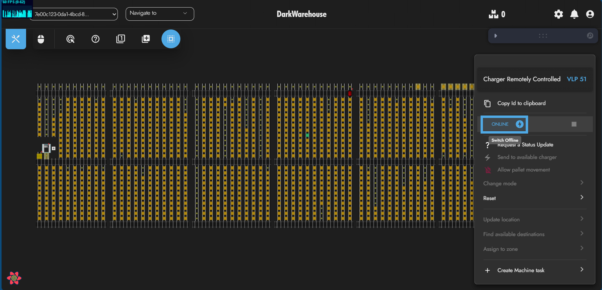

Turning the Charger online again can be done by right-clicking the Charger and pressing "Offline".\
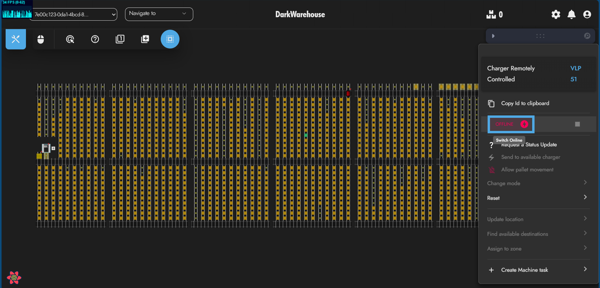

Turning a Charge Pad offline can be done by right-clicking the Charger and pressing "Online".\
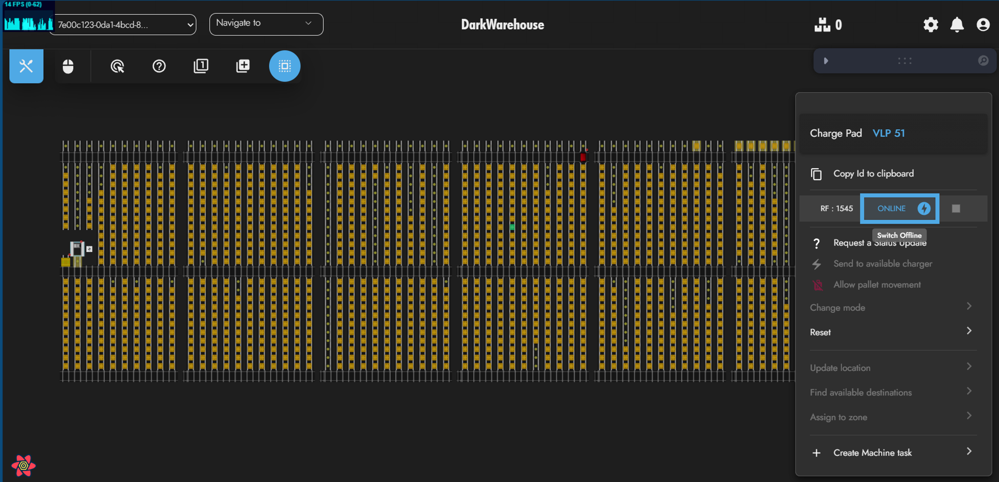

Turning the Charge Pad online again can be done by right-clicking the Charger and pressing "Offline".\
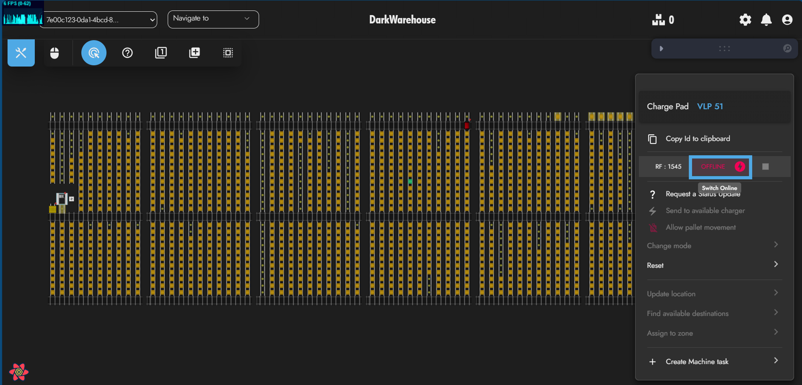