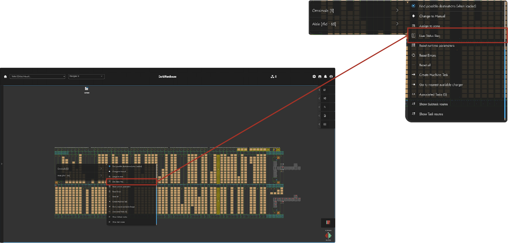
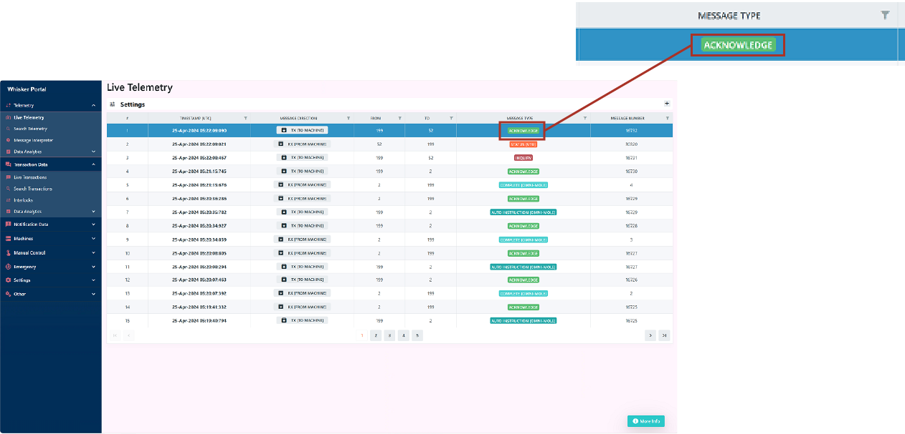

# Problem Identification

During operations, the system may encounter issues that could affect the normal workflows. Users are regularly notified of any known error occurrences through the Dark Warehouse [Notification System](/docs/04-Navigating%20the%20Software/05-System%20Notifications/System%20Events%20Notifications.md)🔔, but the underlying issues may be difficult to underpin. The documentation discussed below assists with identification techniques to recognize as well as diagnose certain common issues in the system.

:::note
Users are encouraged to regularly check notifications and understand them. The first step in addressing an issue is to comprehend what the Dark Warehouse is indicating through its system events.
:::

## Network Issues

**Description** : This is an issue that may affect all communication channels between the Whisker and the Dark Warehouse TMS, as well as between the Dark Warehouse TMS/WMS and SQL, or all communication between the Data Bridge and the client WMS📶.

**Identification** : This may be indicated through the system displaying possible Network Issues or unable to properly connect and communicate with the system.

**Possible Resolution** : Users can alert our Developers in order to investigate and the reset Dark Warehouse network systems.

## Inaccurate Data Request

**Description** : Generally, this pertains to requests for stock items that are not present in the inventory, or the transmission of improperly formatted messages📧.

**Identification** : This can be identified by users monitoring the system to evaluate if the sent data request to the system is not being responded to.

**Possible Resolution** : Users can possibly cancel the sent request and attempt the request again with rectified and correct data✅.

## Deadlock Situations

**Description** : Deadlock scenarios occur when a mole encounters a routing issue that prevents it from completing a task.

**Identification** : Deadlock scenarios are rare occurrences and can be difficult to diagnose🔍. One indication of a deadlock is when a mole fails to perform a task for an extended period despite being online and having a clear route available.

**Possible Resolution** : Users can notify our developers to investigate and resolve the deadlock event🔓.

## Machine Task Acceptance Not Performed

**Description** : Sometimes, machines in the system exhibit a behavior where they accept tasks that have been assigned to them but fail to carry out the designated actions📑.

**Identification** : Users can spot this occurrence by verifying whether the machine has acknowledged the creation of the task or not.

**Possible Resolution** : If the issue persists and the machine has not executed the assigned task even after have accepted the task, user can possibly cancel and recreate\retry the task🔁.

## Unresponsive Machine (no Task Complete respones)

**Description** : In certain situations, machines may finish a task without reporting its completion, causing the Dark Warehouse system to remain unaware of the task's status and still consider it active rather than completed.

**Identification** : This can be identified by observing machines that complete a task without reporting its completion📭.

**Possible Resolution** : Users can inform our developers to investigate and address the unresponsive machine occurrence.

## Unresponsive Whisker (no Communication with TMS)

**Description** : This occurs when the Whisker does not communicate with the Darkwarehouse System🔇.

**Identification** : It can be identified when a `Live Status Request` has been performed and no response is given back to the system📡.

Upon a `Live Status Request`, the machine should then respond to the inquiry accordingly.

**Possible Resolution** : Upon this instance the user can then request for the Whisker to be restarted in order to refresh the communication configurations.

## Task Discontinuation

**Description** : Tasks that are allocated to machines, at times, may not complete due to various issues that could possibly occur during the task. 

**Identification** : Users can identify this situation by observing if the assigned machine accepts and performs the created task and is not unresponsive🚫.

**Possible Resolution** : Users can potentially overcome these [obstacles in the system](/docs/08-Traffic%20Management/Obstacles%20in%20the%20System.md) by:

- **Checking if the Omni-Mole is in the correct zone👍.**
- **Ensuring that both source location and destination are accessible.**
- **Verifyng that there are no offline or manual Omni-Mole's obstructing the created task route.**
- **Ensuring there's no manual or recovery locks blocking the task route.**
- **Checking if the machine assinged with the task is online.**

## Omni-Mole Stalled At VTU Without Retrieving Pallet

**Description** : Omni-Mole's stalling at the VTU without retrieving a pallet rarely occurs🤖. 

**Identification** : It can be easily identified by users monitoring the interaction of the two machines and observing if the Omni-Mole is not interlocking with the VTU in order to retreive the pallet🧐. 

**Possible Resolution** : Upon this event the user can simply do the following: 

- **Analyze the TMS Task Qeue to see if the Omni-Mole is selected for another task and if so, find the task and retry it🔄.**

## WMS: Outbound Task Initialization Failure

**Description** : In some instances Outbound tasks may encounter unforseen obstacles that prevent the Outbound task from being performed or initialized🚧. These obstacles may be caused by occupied locations in the system, which result in the Outbound task unable to allocate a location for the desired pallet. 

**Identification** : Once a pallet has been selected for an Outbound task and the users can monitor the Task qeue to ensure and identify if the Task is initialized.

**Possible Resolution** : A small check list users can tick to potentially resolve these challenges include📋:

- **Identifying available locations that can accomodate the required pallet📍.**
- **Ensure that the alocated location is within a zone that an Omni-Mole is able to operate in.**
- **Check WMS Policies allow the outbound task to be performed with the provided parameters.**
- **Ensure that the Outbound scheduled time is correctly set for when the Outbound task is expected to be complete or performed⏱️.**

## Persistent Pallet Rejection

**Description** : The inbound process using Conveyors may continuously reject pallets due to what seems like unknown circumstances. This state of constant rejection can occur due to the reasons discussed on the working with [Conveyors](/docs/06-The%20Equipment/06-Conveyors/Interacting%20with%20Conveyors.md). 

**Identification** : Users can recognize this occurance once a pallet is repeatedly rejected.

**Possible Resolution** : When the system enters this state, users can use the following to try and rectify the rejection problem❌:

- **Confirm the reasons for rejection are accurate and are understandable.**
- **Check that the pallet was successfully transferred onto the conveyor with the correct data requirements📄.**
- **Ensure that the conveyor sensors are cleared from dust or obstructions that could possibly interrupt the conveyor's clear pallet reading process🎇.**

## Movement Jousting Between Moles

**Description** : In events where Omni-Moles are unable to determine their destination result in a situation that can be known as movement jousting🤺. It's worth noting that "jousting" is a nickname for this type of conflict, not an official term. 

**Identification** : In this scenario, Omni-Moles move back and forth in a stalemate due to conflicting individual tasks assigned to them▶️◀️. 

**Possible Resolution** : Resolving this issue typically involves implementing specific methods:

- **Switch Off one of the Omni-Mole's ability to [move pallet's](/docs/08-Traffic%20Management/Can%20Move%20Pallets%20Setting.md), in order to better control the traffic🚦.**

:::note
Upon encountering these issues, please kindly report these obstacles in order for our developers to record possible causes for the errors so that they can then engineer accurate and permenant solutions👨‍💻.
:::

## Not On The List

To report any issues not addressed in these documents, users can contact developers at info@toastedmarshmallow.co. Developers will endeavor to provide permanent solutions and update the documentation accordingly to ensure a clean and smooth experience✨.