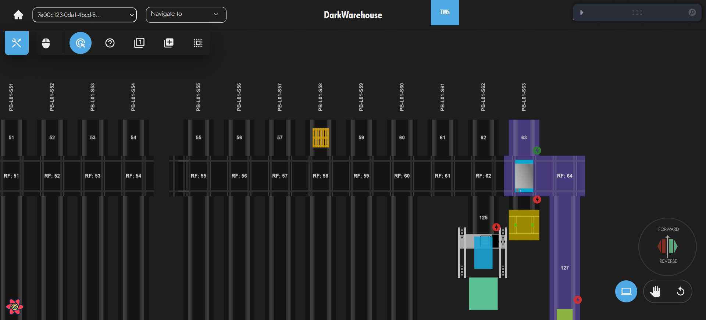
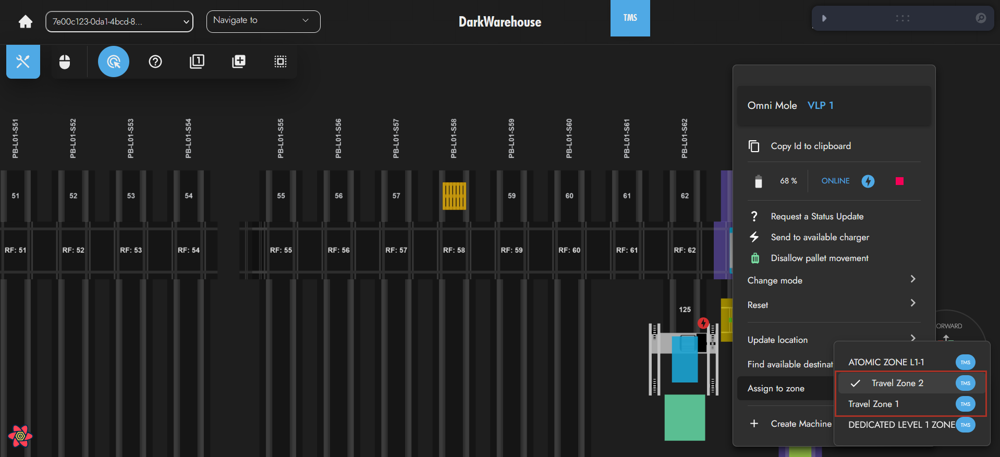
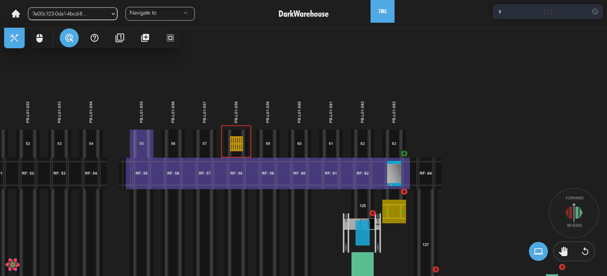
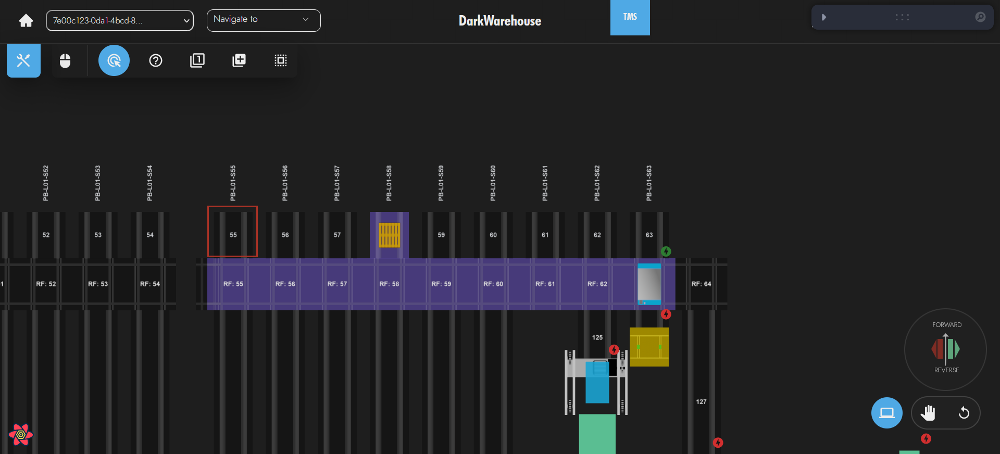
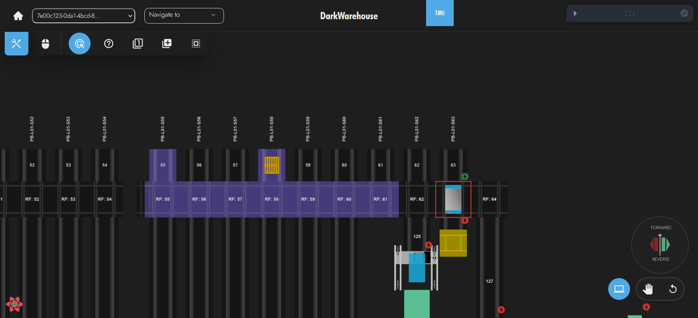

# Routing and Obstacles in the System

This page provides an overview of routing and the different obstacles delaying or preventing routes from being found. It can act as a useful checklist for when a task is not being performed.

## Routing🛣️

Routing is the process of finding the path an Omni-Mole will take to perform a task. It is created by analysing the current state of the system, specifically the zones the Omni-Mole is in, and choosing the best path that navigates around any obstacles in the system.

Routing makes up to four attempts with different requirements:
1) Find a route through a **vtu with the least number of tasks** and **without any temporary obstacles**.
2) Find a route through a **vtu with the least number of tasks** and **with temporary obstacles**.
3) Find a route through **without any temporary obstacles**.
4) Find a route through **with any temporary obstacles**.

If the system fails to find any of the above routes, the task will not be performed. At this point you may need to look into what permanent obstacles exist in the system that coud be causing routing to fail.

### Routes Required for Tasks

Different tasks require different routes, this is discussed below.

#### Generic Tasks🛣️

Generic Tasks require a single route from the Omni-Mole's current location to the task's destination location.

#### Pallet Task🚚

Pallet Tasks requires two routes. 
1) A route from the Omni-Mole's current location to the pallet's current location. 
2) A route from the pallet's current location to the task's destination location. 

If the second route cannot be performed then the first route will also not be performed.

#### Multi-Pallet Task🔁

Multi-Pallet Tasks require a single route from the Omni-Mole's current location to the task's destination location.

## Obstacles🚧

Obstacles are defined as any obstruction to the routing of the system, such as locks, Omni-Moles, or zone setup. It is important to understand these when diagnosing issues related to routing.

### Temporary Obstacles🚦

Temporary obstacles are obstacles that will automatically be resolved by the system. This means a path can be found by passing through them. The Omni-Mole will move along it's path until it reaches a temporary obstacle, wait for it to be resolved, then continue. A couple examples of temporary obstacles are active subtasks, Omni-Moles assigned to tasks, and Omni-Moles that are online, in auto and can be relocated.

### Permanent Obstacles⛔

Permanent obstacles cannot be automatically resolved and paths will need to be routed around them. If no path can be found by routing around them, then the task cannot continue. Instead a user will need to manually resolves the obstacles blocking the path.

To demonstrate the below obstacles we will use the following situation:

#### Manual or Recovery Locks🔒

A manual or recovery lock can obstruct routing if it is blocking the only path that can be found.

##### Diagnosis🔍

Below is an example of a manual lock blocking an Omni-Mole from reaching a pallet.

##### Solution💡

In order to resolve the issue the locks need to be removed.

###### Manual Locks🚫

Manual locks can only be created by a user, so it is best to check why this lock was created before removing it.

###### Recovery Locks💥

Recovery locks are created after a subtask fails. The normal recovery procedure needs to be followed before this lock can be removed.

#### Source or Destination Lock🔒

If either the source or the destination have manual or recovery locks a path cannot be found.

##### Diagnosis🔍

Below is an example of a a pallet tasks source being locked and preventing a path from being found.

##### Solution💡

In order to resolve the issue the locks need to be removed.

###### Manual Locks🚫

Manual locks can only be created by a user, so it is best to check why this lock was created before removing it.

###### Recovery Locks💥

Recovery locks are created after a subtask fails. The normal recovery procedure needs to be followed before this lock can be removed.

#### Omni-Mole that is Offline or not in Auto🔴

An Omni-Mole that is offline or not in auto can obstruct routing if it is blocking the only path that can be found. This is because the system is unable to automatically tell it to move out of the way.

##### Diagnosis🔍

Below is an example of an offline Omni-Mole preventing a path from being found.

##### Solution💡

Check why the Omni-Mole is offline, then either put it back online or manually move it out of the way and update it's location.

#### Omni-Mole Not Assigned the Zone

If an Omni-Mole is not assigned to a zone that includes the source and destination, or a path between them, then a path cannot be found.

##### Diagnosis🔍

Below is an example of how an Omni-Mole having incorrect zones assigned can lead to a path not being found.

>Travel Zone 1 includes the Omni-Mole, the source and the destination.

>Travel Zone 2 includes the Omni-Mole but not the source and the destination.

>The Omni-Mole is assigned to Travel Zone 2 but not Travel Zone 1

##### Solution💡

Ensure the correct zones are assigned to the Omni-Mole.

#### Source or Destination Outside the Zone

If either the source or destination is outside the zones assigned to the Omni-Mole a path cannot be found.

##### Diagnosis🔍

Below is an example of the source being outside the zones assigned to the Omni-Mole.

Below is an example of the destination being outside the zones assigned to the Omni-Mole.

##### Solution💡

Update the Zone to include the source and destination locations.

#### Omni-Mole Outside the Zone

If the Omni-Mole is outside of its assigned zones it cannot find a path.

##### Diagnosis🔍

Below is an example of an Omni-Mole being outside its assigned zone.

##### Solution💡

Either extend the current assigned zones to include the Omni-Mole, or assign another zone to the Omni-Mole that overlaps with the existing zone.

#### Disconnect in the Zone

If a zone is not entirely connected then there may not be a path from the source location to the destination location.

##### Diagnosis🔍

Below is an example of a zone being disconnected and not allowing a path between the source and destination.

##### Solution💡

Update the zone to not be disconnected.

#### All VTUs In the System Are Offline or Not In Auto

If all VTUs are offline and the task needs to change levels then no path can be found.

##### Diagnosis🔍

Below is an example of all VTUs being offline.

##### Solution💡

Put at least one VTU back online.

#### All VTUs Are Outside the Zone

The zone must include at least one VTU in order for a path through it (or to it) to be found.

##### Diagnosis🔍

Below is an example of a VTU not being included in the zone

##### Solution💡

Put at least one VTU in the zone.