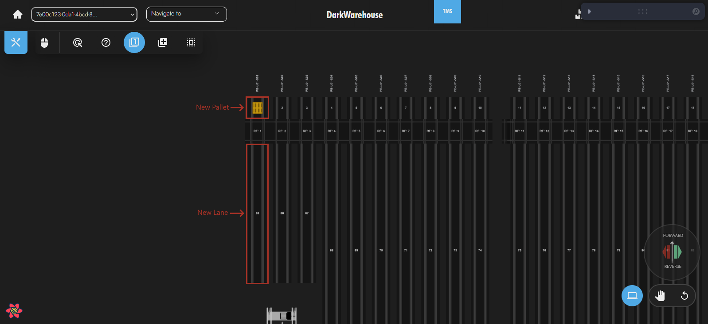

# Policies

Policies are used to define how the WMS stores, orders and groups pallets. They are used for inbound, outbound and shuffle functionality. Combining policies together allows for the WMS to have a more complex system for handing stock.

## Inbound Policies

Inbound policies are used to determine where a pallet will be stored after being scanned into the system. They will also be used when shuffling a pallet or performing a cleanup of the system.

The bare minimum for inbound policies are the following:
1) An alternative new lane policy
2) A compulsory existing lane policy

This combination allows for pallets of a specific type to be placed together and any pallets that do not have the specific type in the system to be placed in a new lane.

### Filter Inbound Policies

Filter inbound policies determine where a pallet can be stored.

#### New Lane Any Lane

The New Lane Any Lane policy is used to select a new lane if the pallet cannot be placed in any existing lanes. It will choose any empty lane ordered by the lane number.

There are two scenarios where a new lane needs to be used:
1) There are no pallets of a specific type in the system

The new lane is selected using the lowest lane number. In this case it is the lane directly in front of the new pallet.
2) Where all lanes for pallets of a specific type are already full

>This scenario makes use of an alternative **New Lane Any Lane** polciy and a compulsory **Existing Lane Same Pallet** policy.
>The full lane consists of pallets with the same product and product count as the new pallet. Since the lane with pallets of the same type is full, a new lane is chosen using the lowest lane number.

#### Existing Lane Same Pallet

The Existing Lane Same Pallet policy is used to select an existing lane with the same type of pallet. It will check the product and product count of a pallet and find lanes that have similar pallets.

>In the above example the **new pallet** has the same type as the pallets in **lane 2** but a different type to **Lane 1**.
>This leads to the **new pallet** being placed in **lane 2**.

#### Same Level

The Same Level policy is used to choose lanes on the same level as the pallets current location. By making this an optional policy, it is possible for a pallet to be placed on another level if necessary.

>The above image is level 1 of the system. **Lane 1** contains 3 pallets of **Product A**.

>The above image is level 1 of the system. **Lane 2** contains 4 pallets of **Product A**. The **New Pallet** has **Product A**.
With the **Same Level** policy active, the **New Pallet** will be placed in **Lane 2** even though **Lane 1** has a lower lane number.

#### Traffic Zone

The Traffic zone policy is used to choose lanes in a traffic zone that has the same traffic level as the pallet.

>The **New Pallet** has traffic level 2.
>**Traffic Zone 1** has traffic level 1.
>**Traffic Zone 2** has traffic level 2.
>**Lane 1** has a lower lane number than **Lane 2**.
With the **Traffic Zone** policy active, the **New Pallet** is placed in **Lane 2**  even though **Lane 1** has a lower lane number. This is because **Lane 2** is in **Traffic Zone 2**.

### Order Inbound Policies

Order inbound policies determine the order of locations to store a pallet.

#### Priority Zone

The Priority Zone policy is used to determine zones where pallets should be stored first. Once the priority zone can no longer store the pallet, a lower priority zone will be used.

>**Priority Zone 1** has priority of 1.
>**Traffic Zone 2** has priority of 2.
>**Lane 1** has a lower lane number than **Lane 2**.
With the **Priority Zone** policy active, the **New Pallet** is placed in **Lane 2**  even though **Lane 1** has a lower lane number. This is because **Lane 2** is in **Priority Zone 2**. Once **Priority Zone 2** is full, pallets will be placed in **Priority Zone 1**.