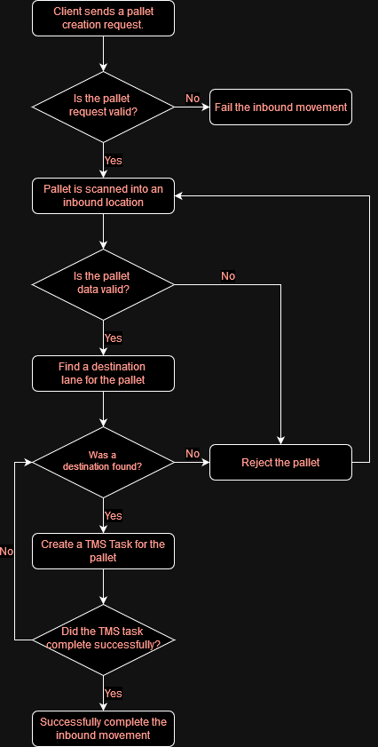

# Introduction
Inbound Movements are performed to move pallets into the store.

Inbound movements follows four steps:
1) Automated Pallet Creation.
2) Scanning the Pallet Into the System.
3) Selecting a Destination Lane.
4) Creating TMS Tasks.

The following flowchart provides a more detailed description of the inbound process.

## Automated Pallet Creation
Pallets are automatically created by the client through the data bridge. In this step the pallets barcode, product and size are provided by the client. Optionally the pallet can be provided a traffic level to determine how quickly the pallet will move through the system.

## Scanning the Pallet Into the System
Pallets are scanned onto either an inbound lane or a conveyor. After scanning the pallet the scan data is used to validate the pallet. If it fails validation it will be rejected, otherwise it will be moved into the store.

### Scanning Onto An Inbound Lane
Scanning onto an inbound lane requires the pallets barcode to be scanned and then the lanes barcode. Once this is done the pallet will be moved onto the inbound lane.

### Scanning Onto A Conveyor
When scanning onto a conveyor, once the pallet reaches a scan in station, it will automatically be scanned and it's location updated to the conveyor.

## Selecting a Destination Lane
After scanning the pallet into the system a destination needs to be chosen. This is done using a combination of different inbound policies. If no destination can be found the pallet will be rejected.

## Creating TMS Tasks
Once a destination has been selected or the pallet has been rejected a TMS task will need to be created to move the pallet. Once it reaches the destination the inbound movement is completed.