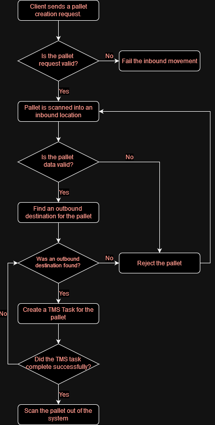

# Inbound Bypass
In some cases an inbound pallet must immediately be taken to an outbound location. This is called an inbound bypass.

The steps are as follows:
1) Automated Pallet Creation.
2) Scanning the Pallet Into the System.
3) Selecting an Outbound Destination Lane.
4) Creating TMS Tasks.
5) Scanning the Pallet Out Of the System.

The following flowchart provides a more detailed description of the inbound bypass process.
