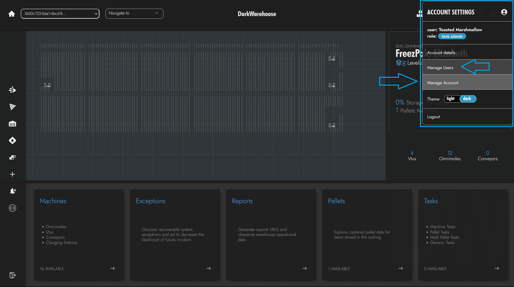
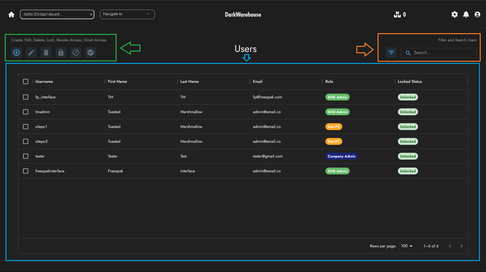
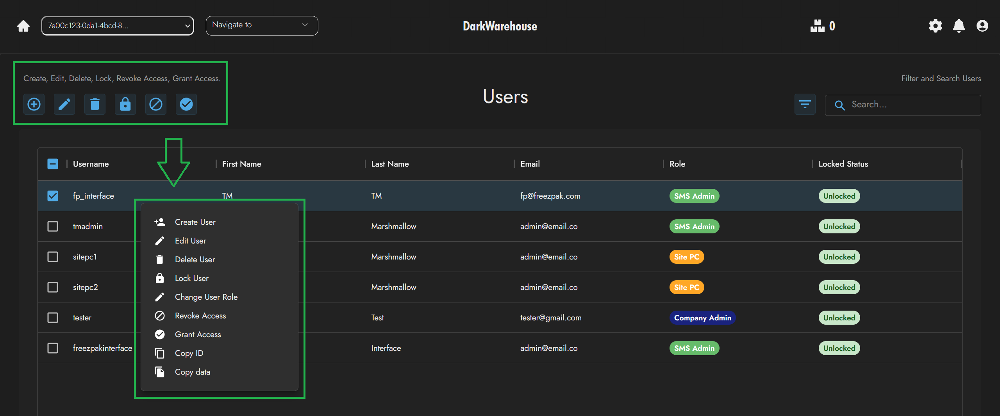
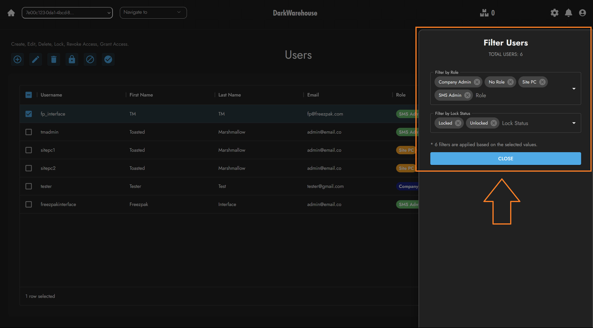
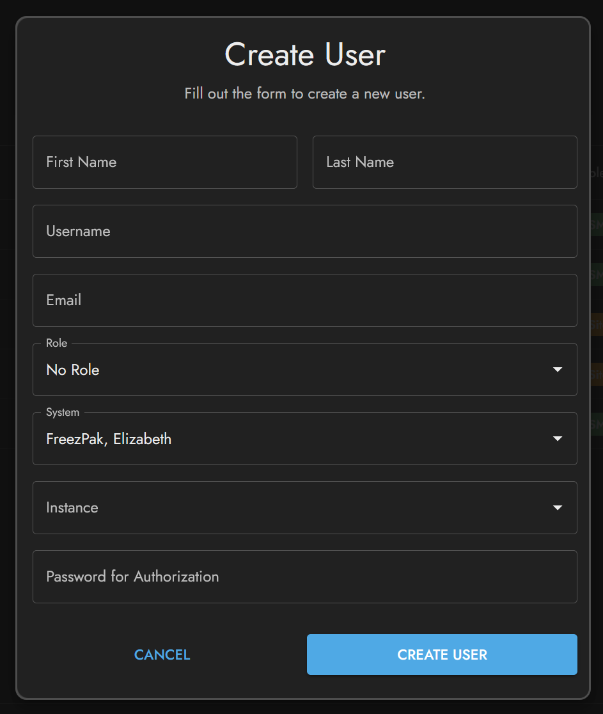
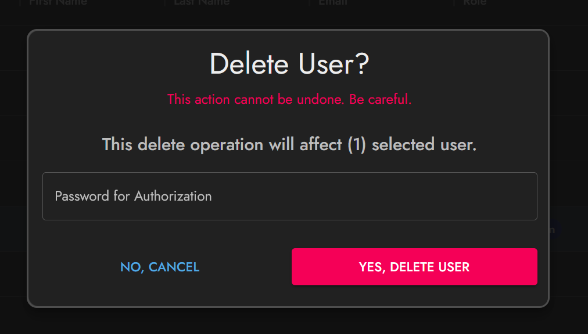
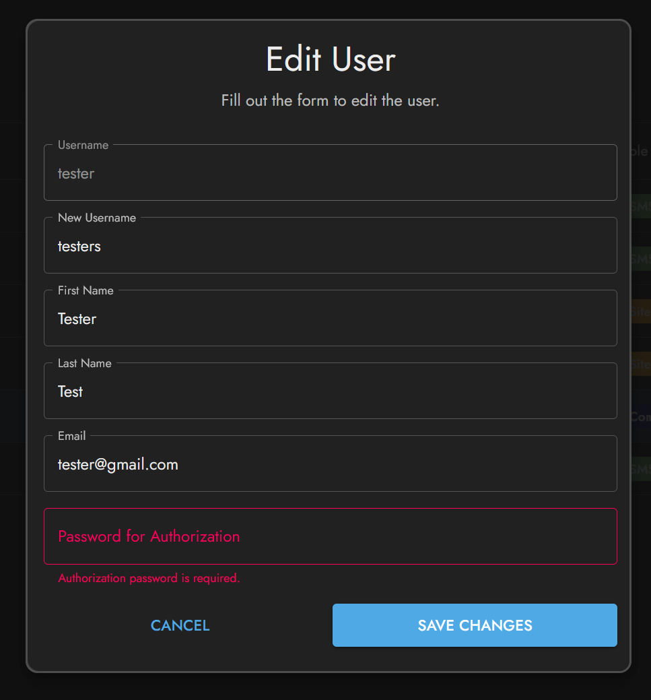
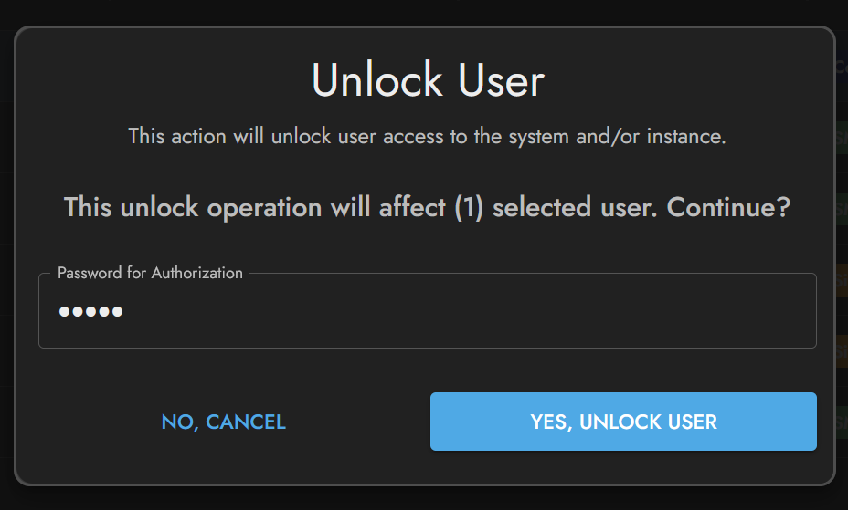
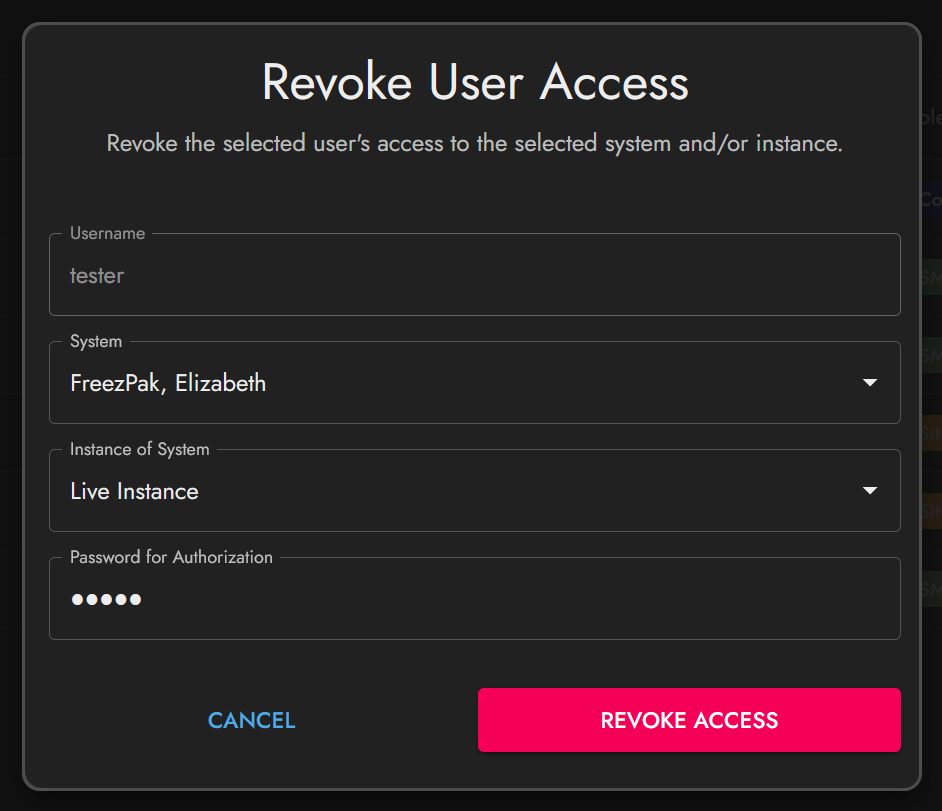

# Admin User Management

## Accessing User Management :busts_in_silhouette: :door:

Navigate to the **User Management** page by clicking on the profile icon in the top right corner of the portal dashboard, then select **Manage Users**.

## Managing Users :wrench:

Within the User Management Portal, you can find the following sections:

- :green_square: **Admin Operations**: Quick access to Create, Read, Update, and Delete user functionalities.
- :orange_square: **Search and Filter**: Easily search for users or filter them by roles and lock status.
- :blue_square: **Users List**: A comprehensive table displaying user details like usernames, roles, and status.

### Admin Operations :computer_mouse:

Administrative actions for user management are available in a button group format, allowing for Create, Read, Update, and Delete operations:

- **Create User** :heavy_plus_sign: — Add a new user account.
- **Edit User** :memo: — Modify existing user account details.
- **Delete User** :heavy_minus_sign: — Remove user accounts from the system.
- **Lock User** :lock: — Restrict user access to the system.
- **Unlock User** :unlock: — Restore user access to the system.
- **Revoke Access** :no_entry_sign: — Remove user's access to specific system instances.
- **Grant Access** :key: — Provide user access to specific system instances.

:::note Batch Operations
Some actions are available for batch processing, like deleting or locking/unlocking users, while others, such as editing, are limited to individual users to preserve data accuracy.
:::

### Context Menu :computer_mouse:

Access additional user management features by right-clicking on a user to open the context menu, which provides quick links to all operations and more. This includes changing user roles and copying user IDs or data, each with its distinct icon.

:::info
The context menu complements the Admin Actions by providing a quick and user-friendly way to manage users without navigating away from the user list.
:::

### Search & Filter :mag_right:

Utilize the search bar to quickly find users or apply filters to sort users by role and lock status, enhancing the ease of user management.

### Understanding Authorization Password :closed_lock_with_key:

An **Authorization Password** is a security measure to ensure that any changes made to user accounts are performed by authorized personnel. This password is typically set by the system administrator and may be required for various user management tasks such as creating, editing, or deleting user accounts.

:::note Authorization Security
Always keep the Authorization Password confidential to prevent unauthorized changes. If you are not provided with this password or have forgotten it, contact your system administrator.
:::

### Creating a User :heavy_plus_sign:

To add a new user, click the **Create User** button and fill out the required information in the form, including first and last names, username, email, role, and system instance.

🟢 _Success Message_: "User created successfully."

### Deleting a User :heavy_minus_sign:

Select the user(s) to delete and confirm the deletion by entering the admin authorization password. A warning prompts to ensure the action is intentional as it is irreversible.

🔴 _Warning_: This action cannot be undone.

🟢 _Success Message_: "User deleted successfully."

### Editing a User :memo:

To edit a user, select the **Edit User** icon. Make the necessary updates in the form, ensuring all information is correct. Admin authorization is required, and form validation will alert for any discrepancies.

### Granting Access :key:

Assign system and instance access to a user by clicking the **Grant Access** button. After selecting the appropriate options, admin authorization is needed to complete the process.

### Locking and Unlocking Users :lock_with_ink_pen:

Control user access by selecting the lock or unlock icons. Confirm the action with the admin authorization password to modify the user's access status.

🟢 _Success Message_: "User access locked."

🟢 _Success Message_: "User access unlocked."

### Revoking Access :no_entry:

For revoking a user's access to certain systems or instances, click the **Revoke Access** icon and validate the action with admin authorization.

🟢 _Success Message_: "User access revoked."

### Conclusion :sparkles:

This guide offers a detailed look at managing user accounts within the admin portal. Follow these instructions to ensure a secure and streamlined administration experience.

:::caution
Remember to use admin privileges responsibly to maintain the integrity of the system and the privacy of the users.
:::

_This document is part of the official system administration guide and is subject to updates and improvements._
