# System Notifications in DarkWarehouse 📢

Stay ahead of the game in the DarkWarehouse Portal with our proactive notification system. 🚀 It’s designed to keep you informed and in control, with visual cues and actionable insights right at your fingertips. 🛠️✨

## Notifications on Landing Page 📄

The landing page of the DarkWarehouse Portal provides a comprehensive overview of all active notifications. Upon the occurrence of a notification, the landing page is updated to reflect the new event. This ensures that you are always aware of the latest developments in your warehouse operations.

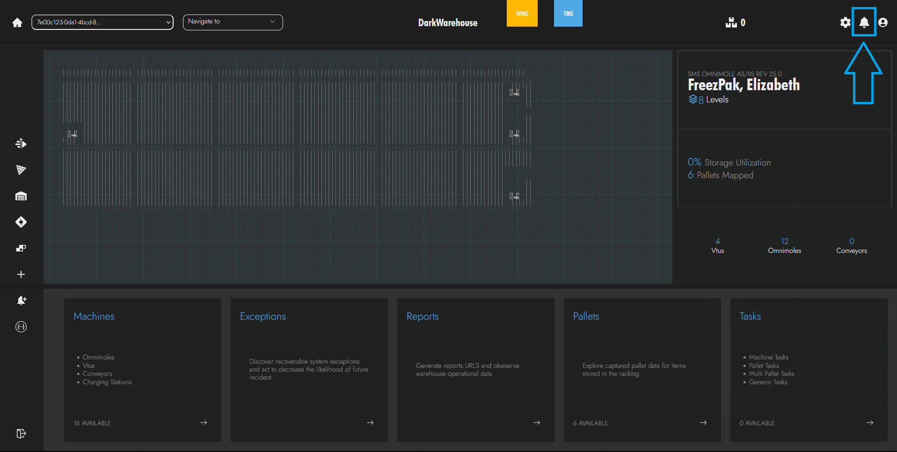

## Accessing the Notification Portal 🔔

At any time, users can access the Notification Portal through the top right-hand side of the interface. This portal provides a comprehensive overview of all system notifications and allows for detailed inspection and management.

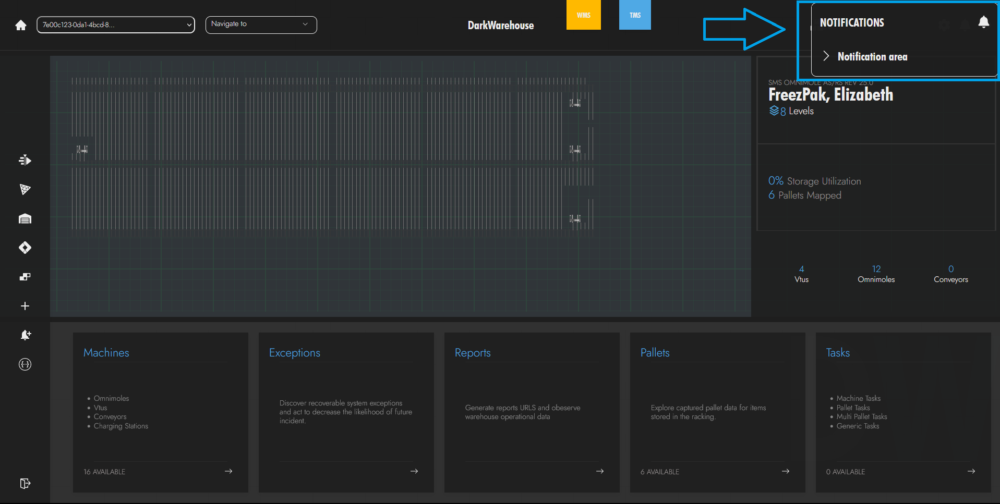

### Inside the Notification Portal 📜

Upon entering the Notification Portal, users are presented with a detailed table of notifications. This table offers insights into each notification's nature, status, and urgency, ensuring no detail is missed.

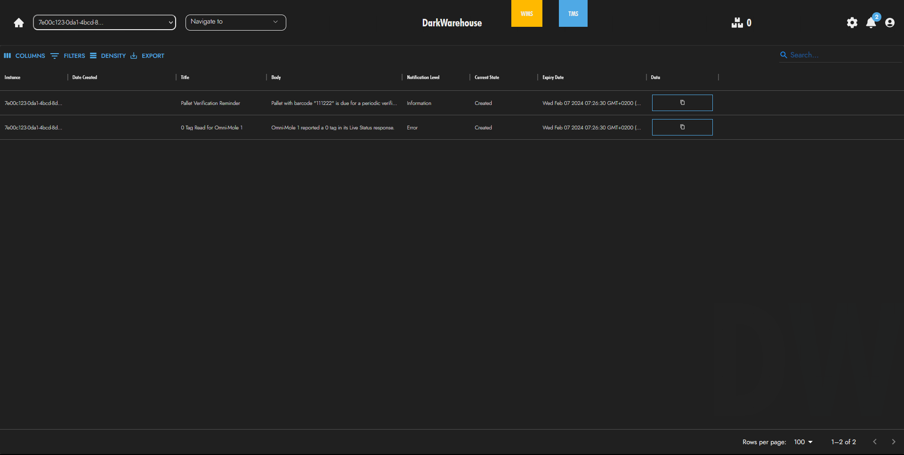

## 3D Canvas View and Notifications (default, low-fidelity view) 🖼️

In the DarkWarehouse, the low-fidelity 2D View of the 3D Canvas View serves as the primary interface for real-time operational oversight. Here, notifications emerge as interactive elements directly within the flow of your warehouse's digital twin.

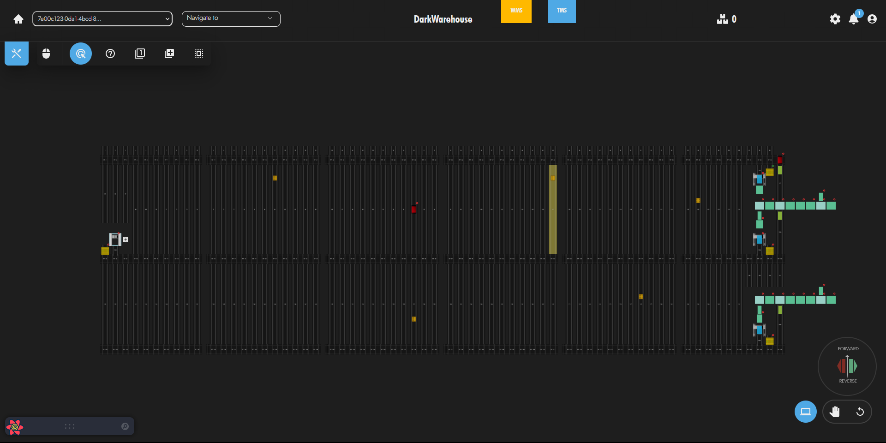

 

This action to open the Notifications Portal can be performed from any page in the DarkWarehouse Portal, since it appears in the navigation bar. For instance, this is the view of the Notifications Portal when opened from the 3D Canvas View.

> **Note**: Here you are able to see the triggered notification pin on the 3D Canvas View, and the corresponding notification card in the Notifications Portal.

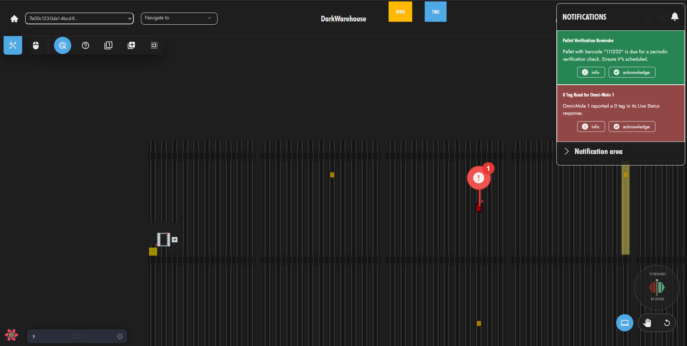

Upon clicking on the notification pin, a detailed notification card will appear, providing all the necessary information about the event. This card is designed to be informative and actionable, allowing you to address the notification directly from the card. The following screenshot shows the case where the user clicks on Acknowledge button to confirm the awareness of the notification.

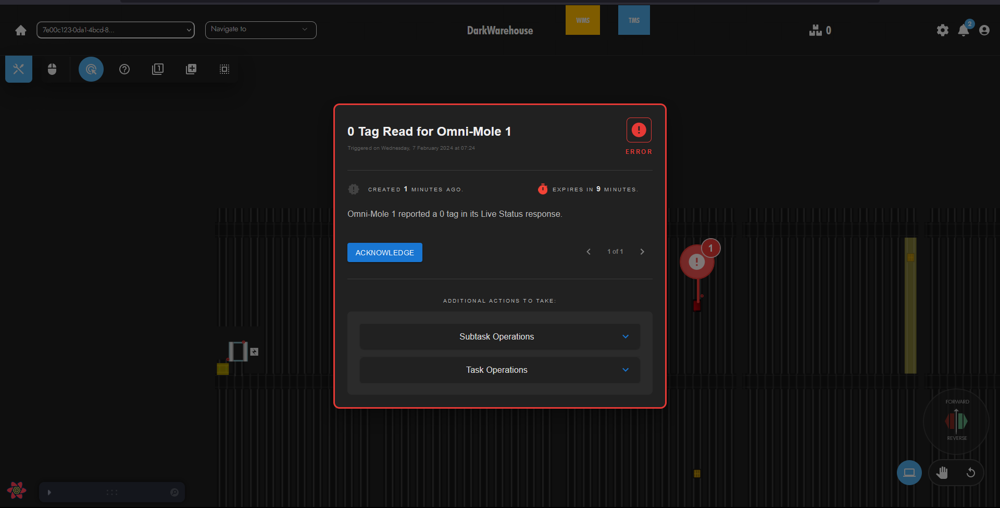

### Acknowledgement of Notification 🟢

- **ACKNOWLEDGE**: By pressing the 'Acknowledge' button, you confirm your awareness of the notification, which is often the first step in addressing it. A success toast message will appear as a confirmation of your action. Then, the notification pin will be updated to disapear, to reflect the acknowledgment.

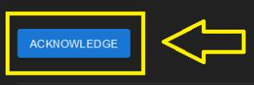

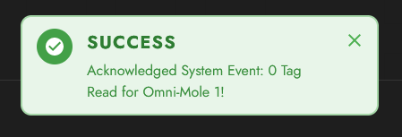

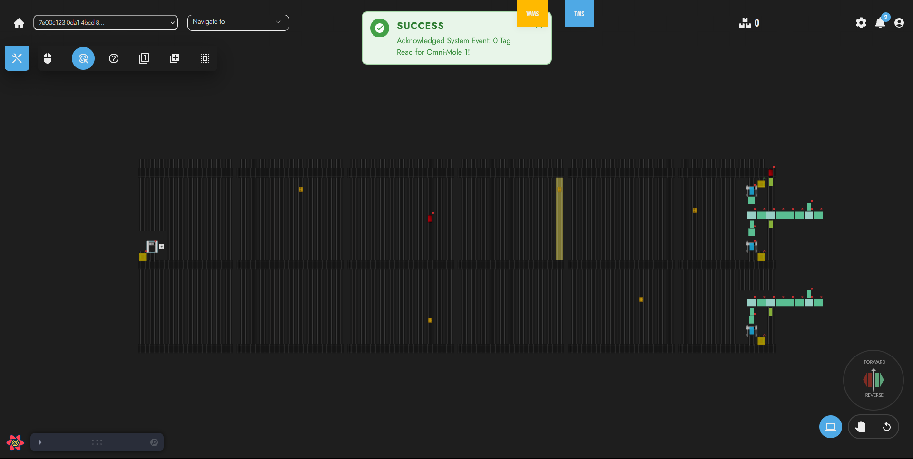

 

## High-fidelity 3D View of the Notification Pins and Overview (non-default view) 📍

> **Note**: While the 3D view below offers an immersive experience, the 2D orientation of the 3D view (see images above) provides a simplified and equally informative perspective. Easily toggle between these views via changing the Fidelity (high/low) in the Menu to suit your monitoring preferences.

In the menu on the left, you can toggle the High-Fidelity 3D View to see the entire system. This view provides a comprehensive overview of all active notifications, allowing you to see the entire warehouse at a glance.

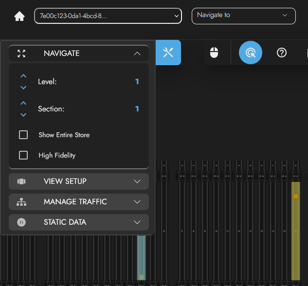

Each notification in the system is represented by a color-coded pin on the 3D canvas, showing exactly where in the warehouse the event occurred. These pins come with a count badge, indicating the number of notifications at that location. 📌🔢

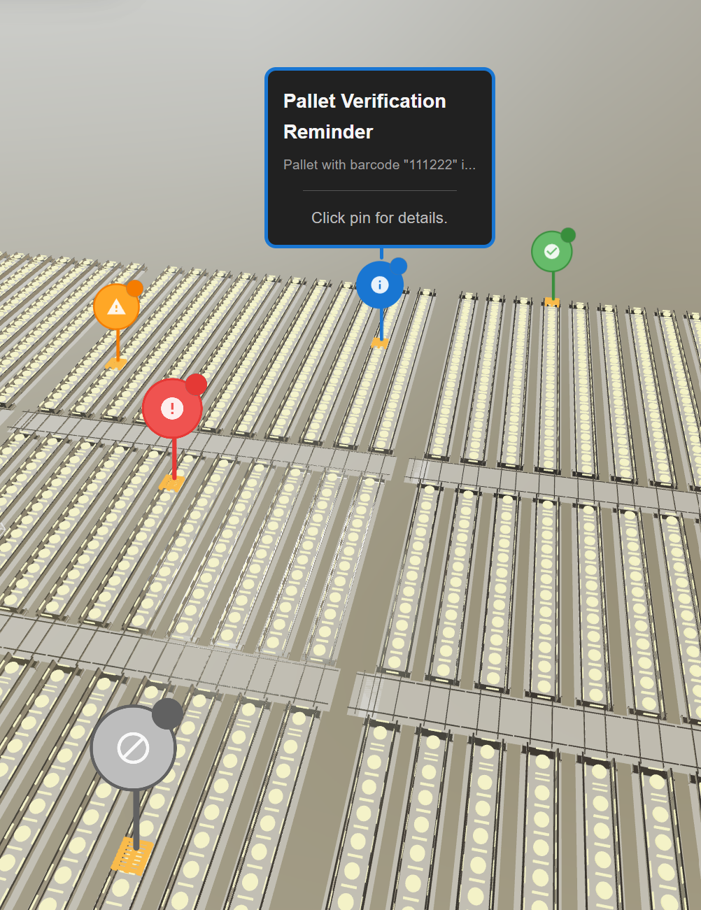

## Notification Types 🎨

Notifications come in various types, each indicated by a specific color:

- **Information (📘)**: Non-critical updates or reminders.
- **Confirmation (📗)**: Positive affirmations that operations are running smoothly.
- **Warning (📙)**: Alerts that may need your attention to prevent issues.
- **Error (📕)**: Urgent issues that require immediate action.
- **Unknown (📓)**: Alerts that need further investigation or categorization.

Here’s what each notification type indicates:

- 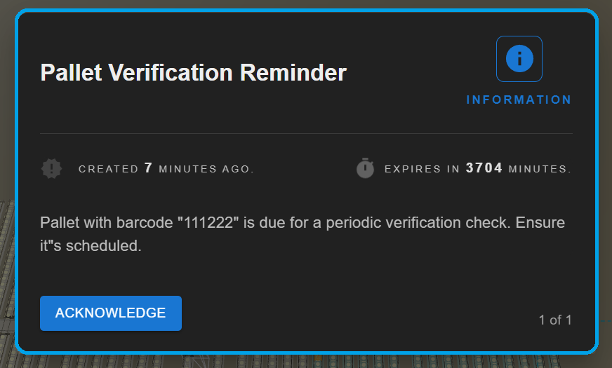
- 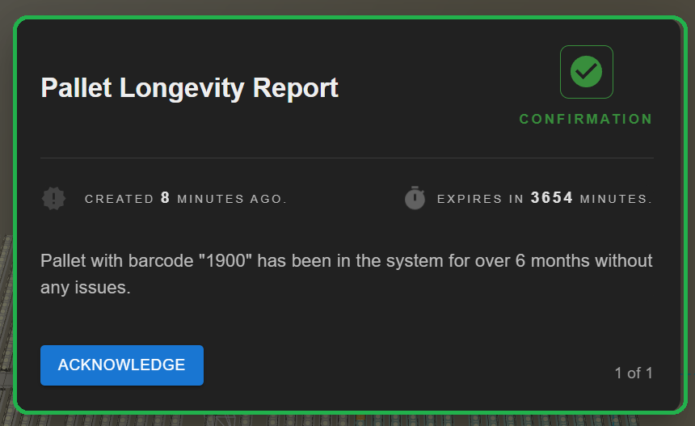
- 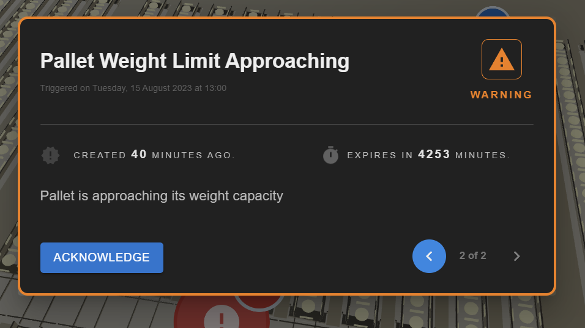
- 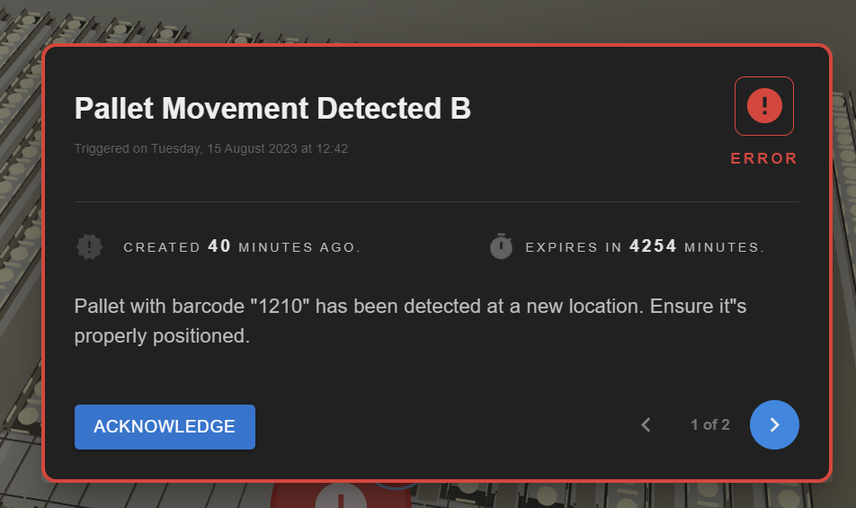
- 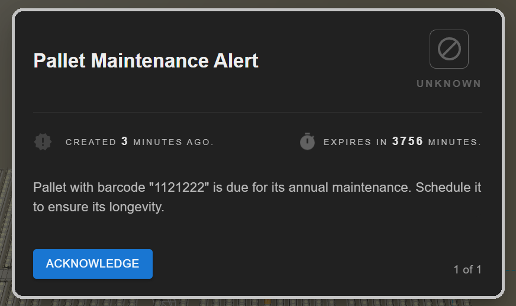

## Delving into Notification Cards 🔍

Clicking on a pin reveals a detailed notification card. This is where you'll find all the critical information you need. Highlighted colours represent the information boxed in the image below:

- **Notification Type (🟡)**: Shows the type of notification received.
- **Timestamp (🔵)**: Indicates when the notification was created.
- **Expiry Time (🔴)**: Displays the time left before the notification expires.
- **Description (🟢)**: Provides a brief summary of the event or alert.
- **Acknowledgement Button (⚪️)**: The button to press confirming you've seen and addressed the alert.
- **Actionable Responses (🟣)**: Provides a brief summary of the event or alert.

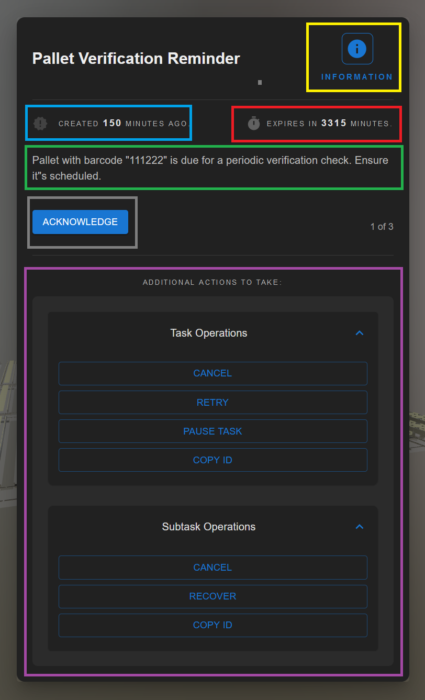

## Notification Pins Count 📍

Each pin on the warehouse canvas features a count badge, showing the number of active notifications at that location, providing an immediate sense of any area's activity level.

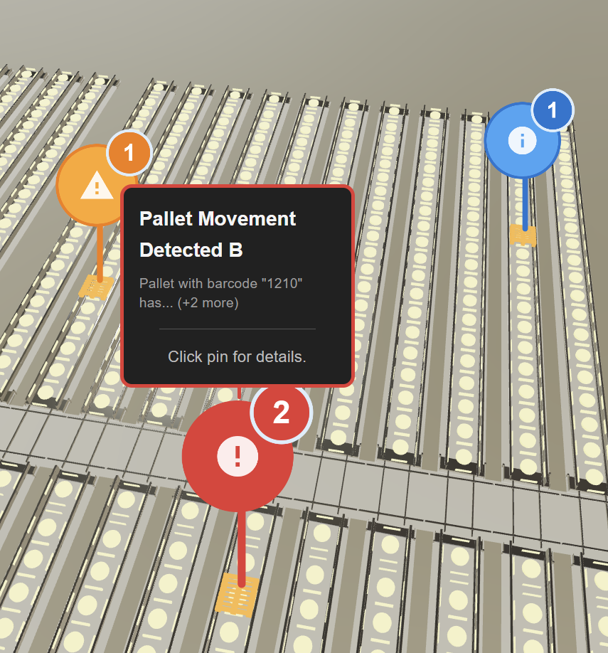

## Actionable Responses 🛠️

### Acknowledgement of Notification (🟡)

- **ACKNOWLEDGE**: Pressing the 'Acknowledge' button confirms that you have seen and are aware of the notification. This action is usually the first step in addressing the notification.

### Time Urgency (🟣)

- **TIME URGENCY**: Notifications that are about to expire will show the expiry time in red text accompanied by a vibrating alarm icon. This visual cue indicates that the notification requires immediate attention.

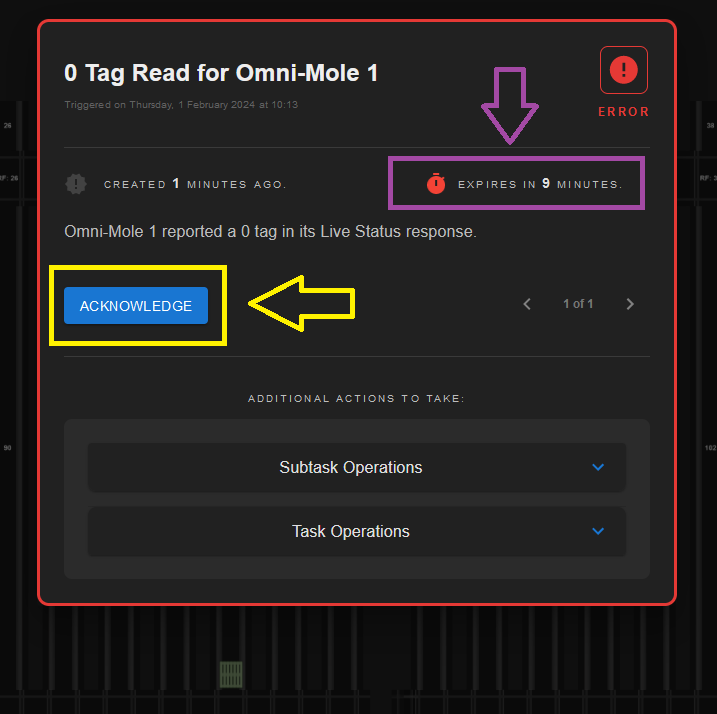

## Custom Notification Functionality 🛠️

DarkWarehouse enhances user interaction by enabling custom functionalities within notifications. Depending on the notification type, users can access a variety of tailored actions:

- Task Operations: Unique commands linked directly to the operational tasks.
- Subtask Operations: Fine-tuned controls for subtask-specific management.

These features ensure that users can respond to notifications with precise and appropriate actions, directly from the notification interface.

### Task Operations 📝

Task Operations provide immediate action options such as:

- **Cancel**: Stop the current task.
- **Retry**: Attempt the task again.
- **Pause Task**: Temporarily halt the task.
- **Copy ID**: Copy the unique identifier of the task for tracking or reporting.

### Subtask Operations 🔍

Subtask Operations allow for more detailed control, including:

- **Cancel**: Terminate a specific subtask.
- **Recover**: Attempt to rectify any issues with the subtask.
- **Copy ID**: Copy the subtask's unique identifier for precise tracking.

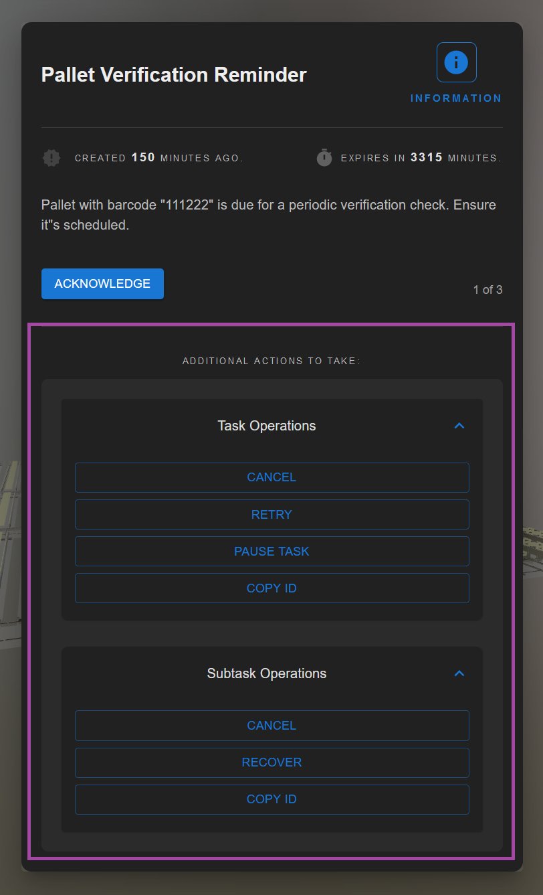

## Multi-Level Notifications 🏢

The multi-level view setting is toggled via the menu on the top left of the 3D canvas.

This allows you, for events affecting multiple levels, to see pins visible at each pertinent point, giving you a bird's-eye view of all related notifications.

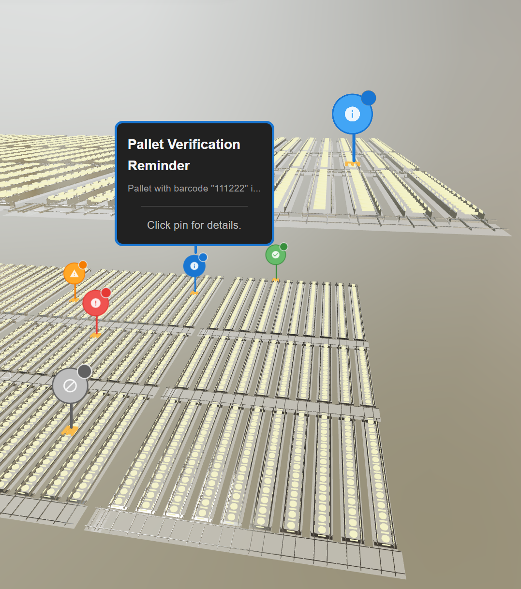

## Conclusion 🌟

The DarkWarehouse Portal ensures you’re always informed and ready to act with a notification system that’s both intuitive and comprehensive. Navigate through your warehouse operations with confidence, knowing that every alert is an opportunity for optimization. 🚀📊
